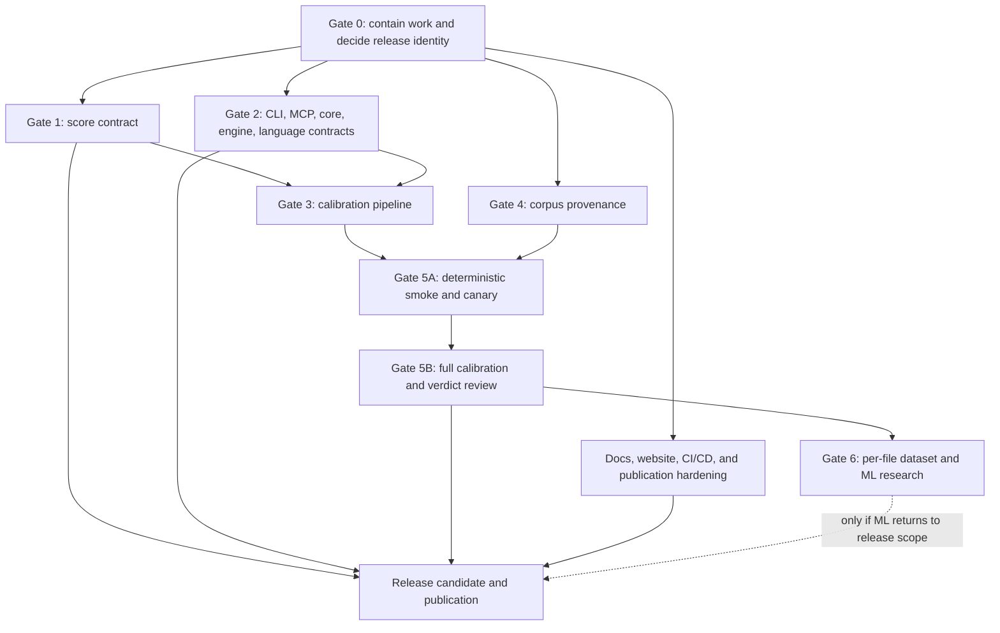

# v0.45 Calibration Continuation and Release-Hardening Plan

**Created:** 2026-07-09

**Status:** Active execution plan — release-materialization Tasks 1-6 are
implemented and bounded-contract reviewed; dependency remediation is green on
the current dirty bytes; the latest bounded serial SlopBrick run passes **307
files / 3,540 tests** (5 skipped files / 9 skipped tests); and the
website/workflow slices have fresh local evidence, including the 16-test
Playwright/axe suite. The clean builder commit/commit-bound receipt remains
open; all corpus, calibration, and broader release gates remain open.

**Current-state pointer (2026-07-14):** the final bounded package, validity,
threshold, freshness, and self-scan evidence is recorded in the
`Live verification follow-up` section below. Older checkpoint counts remain
append-only history and are not current release evidence.

**Working project name:** v0.45 calibration, not yet an approved public version

**Current reconciled plan checkbox snapshot (2026-07-14):** 98/178 continuation items checked;
2/76 v10.3-admission task items checked (the instructional checkbox example
in the plan is excluded). These counts include bounded
implementation/verification slices, not release approval.

**Last reconciled gate ledger:** Gate 0 `12/12`; Gate 1 `14/20`; Gate 2 `48/52`; Gate 3
`5/5`; Gate 4 `0/18`; Gate 5 `0/6`; documentation/operations `19/46`; and
release gates `0/19`. Gate 3's five checked items are the path-portable
TypeScript slice, complete synthetic matrix, 100% smoke accounting, repeated
normalized metric identity, and JSON/Markdown source agreement. This closes
the implemented synthetic runtime matrix only; admission-backed metrics and
production parity remain open.

### Live execution checkpoint — 2026-07-13

The checkbox and gate counts above are the last reconciled ledger snapshot;
they are not being silently incremented by the current dirty implementation
slice. Since that snapshot, the Task 1A recovery work has advanced as follows:

- Core now has semantic validators for the nested authority, acquisition,
  CAS, completion, reservation, envelope, and materialization contracts; the
  valid/invalid/semantic-invalid fixture tranche covers the new schemas.
- Evidence CAS now persists schema-shaped phases, a reservation, an offline
  network observation, a primary completion, and a recovery-visible journal;
  same-authorization loser cleanup and canonical-root resolution are covered
  by bounded tests.
- The verified evidence context now validates nested bundle joins and can bind
  to an expected tool profile and `evidence:verify` invocation intent. The CLI
  parser requires those bindings and emits machine-readable results.
- Acquisition publication now uses the canonical root layout, staged
  proposal-sidecar recovery, receipt/index revalidation, and a phased local
  tool-authority publication path. An arbitrary receipt callback cannot claim
  completion without an indexed profile/intent/receipt chain.

The bounded evidence currently green is Core `129/129`, Core schema fixtures,
Core and SlopBrick typechecks, SlopBrick context/CAS/publication `20/20`
(including the canonical-layout `tool-authority:recover` CLI success path),
and `git diff --check`. The independent Task 1A review is still
`REQUEST_CHANGES`: the local tool-authority lock/transaction recovery fault
matrix, crash-at-every-boundary proof, and a fresh independent approval remain
open. Gate 4 is still quarantine-only (`verified_ai=0`,
`verified_human=0`), with no admission manifest, census, run, or calibration
receipt. No repository acquisition, commit, push, tag, release, npm publish,
or deployment has been performed.

### Current Task 1A recovery-hardening checkpoint — 2026-07-13

The stale `20/20`/`REQUEST_CHANGES` wording above is retained as the prior
checkpoint. The current source now passes SlopBrick typecheck plus four focused
Task 1A files and `54/54` tests under one worker and a bounded heap. The slice
covers the evidence CAS transaction/reservation identity, canonical observation
and cleanup checks, verified-context acquisition and tool-authority joins,
generation-zero acquisition recovery, local authority publication/recovery,
and the canonical-layout recovery CLI. `git diff --check` is also green.

The fresh independent re-review now **APPROVES this bounded Task 1A
recovery-hardening slice**. Lower-priority follow-ups remain plan-open around
byte-checking stale deterministic journal temporary files and replaying the
acquisition chain for materialization-only/empty bundles; neither blocks this
bounded approval. The plan ledger remains intentionally unchanged at `96/178`
continuation items and `2/76` admission items. Gate 4 remains quarantine-only
with `verified_ai=0` and `verified_human=0`; no admission manifest, census,
witness, selection, run, calibration receipt, public-repository pull, commit,
push, tag, release, npm publish, or deployment has occurred.

### Current Task 1B register/review/census checkpoint — 2026-07-13

The bounded Task 1B slice is independently approved in
`.superpowers/sdd/task-1B-review.md`. Core now validates the generation-0
source register and exact source-review set on a self-contained 329-entry
fixture, including explicit `materialPartition` conservation of exactly
`58,089` baseline units plus `394,293` repository units (`452,382` total),
canonical register/entry hashes, aggregate ownership, and mutation rejection.
SlopBrick now exposes a non-persisting `source:census` diagnostic that requires
the branded evidence context, returns no source-derived counts for unbranded or
invalid inputs, keeps candidate claims separate from final eligibility, and
always reports `eligibleUnits=0` until later static-ledger and witness
authorities exist. CLI input paths are realpath-contained against symlink
escapes, and aggregate census rows are explicitly non-additive.

The focused Core schema/typecheck/contract gates and SlopBrick typecheck,
census/path tests (`5/5`) are green with bounded workers and heaps. The Core
repository-level `test:contract` gate still reports the pre-existing tracked
generated `calibration-observation.ts`/`health.ts` freshness boundary; this
bounded slice does not claim that recursive build/release gate. Task 1B's
register-growth transactions, blind/temporal authorities, record/decision
ledgers, overlap/privacy/lineage authorities, and the real corpus census remain
open. The plan ledger remains `96/178` continuation and `2/76` admission items;
Gate 4 is still `verified_ai=0` / `verified_human=0`, with no corpus mutation,
repository pull, commit, push, tag, release, publish, or deployment.

### Current Task 1B register-generation authority checkpoint — 2026-07-13

The bounded Task 1B register-generation contract slice is now independently
approved in `.superpowers/sdd/task-1B-register-authority-rereview.md` after the
fix wave documented in `.superpowers/sdd/task-1B-register-authority-fix-report.md`.
Core schemas, generated types, self-hash validators, and focused tests cover
one/two-source register deltas, generation receipts, fixed-path locks, and
recoverable transactions. The fix wave binds delta source-generation hashes
to both downstream projections, requires a completed receipt-bearing phase and
matching receipt metadata, synchronizes the schema-contract index, and closes
source/register path-role and transaction-wide collision checks.

Bounded Core schema validation, typecheck, focused authority/review tests
(`9/9`), full Core tests (`138/138`), codegen, and `git diff --check` pass.
`core test:contract` still reports the separate pre-existing tracked generated
`calibration-observation.ts`/`health.ts` freshness boundary. This approval is
for the Core contract only: runtime register publication/recovery, source
proposal/approval, blind/temporal authorities, record/decision ledgers,
overlap/privacy/lineage authorities, and the real corpus census remain open.
The plan ledger remains `96/178` continuation and `2/76` admission items;
Gate 4 is still `verified_ai=0` / `verified_human=0`, with no corpus mutation,
repository pull, commit, push, tag, release, publish, or deployment.

### Current Task 1B register-publication runtime checkpoint — 2026-07-13

The bounded offline register-generation runtime is independently approved in
`.superpowers/sdd/task-1B-register-publication-rereview.md`, with the evidence
report in `.superpowers/sdd/task-1B-register-publication-report.md`. The
SlopBrick runtime now performs fixed-layout, lock/transaction-bound one- or
two-source publication and recovery with canonical JSON, symlink containment,
expected-current and pointer CAS checks, persisted filesystem phases,
lock-only recovery, source/register/receipt byte revalidation, tool-receipt
binding, and unknown-file-preserving cleanup. Its CLI exposes
`register:publish-round` and `register:recover`.

The focused runtime suite passes `12/12`; the combined acquisition/register/
path suite passes `34/34`; Core passes `138/138`; SlopBrick typecheck and
`git diff --check` pass. The independent approval is limited to this local
runtime slice. The check-then-rename multi-writer race remains a documented
P2 follow-up under the transaction lock; source proposal/approval, blind/
temporal authorities, record/decision ledgers, overlap/privacy/lineage, the
real corpus census, Gate 4/5, and release gates remain open. The ledger stays
`96/178` and `2/76`; no corpus or remote release state changed.

### Current Task 1B Core authority and bounded SlopBrick diagnostic checkpoint — 2026-07-13

The bounded slice is independently approved in
`.superpowers/sdd/task-1B-core-authority-rereview.md`, with implementation
evidence in `.superpowers/sdd/task-1B-core-authority-report.md`. It hardens the
Core authority boundary and adds the
corresponding non-authority SlopBrick review diagnostic. Core now covers the
source-generation proposal/approval/generation graph, independent blind
source-review role coverage, evidence-to-rights joins, strict canonical
materialization IDs, exact source-review artifact bytes, blind temporal receipt
bindings, record/decision/sample/ledger joins, and strict timestamp/URL
validation. Generated Core peers are regenerated from the schemas, including
concrete fixed tuples rather than `unknown` placeholders; source-review
decision references are SHA-256 IDs in both the schema and validator.

The SlopBrick `reviewAdmissionSources` boundary is pure, offline, and
fail-closed. It requires the branded verified context, rejects malformed
register/review/record/decision inputs without throwing, delegates register
and review-set validation to Core, keeps candidate rows quarantined, and never
returns `ready`, `authorityEligible`, or non-zero `eligibleUnits` in this
slice. `source:census` uses the same diagnostic path for structured inputs and
returns an empty non-authority result for malformed runtime values. No corpus
bytes are read or changed.

Latest bounded evidence after the hardening fixes: Core codegen and schema
fixture validation pass; the full Core package passes `16` files / `158/158`
tests and typecheck; six Core authority files pass `29/29` focused tests; the
SlopBrick review/census files pass `9/9`; and the existing
register-publication runtime remains `34/34` with SlopBrick typecheck green.
The Core `test:contract` gate still fails only at the pre-existing tracked
generated `calibration-observation.ts`/`health.ts` freshness boundary; no
generated bytes were discarded.

This is not full Task 1B. Acquisition-round schemas and runtime, complete
SlopBrick consumption of non-empty structured records/decisions, overlap,
privacy, lineage, witness and manifest authorities, the real v10.3 census,
Gate 4/5, and release gates remain open. The valid source-register fixture is
an AJV/schema-shape fixture; the exact 329-entry semantic proof is the
in-memory contract fixture (with a companion semantic-invalid fixture).
`represented`/`unrepresented` census fields are diagnostic register inventory,
not admitted-record counts, and applied-delta ordering still belongs to the
downstream delta-chain validator. The plan ledger remains `96/178` and `2/76`;
Gate 4 remains `verified_ai=0` / `verified_human=0`, with no corpus, network,
commit, push, tag, release, npm publish, or deployment action.

### Current Task 1B acquisition-round contract checkpoint — 2026-07-13

The bounded acquisition-round contract is independently approved in
`.superpowers/sdd/task-1B-acquisition-round-rereview.md`, with implementation
evidence in `.superpowers/sdd/task-1B-acquisition-round-report.md`. Core now
defines and validates the one/two-source round authorization, approved
acquisition, source receipt, round receipt, lock, and recoverable transaction
schemas. The graph joins source authorizations, receipts, child invocations,
and transaction sources by the round authorization's explicit
`sourceAuthorizationIds` order, so permuted persisted arrays remain valid;
lock/transaction invocation tuples use structural equality after JSON reload.

The contract keeps `toolReceiptId` distinct from `toolReceiptSha256` and adds
the round's `orchestratorToolReceiptId`, `sourceProfileSha256s`, and
`sourceToolReceiptSha256s` projections. It rejects credentialed/oversized or
non-HTTPS URLs, malformed/private/documentation/mapped IPs, peers outside the
resolved set, unrelated request origins, unapproved release redirects,
transfer/asset-cap overruns, nonce/cap mutations, and staged receipt/state
mismatches. The focused evidence includes a genuine two-source explicit-order
graph, release-cap/redirect tests, staged child/orchestrator states, JSON
round-trip proof, and adversarial rehash probes.

Core passes codegen, schema validation, typecheck, and **17 files / 163 tests**;
the focused acquisition/schema run is **6/6** and `git diff --check` is green.
Core `test:contract` still reports only the pre-existing tracked generated
`calibration-observation.ts`/`health.ts` drift. This is an offline contract
approval only: acquisition/runtime network behavior, filesystem crash/race
proof, complete structured Task 1B consumption, the real corpus census,
Gate 4/5, and release gates remain open. The ledger remains `96/178`
continuation and `2/76` admission items; no corpus, network, commit, push,
tag, release, npm publish, or deployment action occurred.

### Historical Task 1A review snapshot — superseded 2026-07-13

The earlier independent review is retained for provenance in
`.superpowers/sdd/task-1A-fresh-review.md`: bounded SlopBrick typecheck plus
three focused files pass `27/27`, but the verdict is `REQUEST_CHANGES`. The
remaining P1s are explicit: persist the intent-only authority generation
before output mutation; bind and revalidate the exact authority artifact set
through recovery/cleanup; revalidate the indexed authority receipt on
acquisition recovery; exercise the real authority crash/race matrix; require
CAS recovery nonce/acknowledgement and bind primary completion to its
transaction; require the CAS acquisition-envelope/tool-receipt joins and fix
materialization symlink containment. Do not advance Task 1B or promote corpus
data until these findings are fixed and independently approved.

### Historical verification checkpoint — superseded by the live override above

The final current-source Task 6 packed-consumer pair uses one freshly packed
tarball (`61d3b9e9c3a8d8d01b19425431f3dca56d395e30b719461f1c0e34ad9c398846`)
and passes 9/9 on Node 22.22.3 plus 9/9 on Node 24.15.0 with strict offline
installation and the pair assertion enabled. Both receipts agree on the
tarball, builder commit, dirty status, and status hash
`0142d40f2cca9afa8f713d7e5bf4ed9fc1f9e5e6895f73771fa2764e2574fe6f` (179
status entries); the builder is still dirty
(`81e79b9ec47f46f70575ae650beccd3a278b60e5`), so this closes the current
same-tarball bounded evidence only, not the clean release prerequisite.
The receipt-bound snapshot remains 179 entries with the hash above; the current
worktree is now 342 status entries
(`2aa9f819ac113c492cabdba42e25ba386a6839fb51a15025757bf559f956bc70`)
after the score-contract, provenance, CLI regression, workflow, website
accessibility, v10.3 run-artifact, metrics, and current verification slices. No receipt
has been rebound or treated as clean-release evidence.

The latest bounded verification is green for typechecks and package tests:
Core 127/127, Engine 59/59, Website 37/37, and SlopBrick 3,316/3,316 tests
with 9 skipped under one worker. The suite covers 285 files with 5 skipped.
Recursive typecheck has zero errors (the
website reports three existing hints); the website static build emits four
pages; the website Playwright/axe suite is 13/13 with no serious or critical
violations; the workflow contract suite is 4/4; Core schema fixtures validate;
and the fresh SlopBrick build passes. The recursive build remains blocked by
Core's codegen-freshness guard, which detects uncommitted generated
`packages/core/src/generated/calibration-observation.ts` and
`packages/core/src/generated/health.ts` changes; no codegen bytes were
discarded. The local strict accessibility gate is closed for the candidate
(static routes, keyboard/focus checks, contrast, and accessible-name checks);
deployed-candidate performance and production proof remain open. The
whole-project CLI/MCP golden parity fixture is green (1/1),
and the affected score/provenance suite is green at 12 files/234 tests; the
standalone `suggest`/`badge` validity regressions add 111 scan-completion and
7 badge/color checks. The latest locally available built-CLI self-scan receipts are complete and
internally accounted: package `.` 208/208 (119 active, 274 suppressed; AI
Slop 4.6849, Repository Health 98.1111) and platform root `../..` 439/439
(212 active, 550 suppressed; AI Slop 4.3307, Repository Health 94.8741), with
zero failures/skips and no failed thresholds. These are dirty-byte diagnostic
receipts, not a stable release snapshot; refresh/rebind them after a clean
builder boundary. The manual review is closed for diagnostic triage: the
renderer separates AI and engineering lanes, groups repeated compression
findings, labels context, and keeps the score message truthful. Compression
and self-referential findings remain visible and contextualized; the scores
remain non-release evidence.

The current-source score-contract follow-up is independently approved: the
incomplete JSON/SARIF/MCP projection slice passes 44 focused projection tests
plus 28 selected score-explanation/partial tests, and the lossless per-rule
calibration-evidence slice passes 8 SlopBrick calibration files/31 tests plus
3 Core contract tests. Typechecks, the rebuilt full SlopBrick suite (285 files,
3,316 passed/9 skipped), and diff-check are green. The evidence is sanitized
and diagnostic-only; it does not create a verified v10.3 cohort or release
authorization.

The read-only Gate 4 corpus audit (2026-07-13) confirms the current deficit
without creating an admission artifact: the centralized inventories contain
224,903 declared-AI rows and 227,479 declared-human rows, but every row remains
quarantine/discovery evidence. All 317 repository records are still pending
origin, commit, license, family, and label review; all 12 source-register
entries are quarantine/pending. The controlled HumanEval audit has 100 AI/100
human pairs but zero eligible pairs after the source contract, and EvalPlus has
zero eligible files. Therefore the reviewed eligible census is truthfully
`verified_ai=0` and `verified_human=0`; `review/admission/`, the census,
witnesses, ledgers, manifests, selections, runs, and metric receipts are absent.
The bootstrap is ready for its local probes but `authorityEligible=false` and
candidate bytes were not accessed. Tasks 1A–3B must establish the offline
evidence/ledger/context/census authority before any measured deficit or public
repository acquisition; no new repository was pulled in this audit.

A bounded Task 1A Core contract slice now passes (2026-07-13): five durable
policy/witness/tool-profile/invocation-intent/receipt schemas, generated peers,
and fail-closed self-hash/action/network validators are exported and covered by
6/6 focused Core tests; Core typecheck and schema validation are green. The
Core codegen-freshness guard still reports the two pre-existing dirty generated
observation/health peers. This slice does not close Task 1A: the evidence CAS,
verified context brand, authority publication, SlopBrick `evidence:verify` CLI,
remaining admission schemas, and independent review remain open.

The canonical score/provenance closeout now has independent approval for the
incremental/partial/PR path: explicit successful-file/project effective issue
projections drive headline and secondary scores, cache-only clone evidence
stays in the audit envelope, duplicate-rule CLI opt-in paths are covered, and
failed results cannot feed business-logic enrichment. The score model is now
per-file log burden followed by fixed-scale additive accumulation; clean files
cannot dilute existing evidence and harmful evidence cannot improve Repository
Health. The public score contract is versioned as `v2`, including the fixed
cumulative scale and the explicit constitution-drift diagnostic boundary. This
closes the bounded implementation slice, not the clean-commit,
corpus-admission, calibration, or release gates.

The first post-lane direct Vitest invocation exposed a build-order trap: the
golden test compared the new source renderer with a stale `dist/index.js` and
failed only on the old `Issues (5)` heading. Rebuilding SlopBrick refreshed the
artifact; the targeted golden test passed 1/1 and the subsequent historical
suite passed 276 files (5 skipped), 3,208 tests (9 skipped). Future source-to-built
golden gates must rebuild first (or use the package `test` script); this was
artifact freshness, not a score or renderer-semantics defect.

Manual review then found a second renderer contradiction: the package self-scan
showed 117 active AI-specific findings beside `[NO SLOP]` and “no detectable AI
slop.” A report-aware score/message helper now qualifies active AI signals below
10 as `LOW` / “low amount of AI slop” across pretty, composite, verdict, and
brief output while retaining absolute clean wording for no-AI reports. The
TDD regression was red before the fix and green 2/2 afterward; report tests,
rebuilt golden parity, the 276-file/3,258-test full suite, typecheck, build,
diff check, and independent review pass. The remaining usefulness decision is
the compression cohort and self-referential root context, not score/message
truthfulness.

The external corpus tree is now centralized under `/Users/cheng/corpus-expansion`:
the legacy positive/AI and negative/human filelists account for 224,903 and
227,479 unique paths with zero exact-path overlap. The centralized baseline
trees contain 5,833 and 52,280 immediate regular source files; the maintained
selected filelists contain 5,809 and 52,280 paths. Generated `.slop-audit`
artifacts are excluded and quarantined separately. The copy and path-rewrite receipt is
`/Users/cheng/corpus-expansion/v10.3/review/corpus-centralization-receipt-2026-07-13.json`.
This is inventory centralization only; labels remain declared/quarantined and
no v10.3 admission manifest or calibration run has been created. The v10.3
positive and negative JSONL inventories were then rebuilt from the centralized
lists (224,903 and 227,479 indexed, zero missing), and
`node v10.3/review/validate-review-artifacts.mjs` remains green.

Gate 2 correctness remediation is implemented on `codex/v0.45-recovery` and
has passed focused integration evidence. The parser-backed comment metric,
AST-proven CORS facts, project-level identical-block coordinator, effective
issue-set diagnostics, Unicode line offsets, and nonblocking large-JSON/beacon
paths are covered by serial one-worker tests. SlopBrick and website package
typechecks are green. The earlier 264/3,151, 265/3,157, and 276/3,208 bounded
counts are historical checkpoints; the current verification override above
supersedes their pending-rerun wording with the final 276-file/3,258-test run
and final Task 6 pair.

The workspace registry is currently **119 rules across 27 categories** in the
unreleased v0.44 candidate checkout. The latest verified npm release is
**slopbrick@0.43.0 with 103 rules across 22 categories**. Historical v10.1
metadata covers 103 rules and reports 576,750 analyzed files from 581,550
sampled paths; those denominators are intentionally kept separate. Site facts
now carry candidate and published tracks plus measured/unmeasured coverage,
and the website prebuild fails if the executable registry, catalog, and signal
keys drift. No release, tag, push, publication, deployment, or corpus
admission is authorized by this checkpoint.

There are two explicit lanes: the immutable release-asset Task 6
implementation and bounded approval are complete, while its required
commit-bound release prerequisite remains open. The manual self-scan decision
is now closed for diagnostic use: output is truthful/useful with explicit
context, but scores remain prohibited as release/calibration evidence. The
release/corpus lane stays blocked until the reviewed and cleanly committed
dependency migration, provenance/calibration gates, and the authorized clean
builder commit are independently closed.

The separate v0.45 runtime/release-workflow Task 5 slice is now recorded as
ready: Node.js 22/24 is a single package/doctor/docs/CI policy; the PR review
workflow has explicit manual inputs, multiline output, and exit-code handling;
and `publish.yml` verifies an exact tag, creates one checksum/size receipt,
uploads it before the `publish` environment gate, and publishes only that
verified tarball with an already-published skip. Focused runtime/packed-consumer
tests pass 7/7 and all three workflow files parse as YAML. This changes no
remote, tag, registry, or environment state.

Immutable release-asset Task 5 is also complete: its manifest-aware
`cal:materialize` command passes the final 16-test focused matrix, package
typecheck, and build, with independent spec/quality approval. It emits only a
local checkout map and does not admit corpus files or change release state.

Immutable release-asset Task 6 is now implementation-complete for the bounded
contract: exact Git/release resolver binding, raw manifest hash routing,
path-free scan artifacts, valid/invalid packed schema checks, and isolated
    Node 22/24 materialize/select/verify receipts all pass. The stable same-tarball
    pair also passes on both runtimes with strict offline installation and pair
    identity checks. The latest bounded package gates pass serially (Core 116,
    Engine 59, Website 37, SlopBrick 3,208 tests; 9 skipped), while the recursive
    build remains blocked by the uncommitted Core codegen freshness guard.
    Receipts identify a dirty builder because no commit was created; do not treat
    this as release authorization.

**Latest verified npm/tag release:** v0.43.0

**Scope:** scanner correctness, corpus provenance, calibration infrastructure, rule evidence, ML research boundaries, package/release truth, documentation, website, CI/CD, and publication

> **For agentic workers:** This is a program roadmap, not a single executable implementation task. Before changing code, create a bounded implementation plan for the selected workstream and use `superpowers:subagent-driven-development` (recommended) or `superpowers:executing-plans` task-by-task. Each implementation plan must use failing-test → minimal-fix → full-verification cycles.

**Goal:** Restore trustworthy scanner behavior, calibration evidence, package contracts, public documentation, and release operations before the next public SlopBrick release.

### Recovery execution status (2026-07-09)

The bounded recovery tranche is complete through documentation reconciliation:

- Tasks 0–4 (artifact parity, discovery, completion outcomes, current-data CI,
  and Dart contracts) are approved by their independent reviews. See the
  commit/test ledger in [`v0.45.0-execution-evidence.md`](./v0.45.0-execution-evidence.md).
- The earlier Task 5 diagnostic run recorded package-source and repository
  self-scans that analyzed every requested file with zero failures/skips but
  exited 1 because `meanSlop` failed. The later Gate 2 snapshots were complete
  JSON diagnostics (204/204 package; 435/435 root); the 2026-07-13 override
  supersedes those counts with 208/208 and 439/439. All remain non-release
  evidence while the compression/manual-UX decision is open.
- Gate 0, Gates 1–6, and the documentation/site/operations/release gates below
  remain unchecked until their own evidence exists.

### Post-reconciliation verification (2026-07-09)

Commit `ea9c7c1d1` corrected the Dart signal metadata `aiSpecific` drift and
was independently approved (four files, 19 tests passed). Follow-up verification
after the pinned dependency repair shows structural-clone within budget,
category-separation passing, and parser-kotlin passing after compiling the Node
24 native addon. The calibration-db fixture still discovers zero files, so the
corpus/provenance gate remains open and no full-suite or release pass is claimed.

**Architecture:** Preserve the deterministic rules engine as the product baseline, put I/O behind explicit boundaries, make calibration runs immutable and file-accounted, and promote evidence only through versioned schemas and review gates. Independent workstreams are implemented and reviewed separately, then integrated through consumer and live-deployment tests.

**Tech stack:** TypeScript, Node.js, pnpm workspaces, Vitest, tsup, Astro, Playwright/axe, GitHub Actions, npm trusted publishing, and Cloudflare Pages.

### Global constraints

- preserve the existing dirty worktree and unrelated user changes
- no direct publication, local npm publish, or unreviewed signal-table update
- no production Python dependency in this TypeScript monorepo
- no “working” claim based on unit tests alone; require the relevant integration/consumer/live evidence
- no release claim for a language, command, schema URL, score, model, or deployment path without an executable contract test

---

## 1. Purpose and authority

This is the authoritative continuation of `v0.45.0-handoff.md` after the 2026-07-09 repository-wide audit.

It supersedes the execution order and release commands in:

- `v0.45.0-handoff.md`, especially “Priority 1”, “Priority 2”, “Release checklist”, and the “1–2 days” estimate
- `master-plan-v0.45.md` where it treats v0.44 as shipped or the current ML artifacts as release-ready
- `slopbrick-calibration-plan-v10.2.md` where historical phases are marked complete without the gates defined here
- the calibration section of the root `TODO.md`

Those files remain historical context. They are not safe operating instructions unless this plan explicitly adopts a step.

When sources disagree, use this order:

1. executable code and reproducible tests
2. this plan and its recorded gate evidence
3. the v0.45 handoff
4. older master plans, calibration plans, and TODO notes

This document does not authorize a release. A push to `main`, version tag, GitHub release, production deployment, or npm publication can occur only after every applicable release gate in Section 16 is evidenced.

---

## 2. Audit reset

The handoff estimated the work at roughly 80% complete and prescribed:

1. finish per-file feature extraction
2. train the model
3. run tests
4. release v0.45.0

That sequence is invalid. The post-handoff audit found defects upstream of both calibration and release:

- 755 chunks were expected; 421 have valid output, 144 have recorded error markers, and 190 are entirely missing
- the actual surviving scan covers 75,600 positive and 177,000 negative files: 33.61% positive coverage, 77.81% negative coverage, and 55.84% overall
- the merge labels a pooled fire ratio as “precision” even though the positive and negative denominators differ substantially
- zero-fire rules disappear from the merged report
- zero-fire files disappear from the feature data
- 35 of the advertised 50 model features are constant zero placeholders
- the trainer uses one aggregate row per rule rather than one row per file
- the proposed random file split leaks repository, framework, language, era, and clone identity across train/test
- the positive corpus contains mature human-authored projects without file-level AI provenance
- the “test-excluded” v5 lists still contain at least 19,441 positive and 11,642 negative test-like paths/names
- v5 selects the first 10,000 lexical paths per bucket and has extension/language-list mismatches, so sampling and claimed language coverage are not reproducible or representative
- worker scans ignore the include-rule filter used by calibration
- a timeout can discard a 600-file chunk, and `--skip-existing` treats error markers as completed work
- temporary scan output can be reused across chunks
- the updater emits `WEAK`, which is absent from the canonical verdict type
- the current model is a roughly 3.2 KB aggregate-rule meta-classifier with F1 0.0; it has no product inference path, its ONNX export omits preprocessing, and `models/` is excluded from npm
- score behavior, CLI command flow, MCP configuration, language routing, package metadata, release lineage, and deployment docs have separate release blockers

Therefore:

- do not use the current calibration report to promote or demote rules
- do not run `update-signal-strength.ts` against it
- do not train from `per-file-features-v45.jsonl`
- do not ship `ai-baseline-v0.45.json` or `ai-baseline-v0.45.onnx`
- preserve v10.2a as exploratory evidence; the corrected methodology/run becomes v10.3
- retire “80% complete”; progress is gate-based
- remove ML shipment from the critical path unless explicitly restored after Gate 6

---

## 3. Target release train

Verified public history stops at v0.43.0. v0.44.0 has no verified npm version, tag, or GitHub release, despite documents saying it shipped.

Recommended train:

- **v0.44.0 — trust restoration:** score/CLI/MCP/core correctness, language-routing truth, calibration infrastructure; no model and no unverified calibration claims
- **v0.45.0 — evidence-backed calibration:** completed v10.3 corpus run and manually reviewed rule-verdict changes
- **v0.46.0 or later — optional ML:** only after repository-disjoint evaluation and full product integration

Gate 0 must either adopt this train or record an explicit decision to skip v0.44.0. A mixed state is forbidden.

---

## 4. Completion definition

The program is complete only when:

1. public scores obey one written and tested contract
2. CLI, MCP, core, engine, schemas, caches, package types, and language claims agree
3. every calibration run has an immutable manifest and accounts for every selected file exactly once
4. corpus polarity is supported by evidence, not folder names or intuition
5. AI-signal calibration is separated from general quality-rule validation
6. metrics use explicit positive/negative denominators and include zero-fire files/rules
7. calibration decisions are reproducible, reviewable, and limited to eligible cohorts
8. any ML experiment uses real per-file features with repository-disjoint evaluation
9. package, changelog, docs, site, CLI help, MCP docs, GitHub, npm, and deployment tell the same versioned story
10. the full monorepo, clean-consumer, self-scan, accessibility, security, and release gates pass
11. npm publication uses GitHub Release → OIDC trusted publishing only

---

## 5. Non-negotiable guardrails

Until Gate 0 closes:

- do not use `git add -A`
- do not push the dirty `main` branch
- do not create a version tag or GitHub release
- do not approve a production publish/deploy
- do not overwrite canonical signal strengths
- do not wipe current raw artifacts before hashing and classifying them

Production calibration tooling must remain TypeScript. The repository currently declares Node 20+, but Node 20 is end-of-life as of 2026-07-09. Gate 0 must either raise the supported runtime to maintained LTS versions (recommended: Node 22 and 24) or document and fund an explicit EOL-support policy. Rewrite the current Python scripts in TypeScript or move research training to a separately governed repository.

Positive data requires recorded provenance:

- a reproducible model/prompt generation pipeline
- an explicitly AI-generated benchmark with traceable source metadata
- or manual adjudication under a written labeling protocol

A repository is not positive merely because it looks noisy, is AI-related, is a sample app, or balances a language.

---

## 6. Dependency map



Allowed parallelism:

- Gate 1 and Gate 2 can run in parallel
- corpus provenance can run alongside scanner/pipeline implementation
- CI/CD and site preparation can run early, but final copy waits for frozen release facts
- anything changing discovery, parsing, filtering, rule logic, or issue emission lands before the calibration SHA is frozen
- ML begins only after v10.3 data passes Gate 5

### Planning ranges

These are engineering-effort ranges, not release promises. Re-estimate after Gate 0; corpus acquisition and unattended scan time are separate.

| Wave | Work | Dependency | Initial effort range |
|---|---|---|---|
| 0 | containment, inventory, version/scope decision | none | 0.5–1.5 days |
| 1A | score contract and invariants | Gate 0 | 2–4 days |
| 1B | CLI/MCP/core/engine/language contracts | Gate 0 | 4–8 days |
| 2A | v10.3 schemas, runner, verifier, metrics | Gates 1–2 | 5–10 days |
| 2B | corpus manifest, provenance, leakage review | Gate 0; parallel with 1/2A | 5–15 days |
| 3 | smoke, canary, corrections | Gates 3–4 | 2–5 days plus compute |
| 4 | full calibration and manual verdict review | canary approval | 2–5 review days plus compute |
| 5 | release hardening, docs, site, operations | facts frozen; parts parallel | 3–7 days |
| Optional | valid feature data and ML research | full v10.3 | 5–15 days plus experiments |

The critical uncertainty is corpus provenance, not model training. If verified positive data is insufficient, pause calibration claims rather than compressing Gate 4.

### Required implementation-plan decomposition

Do not hand the entire roadmap to one implementation agent. Produce separate plans under `docs/superpowers/plans/`:

1. scanner worker packaging, lifecycle, self-scan, scores, and output UX
2. core/engine schema, cache, purity, graph, and public-API contracts
3. CLI/MCP command semantics, configuration, and security
4. v10.3 corpus, runner, statistics, verdict review, and optional ML research
5. package, GitHub/npm supply chain, website, Cloudflare, accessibility, and release truth

Each plan names exact files, public interfaces, failing tests, commands, expected failures/passes, and a standalone commit boundary.

### Required review roles

One person may hold multiple roles, but each sign-off must be explicit:

- release owner: version, scope, changelog, publication
- scanner owner: score, CLI, worker, parser, and rule contracts
- data owner: corpus licenses, labels, manifests, and exclusions
- statistical reviewer: method version, thresholds, intervals, and verdict diff
- package/ops reviewer: tarball consumer, CI, npm, Cloudflare, and rollback
- product-truth reviewer: README, CLI/MCP docs, website, and release facts

---

## 7. Gate 0 — preserve, classify, and decide

### Tasks

- [x] **G0-01 — Inventory the dirty tree.**
  - capture `git status --short --branch`, `git diff --stat`, `git diff --name-status`, and all untracked files
  - classify each item as keep/harden, regenerate, research-only, defer, unrelated, or accidental
  - preserve unrelated user changes

- [x] **G0-02 — Preserve current evidence.**
  - hash current chunk results, reports, feature JSONL, and model artifacts
  - record the producing commit/config when discoverable
  - label each artifact exploratory and non-authoritative
  - do not commit raw third-party code from `/tmp` without license/privacy review

- [x] **G0-03 — Move work off dirty `main`.**
  - create a `codex/` recovery branch
  - split existing work into reviewable concern-specific commits
  - use a dedicated worktree for long calibration runs if it prevents code/result drift

- [x] **G0-04 — Resolve accidental or misleading diffs.**
  - restore coherent ESM package metadata
  - inspect and revert only the accidental one-line Kotlin parser diff
  - remove date-only generated website drift
  - remove ML/model claims from package description and changelog
  - add an `[Unreleased]` changelog section until final facts exist
  - classify every current model/script as research or product
  - Evidence: `818207d18` restores the accidental parser/fixture state;
    `b3eed1836` aligns package/changelog metadata to the unreleased v0.44.0
    train and labels historical calibration paths as internal context.

- [x] **G0-05 — Decide the release train.**
  - recommended: next public version v0.44.0
  - alternative: explicitly document intentional v0.44.0 skip
  - eliminate every false “v0.44 shipped” statement
  - Decision recorded in `v0.45.0-gate0-evidence.md`: adopt v0.44.0 trust
    restoration; current v0.45.0 metadata remains unreleased staging.

- [x] **G0-06 — Freeze scope.**
  - recommended v0.44: trust restoration, no ML
  - decide whether Dart/Ruby/PHP/C# are completed or removed from claims
  - move deferred work to a later milestone rather than describing it as shipped
  - Decision recorded: these languages remain experimental/default-off and are
    excluded from public support claims until their gates pass.

- [x] **G0-07 — Define artifact ownership.**
  - code/schemas/small summaries in repo
  - raw corpora and file-level runs in a configurable external root
  - committed evidence contains hashes, counts, settings, metrics, and decisions
  - Ownership and hashes are recorded in `v0.45.0-gate0-evidence.md`.

### Gate 0 evidence

- [x] recovery branch and reviewed diff inventory — [`v0.45.0-gate0-evidence.md`](./v0.45.0-gate0-evidence.md), branch `codex/v0.45-recovery`
- [x] v10.2a evidence hash ledger — directory and artifact digests recorded in [`v0.45.0-gate0-evidence.md`](./v0.45.0-gate0-evidence.md)
- [x] one next-version decision — v0.44.0 trust restoration
- [x] frozen feature/language scope — no unverified language/ML claims
- [x] no release action taken — no tag, push, GitHub release, npm publication, or production deployment

---

## 8. Gate 1 — restore the score contract

### 8.1 Normative semantics

- [ ] **SCORE-01 — Define every public score.**
  - `aiSlopScore` uses enabled AI-specific evidence only
  - `engineeringHygiene` reflects maintainability/quality findings
  - `repositoryHealth` is always higher-is-better
  - backend findings remain diagnostics; no separate `backendScore` headline is exposed
  - define bounds, rounding, empty input, suppression, and denominator
  - Partial implementation evidence: `9e1bf8d97` adds optional `scoreBasis`
    provenance (effective issue set, analysed-file denominator, suppression and
    parse-error counts) across report/health artifacts. Full public semantics
    and empty/suppression contract review remain open.
  - Renderer-contract evidence: `9fb68690c`, `f28db4525`, and `9fcb46b33`
    centralize the four score briefs and the Repository Health formula,
    propagate numeric scores plus score basis through JSON, Markdown, terminal,
    HTML, SARIF, and MCP, and retain disabled findings only in audit formats.
    The report/MCP contract slice passes 182/182 under independent review.
  - Canonical-health evidence: `b1b25ea09`, `614d43f03`, `3b869688a`, and
    `8779c1a49` remove the stale Phase-12 headline overwrite. Final scans,
    watch, health persistence, renderers, and documentation now use the
    published four-axis formula; a suppressed-test/non-default formula
    regression independently reconstructs the final headline.
  - **Naming and wire-rounding decision (2026-07-12):** the canonical public
    fields are exactly `aiSlopScore`, `engineeringHygiene`, `security`, and
    `repositoryHealth`. There is no `hygieneScore` alias and no `backendScore`
    headline; backend findings remain rule/category diagnostics. All four
    fields are bounded to 0–100. Scores use the effective issue set, while
    successfully analysed files are carried as score-basis coverage and
    provenance; per-file AI burdens are additive and are not diluted by that
    count. Suppressed/default-off findings remain audit evidence but cannot
    affect scores. Complete scans
    are `scoreValidity: valid`; incomplete scans retain numeric diagnostics
    but cannot gate; empty scans are `not-applicable` and serialize no score
    fields. JSON/SARIF preserve full numeric precision, human renderers show
    one decimal, and persisted health snapshots round to the nearest integer.
    This closes the naming/serialization decision only; the broader normative
    SCORE-02 review remains open. Effective-set aggregation and whole-project
    golden closure evidence are recorded below.
  - 2026-07-12 denominator hardening adds one shared successful-analysis
    predicate: parse errors and every `failureKind` (parse, timeout, crash,
    internal) are excluded from scoring, scoreBasis, accounting, and
    enrichment denominators. The focused accounting/metrics/completion slice
    passes 148/148; the full recursive rerun remains pending.

- [ ] **SCORE-02 — Build one effective issue set.**
  - apply `defaultOff`, explicit rule/config suppression, ignores, path filters,
    and config toggles before aggregate scoring; constitution drift remains a
    separate diagnostic and never enters headline scoring implicitly
  - every renderer consumes the same effective set
  - Partial implementation evidence: `b0c169701` filters default-off and
    suppressed findings before aggregation while retaining audit records;
    targeted scan, metrics, SARIF, structure, and TypeScript checks pass.
    Cross-renderer golden parity remains open.
  - `9fb68690c` makes the HTML report consume the actionable (non-`off`)
    finding view like terminal output while JSON and SARIF intentionally retain
    audit history. The fixed golden contract covers that boundary.
  - `614d43f03` shares directive/default-off normalization between scan and
    watch scoring while retaining `off` audit findings, so incremental output
    cannot score or present the same effective set differently.
  - **2026-07-12 project-finding closure slice:** `runProjectRules()` now
    runs before `aggregateReport()` receives its effective issue groups, so
    active project-level findings (including AI-specific
    `layout/gap-monopoly`) contribute to the four headline scores instead of
    appearing only in `report.issues`. Enrichment adds the same active
    non-file findings to its secondary effective inputs; default-off and
    `severity: off` findings remain excluded through
    `effectiveIssuesForScore()`. The red/green scan-completion contracts are
    `includes effective project-rule findings in the headline aggregate` and
    `includes active project findings in secondary effective score inputs`;
    each passes under one worker. This closes the project-rule omission. The
    cross-renderer/CLI/MCP golden parity and incremental-cache evidence policy
    are recorded below; the broader normative SCORE-02 review remains open.
  - The bounded renderer fixture `tests/report/whole-project-parity.test.ts`
    now covers active project/file findings plus two default-off audit records
    across JSON, SARIF, Markdown, HTML, pretty, and MCP persisted-health
    output (2/2 focused tests, one worker). It also makes project-level human
    context explicit as `project-wide`; the end-to-end CLI/MCP reconstruction
    is recorded in the whole-project golden test below.

- [x] **SCORE-03 — Enforce category separation.**
  - non-AI security/docs/hygiene rules cannot change AI Slop
  - category interactions exist only when the contract declares them
  - Evidence: `0ed1fe300` isolates explicit non-AI findings from the AI score;
    metrics/composite/category-separation tests pass (41 focused tests).

- [x] **SCORE-04 — Fix directionality once.**
  - adding unsuppressed harmful evidence cannot improve Repository Health
  - calculate health in one place; do not overwrite it later with a contradictory formula
  - Evidence: `1daa779bc` inverts raw aiSlopScore for repository health and
    adds monotonic coverage; `28b3f8ae7` aligns JSON/MCP score briefs;
    `1d04106fa` aligns telemetry and terminal brief wording. Focused
    score/maintenance/MCP/report tests pass (48/48). `b1b25ea09` removes the
    competing enrichment overwrite, and `614d43f03` aligns the exact final
    score inputs and watch behavior under independent review.

- [x] **SCORE-05 — Use a real exposure population.**
  - choose analyzed files, analyzed LOC, tokens, or relevant syntax nodes
  - remove UI-component-count normalization from backend scoring
  - use successfully analyzed files as the shared score-basis coverage
    population in CLI, JSON, MCP, SARIF metadata, and health artifacts; the
    canonical AI bucket arithmetic is bounded additive per-file burden rather
    than a global file-count dilution rate
  - Implementation evidence: `7a81a4158` uses analyzed file count rather than
    UI component count and adds a backend/CLI regression; `9e1bf8d97` and
    `fbc6da3dd` propagate the same `scoreBasis` metadata through JSON, pretty,
    Markdown, HTML, SARIF, MCP, and health artifacts.
  - Invariant evidence: `622814466` deduplicates fired rule IDs before LR
    combination; engine 52/52 and SlopBrick LR/guardrail tests pass. SCORE-01
    and SCORE-02 remain open for the full public semantics/golden contract.

### 8.2 Tests

- [ ] no findings, empty repository, tiny repository, large repository
  - Empty-input coverage must distinguish an ordinary unmatched workspace
    (not-applicable, exit 1) from an empty `--staged`/`--changed` no-op (not-
    applicable, exit 0). Neither path may render or persist synthetic clean,
    score, health, trend, threshold-pass, or baseline evidence.
  - Apply that contract to the default scan, `watch` subcommand and `--watch`
    flag, CI, heatmap, pretty, JSON, SARIF, HTML, and file-output variants.
    Not-applicable machine output must carry accounting and validity without
    synthetic 0/100 score, coherence, advice, or threshold-pass fields;
    heatmap JSON must be a typed not-applicable object rather than an
    ambiguous bare empty array.
  - Partial scans may show diagnostic findings and accounting, but must never
    print a clean/coherence/threshold-pass verdict or persist their numeric
    placeholders as valid score history.
- [ ] AI-only, hygiene-only, backend-only, and mixed findings
- [x] suppressed and default-off findings
  - `769e0f3da` verifies through `runScan` that default-off and next-line
    directive findings leave all four effective scores and the exposure
    denominator unchanged, while their audit evidence remains observable.
- [x] score bounds
  - `metrics.test.ts` covers finite 0–100 bounds for every canonical bucket and
    the four-axis Repository Health composite; the current full suite passes
    3,258 tests under the bounded serial gate.
- [x] health monotonicity
  - The per-file log-burden regression proves that adding unsuppressed harmful
    evidence cannot improve Repository Health and that clean files do not
    dilute existing evidence; the current full suite passes.
- [x] suppression invariance
  - The same run-level contract checks default-off audit counts and parsed
    directive facts, with scan-completion passing 21/21 under independent review.
- [x] category separation
  - AI-only and non-AI category-isolation cases are covered by the metrics and
    composite regressions; the current full suite passes. The broader mixture
    matrix and empty/partial output matrix remain open.
- [x] input-order invariance for aggregate scoring
  - `1376358a7` and `9142cf9bf` add a decimal-weight permutation contract and
    canonicalize Bayesian, AI-bucket, and category weighted evidence sums.
    The prior arithmetic produced one-ULP score drift for equivalent inputs;
    metrics passes 40/40 and independent review approved the fix.
- [x] serial/worker equivalence for resolved workspace scans
  - `378543990`, `0914b5e98`, and `a1779f989` compare a direct scan with the
    worker path under the same configuration and registry. The regression
    exposed and fixed worker use of the process cwd instead of the requested
    workspace; fixtures cover workspace exclusions, default-off findings,
    next-line directives, canonical per-file results, all four scores, and
    `scoreBasis`. Independent review and the focused CLI suite pass 19/19.
- [x] CLI/MCP single-file and renderer score/provenance contract
  - `8b8172fe9` covers resolved-config single-file parity; `f28db4525`
    covers persisted-health MCP scores/basis/briefs and all report renderers.
- [x] whole-project CLI/MCP golden report agreement
  - **2026-07-12 renderer golden fixture:**
    `tests/report/whole-project-parity.test.ts` exercises a deterministic
    multi-file report with one active project-level finding, one active
    file-level finding, and two default-off audit findings. JSON and SARIF
    retain all four findings plus full-precision scores; Markdown, HTML, and
    pretty retain the two actionable findings and expose the two-instance
    default-off audit. The fixture also verifies persisted score basis,
    completion, and validity through MCP `slop_suggest`; the focused slice is
    green at 2/2 tests (one worker). Project-level findings are labelled
    `project-wide` instead of `unknown context` in human renderers.
  - **2026-07-12 end-to-end closure evidence:**
    `tests/cli/whole-project-golden.test.ts` passes 1/1 under one worker. It
    runs the same deterministic multi-file workspace through source `runScan`,
    the built CLI, and persisted MCP health; reconstructs AI Slop and
    Repository Health; and compares all four scores, score basis,
    completion/validity, active versus audit issue views, JSON/SARIF, and
    Markdown/HTML/pretty output. Incremental-cache hydration is a separate
    policy and is covered by the contract below.
- [x] incremental-cache hydration policy
  - The normal-file fail-closed slice is now covered by
    `tests/cli/incremental-cache-contract.test.ts` (9/9): relative paths are
    workspace-rooted, malformed caches fail open, cache-write failures do not
    abort valid scans, all-cache-hit runs are not misreported as empty, and
    unhydrated ordinary findings cannot enter an incomplete score.
  - The adopted policy is fail-closed: hash-only cached files are not hydrated
    into ordinary or project-level findings. When any files are cached, the
    result stays `partial`/`incomplete`, scores only rescanned files, preserves
    health/cache bytes, and requires a later full scan for project-wide parity.
    This avoids silently claiming that `runProjectRules()` saw cached files.
    A future versioned cache schema may store project facts for hydration, but
    that is a separate enhancement and not a release prerequisite.
  - 2026-07-13 rebuilt-package focused gate: incremental cache 9/9, whole-
    project CLI/MCP golden 1/1, renderer contract 7/7, and cross-surface parity
    2/2 (19/19 tests total). Machine JSON remains parseable on first and
    all-cache-hit runs; the unsupported report format path now exits 2.

### Gate 1 evidence

- Bounded score-contract matrix evidence (2026-07-13):
  `tests/engine/score-contract-matrix.test.ts` now passes 4/4, and the matrix
  plus metrics regression passes 50/50 under the serial 2-GiB verification
  profile. It covers empty, tiny, and large-clean populations plus AI-only,
  hygiene-only, backend-only, and mixed isolation. This is useful regression
  evidence, but does not by itself close SCORE-01/SCORE-02: the full
  incomplete, renderer, provenance, and property matrix remains open.
- **2026-07-14 bounded end-to-end/property extension:**
  `tests/cli/score-contract-matrix.e2e.test.ts` passes 6/6 and drives one
  effective issue set through score assembly and JSON/SARIF/pretty/Markdown/
  HTML projections. It covers AI-only, hygiene-only, backend-only, mixed, and
  audit-only findings, score-basis conservation, bounds, Repository Health
  monotonicity, and input-order invariance. The new
  `tests/engine/score-contract-properties.test.ts` passes 3/3 with 150
  randomized cases for bounds, harmful-evidence monotonicity, and non-AI
  security separation. Valid Markdown and HTML now include detailed scan
  accounting when the producer supplies it; selection-only reports render
  unknown zero-finding/failure buckets as `n/a`; renderer-contract coverage is
  10/10. These close the bounded matrix/property and valid-report accounting
  slices, but the full runScan/subcommand/health-wire and provenance contract
  remains open.
- [ ] approved scoring contract
- [ ] invariant/property tests green
- [x] no duplicate or overwriting score formula remains
  - `tests/cli/score-authority.test.ts` injects a conflicting enrichment
    `repositoryHealth` and proves the final report retains the authoritative
    aggregated four-axis formula. The focused score-authority/scan-completion
    gate passes 2 files/116 tests; this closes the overwrite invariant only,
    not the full SCORE-01/SCORE-02 contract or property matrix.

---

## 9. Gate 2 — restore platform contracts

### 9.1 CLI and worker lifecycle

- [x] **CLI-00 — Fix packaged worker resolution and bound worker failure.**
  - Evidence: reviewed worker lifecycle/package commits through `1a306d2ba`,
    plus source/build parity in `e8b7a2d4f`.
  - current reproduction: a whole-platform scan resolves a nonexistent `dist/engine/worker.cjs` while the build emits `worker.js`/`worker.mjs`
  - a worker that dies before receiving a file currently triggers an uncapped replacement loop; the 2026-07-09 self-scan reached roughly 3,500 threads/file-descriptor pairs and ended with `EAGAIN` without scores
  - add a post-build/tarball test that asserts every resolved worker entry exists
  - run a >3-file scan from the packed tarball under Node 22 and 24
  - cap startup failures, reject the scan once the cap is reached, await worker termination, and prove resources return to baseline
  - record peak threads, open descriptors, RSS, elapsed time, and completed files in a regression budget
  - never respawn indefinitely when no file was assigned

- [x] **CLI-01 — Return typed outcomes instead of exiting inside scan actions.**
  - Evidence: `f94805af8`/`2090a5ba6`/`0da9150f5` and completion-outcome tests.
  - only the top-level entry sets `process.exitCode`
  - `ci` and `watch` consume scan results

- [x] **CLI-02 — Make every advertised flag observable.**
  - Partial evidence: `6fbfa2b11`/`f45ea9af5` correct the brief-report footer
    and keep the UX suite green (41 tests). `40b2de70f` normalizes Commander
    spellings (`--threads`, `--diff`, `--refresh-snippets`, `--security-only`,
    `--full`, `--verbose`, `--no-color`) into the scan contract; `--full`
    explicitly overrides a composed `--brief`, verbose counters go to stderr,
    and color overrides reset between runs. `scan-completion` now covers a
    four-file security-only worker scan. `f612ba0a0` adds a packaged
    subprocess smoke for `--threads`, `--verbose`, `--brief --full`, and
    `--no-color`; `27dd71568` forwards the refresh option through finalize
    persistence and adds an initialized-AGENTS subprocess regression. A full
    audit of every remaining advertised flag/alias remains open. `380ca1701`
    covers JSON/HTML output-file forms and `--no-telemetry` in a packaged
    subprocess (scan-completion 17/17). `2c46c2466` adds CI forwarding coverage
    and aligns `--max-slop` with raw `aiSlopScore` semantics. The named
    flag/alias subprocess audit is complete; do not remove a published flag
    without a migration note.

- [x] **CLI-03 — Forward all filters to workers.**
  - Evidence: `043a0dc35` and `7635d2678` expose and thread rule/include/exclude
    filters through worker data and add a >3-file regression; scan-completion,
    typecheck, and build pass.
  - include/exclude rules
  - paths and languages
  - size caps
  - config and constitution
  - add a >3-file test proving inline, worker, direct `scanFile`, and calibration subprocess parity

- [x] **CLI-04 — Command smoke tests.**
  - Focused evidence: built `dist` binary smoke-tested JSON scan, `--security-only`,
    `--verbose`, `--brief --full`, and a SIGINT watch lifecycle; existing CI
    pass/fail/JSON tests pass. `d268d629b` maps malformed config syntax to the
    documented exit-2/config-validation path, and MCP initialize returns valid
    JSON-RPC. `ebcdd8865` fixes source `dev -- --help` parity; packaged-worker
    and pack-consumer suites cover built/packed surfaces. Focused command smoke
    and source/build/tarball checks pass.

- [x] **CLI-05 — Make CI gating authoritative.**
  - Evidence: `f94805af8` through `0da9150f5`; CI tests cover current report,
    thresholds, incomplete scans, malformed config, JSON, and no-increase.
  - `2c46c2466` aligns `--max-slop` with the documented raw `aiSlopScore`
    ceiling; clean scans pass and a noisy markdown-leakage fixture fails.
  - scanning returns a typed result before any process exit
  - CI applies thresholds, writes CI-specific machine fields, then selects the documented exit code
  - add subprocess tests for pass, each threshold failure, scan failure, incomplete scan, and malformed config

- [x] **CLI-06 — Require source/build/tarball parity.**
  - Evidence: `e8b7a2d4f` and pack-consumer `640e6124c`; source, CJS/ESM,
    declarations, and packed artifact tests pass.
  - `pnpm dev -- --help`, built binary, and packed binary expose the same commands and semantics
  - current source dev fails through a CJS/ESM `unicorn-magic` export error
  - test help, version, ≤3-file inline scan, >3-file worker scan, CI, and MCP from all three surfaces

### 9.2 MCP

Boundary evidence: `eb7303272` and `77077e31f` constrain file tools to the
configured workspace, reject traversal/outside symlinks, and bind existing
reads to validated realpaths. Focused MCP tests pass 39/39; config/result
parity and protocol-wide contract tests remain open.

Configuration parity evidence: `060714730` resolves workspace configuration
once at MCP startup, injects it into tool handling, and rejects invalid config
instead of silently using defaults. MCP server/pattern tests pass 41/41.

Transport evidence: `ad5536dd4` keeps the MCP process open until all pending
async tool responses settle, preventing truncated responses for embedders;
server/pattern/suggest tests pass 53/53. `8b8172fe9` adds a single-file
CLI↔MCP parity contract under one resolved workspace configuration, including
framework, severity override, suppressions, telemetry setting, findings, and
composite result fields. It canonicalizes the existing-file path at the MCP
realpath boundary; focused MCP tests pass 43/43.

- [x] load the resolved project config, constitution, ignores, and path filters
- [x] constrain requested paths to the configured workspace; test traversal and symlinks
- [x] generate docs from the actual registry of seven tools
  - `0d89b3abf` reconciles `docs/MCP.md` with the seven canonical registry
    tools, current request fields, score/composite output, and removed-tool
    status. `51056e179` adds the generated registry block, a
    `generate:mcp-docs` check/write command, and two drift-contract tests.
- [x] validate request/response schemas and registry enumeration
  - Evidence: `fa4ea80e1` restores promised `compositeScore` fields; full MCP
    suite passes 62/62.
- [x] compare MCP and CLI results under the same resolved config/constitution
  - `060714730` loads and injects the resolved workspace config at MCP startup;
    `8b8172fe9` verifies canonical path, parser/component outcome, composite
    score, and every finding using the same loaded configuration. The coverage
    is single-file; multi-file project-report parity remains a Gate 1 renderer
    contract rather than an MCP configuration blocker.
- [x] reject generic “AI” remediation that conflicts with formatters or engineering practice
  - `d365fc043` replaces the whitespace heuristic's manual-formatting advice
    with formatter-safe configuration guidance; rule and hint tests enforce it.
- [x] include evidence category, confidence limits, why-it-fired facts, and a suppression/config explanation in rule output
  - `d365fc043`, `6b6bbdf8d`, and `6048c5011` share CLI/MCP explanations,
    expose historical point estimates with explicit unavailable confidence
    limits, and emit static policy state plus bounded, redacted issue facts.
    The 2 KiB/64-node/128-key contract prevents path/source/size leakage;
    MCP/explain verification passes 80/80 under independent review.

### 9.3 Core, engine, package

- [x] **CORE-01 — Separate cache namespaces/formats.**
  - core artifact cache and SlopBrick incremental cache cannot share a filename
  - version/discriminate each format and safely ignore unknown versions
  - Evidence: `e28f636ee` moves the core freshness cache to
    `.slopbrick/cache.json` and adds a collision regression; core and
    SlopBrick structure tests pass.

- [x] **CORE-02 — Fix atomic path construction.**
  - no `.slopbrick/.slopbrick` nesting
  - Evidence: `44db5737a` and core structure regression coverage; core tests and
    TypeScript validation pass.

- [x] **CORE-03 — Make validators match JSON Schemas.**
  - required fields, enums, nested objects, defaults, and additional properties
  - run valid/invalid fixtures through runtime and schema validators
  - Evidence: `549d49af5` plus `116c0e621`; AJV fixtures, runtime validators,
    39 core tests, codegen freshness, and TypeScript pass.

- [x] **CORE-04 — Replace schema CI stubs with real validation.**
  - compile schemas, validate examples/index/package contents
  - Evidence: `549d49af5` adds `validate:schema` with AJV fixtures and wires the
    CI job to run it; direct validation passes.

- [x] **CORE-05 — Align `structure` output and schema.**
  - define Markdown as a derived rendering or correct the contract
  - Evidence: `fce14364f` and `a26b91a2a` define the schema as a structured JSON
    projection, document `structure.md` as derived Markdown, and preserve the
    old TypeScript export as an alias.

- [x] **CORE-06 — Verify live schema delivery.**
  - Evidence: `fce14364f`/`a26b91a2a` add schema index/package delivery tests;
    core tests, codegen freshness, AJV validation, and TypeScript pass.
  - publish inventory, constitution, structure, health, and index as actual static JSON assets
  - assert HTTP status, JSON-compatible content type, parse success, expected `$id`, and local/remote hash equality
  - fail when Cloudflare returns an HTML SPA fallback with HTTP 200

- [x] **CORE-07 — Make freshness and cache migration truthful.**
  - give core artifacts and incremental scans distinct versioned cache paths
  - compare the recorded hash as well as mtime, or remove the hash field/claim
  - migrate without overwriting either cache format
  - Evidence: `e28f636ee` separates `.slopbrick/cache.json` from the root
    incremental cache and adds collision regression coverage.

- [x] **CORE-08 — Complete schema contract fixtures.**
  - validate every writer output with a Draft 2020-12 validator
  - reject invalid bounds, counts, enums, dates, fingerprints, and nested records
  - add health save/load roundtrip and direct health-validator tests
  - make codegen/build idempotent and leave a clean tree
  - Evidence: `549d49af5`/`116c0e621`/`fce14364f`/`a26b91a2a`; AJV fixtures,
    runtime validators, codegen, and 44 core tests pass.

- [x] **ENGINE-01 — Restore the pure-engine boundary.**
  - Evidence: `01aa7a7be` exports pure `parseSource` while retaining
    `parseFile` as an explicit filesystem adapter; `fc91db6d9` updates the
    architecture and CLI comments. Engine tests, typecheck, and build pass.
  - move filesystem work behind adapters or correct package claims

- [x] **ENGINE-02 — Correct or quarantine Louvain output.**
  - Evidence: `060714730` normalizes parallel/reversed edges before total edge
    weighting; engine 48/48 tests, typecheck, and build pass.
  - prove against reference fixtures or disable it from product decisions
  - use a brute-force small-graph modularity oracle
  - require every accepted move to be monotonic
  - require a complete K4 graph to improve from singleton Q=-0.25 and converge to Q=0

- [x] **ENGINE-03 — Make public API documentation executable.**
  - generate docs from actual exports/signatures
  - use an exact API snapshot rather than presence-only assertions
  - compile and execute every documented example
  - fail when a documented symbol is absent or an argument order/signature drifts
  - Evidence: `a836c9e77`, `87c4d9762`, `d58634c85`, and `a2230119a`
    add the exact `@usebrick/engine/pure` runtime contract, compile and execute
    documented examples, and fresh-build the Core-verdict → Engine-pure artifact
    closure in the test itself. Engine tests pass 56/56; Core verdict and
    package type/build checks pass.

- [x] **ENGINE-04 — Enforce or withdraw purity.**
  - if purity is retained, dependency tests prohibit `node:fs`, `globby`, process exits, and console output in the pure layer
  - discovery/read/write live behind adapters with behavioral integration tests
  - otherwise rename/re-document the package boundary honestly
  - Evidence: the pure subpath rejects filesystem/globby/process/console
    dependencies across every freshly built reachable chunk, while the legacy
    root API remains explicitly adapter-capable. Documentation calls the pure
    surface host/editor-safe rather than browser-portable; structure persistence
    remains root-only pending its own Core-I/O split.

- [x] **PKG-01 — Emit self-contained public declarations.**
  - published types cannot import private workspace-only `@usebrick/core`
  - prove in a clean external consumer
  - Evidence: `640e6124c` inlines workspace declarations and adds pack-consumer
    tests; dts, pack, and TypeScript checks pass.

- [x] **PKG-02 — Restore module metadata.**
  - reconcile `type`, exports, build files, the Gate 0 LTS policy, dev command, ESM, and any claimed CommonJS support
  - Evidence: `e8b7a2d4f` restores explicit ESM/CJS artifacts and source/build
    parity; package integration tests pass.

### 9.4 Language matrix

Each advertised language needs discovery → parsing/fact path → rule execution → end-to-end CLI evidence.

- [x] create one generated support matrix with extension, language ID, parser, rules, defaults, fixtures, and calibration eligibility
  - Evidence: `9354344cb` adds the deterministic `generate:language-matrix`
    script and generated `docs/language-support-matrix.md`; `--check` passes.
- [x] route Dart/Ruby/PHP through the intended parserless/blank-module path rather than SWC failure
  - Evidence: existing backend routing plus `894ef1670` Dart visitor coverage;
    Dart parserless regression passes.
- [x] make C# discoverable/routed or remove it from claims
  - Evidence: `5e49764c8` routes `.cs` through the source-preserving parser,
    adds default discovery, and passes parser/discovery/rule tests.
- [x] complete all four Dart rules: tests, `RULE_HINTS`, signal metadata, default state, registry/catalog, CLI fixture
  - Evidence: `158ee8011`/`ea9c7c1d1`; Dart contracts, hints, signal guardrails,
    and ai-specific drift tests pass.
- [x] generate README/site/help/MCP claims from the matrix
  - `eb88fae34`, `7c7ad475e`, and `37e6bb340` restore declared parserless
    routing, centralize the reviewed manifest, derive the matrix and website
    language summary, check both artifacts in CI, and link the public scope to
    the canonical matrix. Parser/manifest tests, generator checks, and Astro
    validation pass under independent review.

### 9.5 Scan-output correctness and UX

- [ ] never emit headline scores when the scan is incomplete; show a prominent partial/failed status
  - Bounded command-surface evidence is now fail-closed for the standalone
    `suggest` and `badge` commands as well as the main renderer path: incomplete
    and legacy-partial reports/health snapshots emit a neutral validity notice,
    suppress advice/diffs and numeric badges, and return the partial exit code;
    an empty Git-scoped selection remains a successful no-op. The focused
    scan-completion suite (111 tests) and badge/color checks (7 tests) pass.
    The compatibility health-wire/schema decision is closed by the dated matrix
    below; this checkbox remains open only for the broader all-output contract,
    including partial-watch heatmap coverage and manual terminal UX.
  - Compatibility-safe implementation evidence: `074ccd1aa`, `fb65d13df`,
    `5b325332f`, and `4d9942745` retain legacy numeric fields but attach
    `scoreValidity: incomplete|not-applicable`; every human renderer, SARIF,
    persisted health, and MCP carries the non-gating state. Thresholds and
    history refuse invalid scores. A future wire-version decision is still
    required before removing numeric fields altogether.
  - Direct human renderers now enforce score-free not-applicable/incomplete
    boundaries: pretty, brief, why-failing, and Markdown emit the validity and
    accounting notices. The bounded 2026-07-13 slice also omits canonical
    headline fields and the project-level `compositeScore` aggregate from
    incomplete JSON, SARIF `properties`, and the persisted-health MCP score
    projection. An explicit JSON `scoreExplanation` opt-in cannot bypass that
    boundary. Compatibility health snapshots still retain numeric diagnostic
    fields (including `assemblyHealth`/category subscores), which remain
    non-gating; complete reports retain the aggregate and explanation. The
    **Compatibility decision — 2026-07-14:** retain the existing health schema
    and its rounded axis fields for backward-compatible diagnostic consumers;
          `scoreValidity` is the mandatory gating signal. The optional project
          `compositeScore` is now omitted for incomplete/empty health snapshots and
          retained only for complete (or legacy-unmarked complete) reports. This
          resolves the aggregate-leak edge without a silent wire break; the broader
          all-output matrix remains the only open part of this checkbox.
  - **2026-07-14 health-consumer closure slice:** `runDoctor()` now treats
    persisted `scoreValidity=incomplete|not-applicable` health as a warning,
    prints the validity/accounting context, and never presents compatibility
    numeric fields as `repositoryHealth=...`. The built-CLI health-wire matrix
    covers partial/empty doctor health, partial CI JSON, and direct JSON/SARIF/
    HTML/Markdown/pretty projections (5/5 tests, serial 2-GiB profile).
- [ ] report requested, analyzed, zero-finding, excluded, parse-failed, timed-out, and crashed file counts
  - Partial implementation evidence: `caf41e1e3`, `635838c14`, and
    `ff8c1e617` add optional terminal `scanAccounting` and separate,
    additive `selectionAccounting`. The latter records only observed candidates
    with exclusive config/type/extensionless/outside-workspace/git-scope counts;
    direct-file and self-scan semantics are intentionally unchanged. Core,
    health, MCP, SARIF, JSON, and terminal contracts cover the aggregate data.
    Unobservable glob/ignore/deleted-path populations remain deliberately out
    of scope rather than being fabricated.
  - The same 2026-07-13 slice renders requested/analyzed/zero-finding,
    observed-excluded, parse/timeout/crash/internal failure buckets, and an
    explicit cache count when detailed accounting exists. It intentionally
    reports `n/a` for unobservable populations and does not relabel generic
    skipped counts as cache hits; the full discovery/accounting population
    requirement remains open.
  - `--brief` is an intentional terse exception for complete scans: it keeps
    the verdict, four headline scores, threshold, and selection context but
    does not duplicate the detailed accounting line. Incomplete `--brief`
    output still uses the shared validity notice, including accounting when
    available, so the non-gating result remains actionable.
- [x] make score directionality and contributing categories visible
  - `09e7b1b98` emits exact score directions, effective score basis, AI-bucket
    weights, hygiene category burdens, security decay inputs, and the final
    four-axis Repository Health inputs on demand. Category burdens are clearly
    distinguished from per-rule contributions.
- [x] separate AI-specific evidence from engineering hygiene in wording and grouping
  - Markdown now uses `Issue.aiSpecific` for its AI Findings versus Engineering
    Hygiene buckets, and pretty output has explicit AI-specific-signal and
    engineering-finding lanes. Both exclude `severity: off` from actionable
    output; focused lane/renderer tests and package typecheck pass. This closes
    the presentation sub-item, not the broader manual self-scan usefulness gate.
- [ ] show the exact matched fact/snippet, rule status, calibration cohort, and remediation rationale
  - Partial explain-surface evidence: `slopbrick explain` now prints the
    built-in static policy state, calibrated point estimates with explicit
    percent/lift units, the validated historical calibration date, explicit
    unavailability of a v10.3 source/cohort, confidence-limit unavailability,
    and an honest rule-level no-snippet notice. The focused formatter/contract
    suite is 10/10 and the rebuilt bundled CLI output was inspected. The
    finding-level evidence contract is now closed for exact/omitted matched
    spans and typed facts through report JSON and the MCP boundary; an admitted
    v10.3 calibration cohort/source remains open.
  - [x] add a bounded typed finding-evidence contract with exact/omitted
    source-span semantics, safe MCP projection, and JSON/MCP regression tests
    - 95 focused tests pass; independent spec/quality review approved the
      contract. Unsafe, source-like, oversized, or details-dropped evidence is
      explicitly omitted rather than presented as exact.
- [x] add `--explain-score` and machine-readable score-contribution output
  - The opt-in terminal and JSON contract is deterministic and uses the same
    configured weights/effective findings as aggregation. Default JSON is
    unchanged; the explanation explicitly excludes unsupported per-rule and
    Bayesian attribution. Focused verification passes 85/85 under review.
- [x] make hints formatter-compatible and technically useful; prohibit advice whose sole purpose is to look less AI-generated
  - Statistical/design hints were rewritten to give engineering context and
    explicitly reject detector-evasion or authorship inference. The policy,
    coverage, and length test is 4/4; an AST-backed runtime `message`/`advice`
    policy test found and removed 70 unsupported attribution claims across the
    rule surface. The runtime wording slice passes 175 targeted rule tests and
    its policy test; SlopBrick typecheck and the rebuilt full suite (276 files,
    3,208 tests; 9 skipped) pass, with independent wording review approved.
    Exact finding spans/snippets remain a separate evidence-contract item.
- [x] validate a stratified sample of self-scan findings manually before using self-scan scores as release evidence
  - Historical refresh (2026-07-13; superseded by the current verification
    checkpoint above): the built CLI accounted for 208/208 package files and
    439/439 platform-root files, with 119/213 active and 273/551 suppressed
    instances respectively. Both were complete/valid and parse-error free;
    the manual decision is closed for diagnostic triage, while
    compression-profile dominance and self-referential rule/example hits
    remain explicitly non-release context.
  - 2026-07-12 package self-scan evidence is complete and parseable (204/204
    selected, 0 failures/skips, 4.60 AI Slop, 100 hygiene, 100 security,
    98.1 health), but 113 active low compression-profile findings (plus one
    isolated heaps-deviation finding) require
    contextual review before treating the score as a release signal. The
    full platform-root scan is also complete (435/435, 0 failures/skips,
    4.28 AI Slop, 99.8 hygiene, 83.3 security, 94.9 health) after the
    lexical-boundary fix removed rule-comment/advice false positives from
    `security/sql-construction` and `security/fail-open-auth`. The remaining
    review is primarily the compression-profile flood and mixed self-hosting
    fixtures, not blind remediation of examples.
  - Direct human-renderer leakage for not-applicable empty reports is fixed and
    covered by 78/78 renderer/UX tests. This removes synthetic score/clean
    language from the pure renderer path but does not close the substantive
    self-scan usefulness decision.
  - The bounded manual review is recorded in
    `.superpowers/sdd/self-scan-ux-audit.md`: both artifacts are complete and
    internally consistent, but compression-profile supplies 113/114 and
    186/208 effective findings, self-referential SQL examples distort the
    platform security view, and legacy `totalScore: 0`/suppression wording
    needs a clearer human-facing contract.
  - **2026-07-13 stratified review:**
    `.superpowers/sdd/self-scan-stratified-review-2026-07-13.md` checks
    representative compression, Heaps, naturalness, `any` density, SQL,
    security, documentation, and CSS findings. Sampled paths exist and their
    facts/messages are consistent; context labels distinguish application,
    generated, rule, fixture, and demo surfaces. The conclusion is a diagnostic
    usefulness pass with an explicit hold on release/calibration use.
  - A focused Markdown renderer correction now honors `Issue.aiSpecific` for
    the AI-versus-hygiene bucket (31/31 focused renderer tests and package
    typecheck/build pass). A follow-on pretty-renderer slice adds explicit
    `AI-specific signals` and `Engineering findings` lanes, excludes
    `severity: off`, and explains empty lanes. Its TDD test was red 3/3 before
    the change; the focused lane test is green 3/3, the full report suite is
    green 160/160, and an independent review found no P0-P2 issues. This is
    presentation evidence only; the diagnostic context/usefulness decision is
    closed, while score/fixture output remains non-release evidence.
- [ ] test terminal width, color/no-color, redirected output, keyboard copy, broken pipes, and deterministic JSON
  - Partial implementation evidence: `cb8b2b7dd` and `3c9db93ff` centralize
    Chalk policy across scan and calibration, cover NO_COLOR/FORCE_COLOR/root
    and subcommand `--no-color`, strict redirected JSON, 20-column wrapping,
    deterministic JSON bytes, and EPIPE-only stream handling. Keyboard-copy
    interaction remains a separate manual/browser UX check.
  - The 2026-07-13 heatmap output slice fixes valid
    `--heatmap --json <path> --quiet` routing through the shared dispatcher;
    the requested JSON file is now written without stdout/stderr leakage.
    Empty and partial CLI validity envelopes are covered. The 2026-07-14
    `watch-mode.test.ts` matrix is now **45/45**, including 14 partial-watch
    heatmap cases covering both watch invocation forms and human, JSON, SARIF,
    HTML, file-output, and quiet modes; partial outputs retain accounting and
    validity while omitting numeric headline fields. The broader matrix remains
    open only for manual keyboard-copy/terminal UX.
- [x] define stable exit codes for clean, findings/threshold breach, partial scan, config error, and internal failure
  - `be4f5bb3d` and `fe22d2fc8` establish 0 clean, 1 policy/partial, 2
    usage/config, and 3 unexpected internal faults. The built subprocess matrix
    covers clean, policy, partial, malformed config, invalid workspace/rule
    filters, Commander parsing, and both bin-level unhandled fault paths;
    12/12 exit-code tests pass under independent review.

### Gate 2 evidence

- [x] inline/worker/filter parity
  - Evidence: CLI-03 filter-forwarding and scan-completion suites pass.
- [x] `ci`/`watch` subprocess tests
  - Evidence: `tests/cli.test.ts` 62/62 and CI/watch smoke tests pass.
- [x] MCP config/security contract
  - Evidence: workspace/symlink boundary, resolved-config injection, and
    invalid-config tests pass; async response flushing is covered by `ad5536dd4`.
- [x] schema/validator parity
  - Evidence: core 45/45 tests, codegen contract, AJV fixtures, and scoreBasis
    health-schema validation pass.
- [x] clean package consumer
  - Evidence: pack-consumer 2/2 plus ESM/CJS/declaration checks pass.
- [x] all advertised languages pass all four layers
  - `tests/language-support-e2e.test.ts` now derives fixtures from all 12
    `LANGUAGE_SUPPORT` rows and all 26 advertised extensions. It proves exact
    discovery paths, source-preserving fact envelopes (`file.path`, extension,
    and `_source`), Rust function and TSX JSX parser witnesses, one deterministic
    `typo/placeholder-text` rule fire per extension, and direct source plus
    rebuilt CLI completion/accounting with exact witness paths. The packaged
    path is guarded by `assertDistSourceFresh`, which compares repository-owned
    `sourcesContent` in the tsup CLI/worker maps before execution. Focused
    one-worker verification passes 1/1; this closes the language matrix
    contract, while the separate clean-builder/release gates remain open.
- [x] self-scan output passes the manual correctness/usefulness review
  - Historical built-CLI refresh (2026-07-13; superseded by the current
    verification checkpoint above): package 208/208 complete/valid with 119
    active and 273 suppressed; platform root 439/439 complete/valid with 213
    active and 551 suppressed. Machine/Markdown parity was green; diagnostic
    usefulness is closed; release-signal review remains open for
    the compression cohort and self-referential rule/example security findings.
  - **2026-07-13 decision:** the output is useful and truthful for diagnostic
    triage after the AI/engineering lanes, compact repetition grouping, context
    labels, score-message correction, and calibrated Heaps wording. Compression
    and self-referential findings remain visible and explicitly contextualized;
    they are not silently excluded. Self-scan scores remain non-release evidence
    until the clean-boundary and provenance gates close.
  - Partial evidence: rebuilt packaged v0.44.0 source self-scan completes
    204/204 with no parse failures or stderr noise; the platform-root scan
    completes 435/435. JSON exposes score direction and `scoreBasis`
    provenance. Fresh results are recorded in
    `.superpowers/sdd/self-scan-review-2026-07-12.md`.
  - Reopened 2026-07-10: a platform-root `--staged` run with zero selected
    files exits 0 but persists synthetic 100 scores and prints “Clean,” score,
    health, trend, and threshold-pass language after correctly saying scores
    are not applicable. Accept only after the staged/changed empty-result
    contract is fixed in source, built CLI, project-memory persistence, and
    manual terminal/JSON review.
  - Reopened further 2026-07-11 by release-materialization Task 3's staged
    scans. A used type-only `BigIntStats` import was falsely reported as
    `dead/unused-import`. After a behavior-neutral type representation and
    genuine security-rationale documentation, the exact staged bytes scored
    7.2 with one active compression-profile issue in a manual run, then 0.0
    with no active issue in the commit hook minutes later. Both runs persisted
    `.slopbrick/` state and repeated a `0.42.0` -> `0.44.0` baseline-migration
    warning. The output also assigned a visual score/status to a backend-only
    TypeScript file and mixed five suppressed issues into “top offending
    components” while reporting zero active issues. Accept only after:
    identical inputs/config/state mode are deterministic; type-only references
    count as uses; unavailable dimensions are `not-applicable`; active and
    suppressed counts are separated everywhere; staged checks are read-only by
    default or explicitly stateful; and baseline migration is one-time rather
    than repeated noise.
  - Corrected in part 2026-07-11 at `efb069b90`: the exact Task 4B bytes first
    scored 13.061, taught the flywheel, then failed the hook at 17.773 thirteen
    seconds later. Git-scoped scans now ignore flywheel tuning and do not write
    project memory, telemetry, baselines, incremental/AST caches, or snippets;
    run-local duplication state is reset and concurrent `runScan()` calls are
    serialized. Focused scanner suites pass 240/240, independent rereview is
    APPROVE, two packaged runs are score/finding-identical, and the Task 4B
    hook left all `.slopbrick` bytes unchanged. The type-only-use,
    irrelevant-axis, suppressed-count, and baseline-migration defects are
    covered by later focused tests; the installed-binary evidence remains open.
  - **Historical Task 4C note (superseded):** the 2026-07-12 staged self-scan
    was scoped, read-only evidence and did not by itself close the whole-
    package/platform review or installed-hook binary gap. Later package/root
    snapshots and the rebuilt Node 22/24 packed-consumer check closed those
    bounded Gate 2 review items; the remaining release-signal and clean-
    boundary gates are recorded in the current follow-up sections below.
  - Fresh 2026-07-12 package-relative JSON is 443,030 bytes and parses
    end-to-end with `completionStatus=complete`, `scoreValidity=valid`,
    204/204 analyzed, 0 parse failures, and an explicit effective score basis
    (`suppressedIssueCount=266`). The broader platform-root JSON is 879,736
    bytes and likewise accounts for 435/435 files. These are diagnostic
    snapshots, not release approval: the package scan is dominated by one
    low compression heuristic, while the root scan includes intentionally
    vulnerable rule fixtures/examples.
- [x] installed pre-commit hooks execute a deterministic reviewed SlopBrick
  binary
  - The installer now writes `./node_modules/.bin/slopbrick --staged || exit $?`,
    upgrades the legacy network-enabled sentinel in place. Direct local-bin
    execution prevents a global package from silently substituting a different
    version. Focused installer coverage is 7/7, including local-bin argument
    and exit propagation. The rebuilt packed-consumer contract is 9/9 on both
    Node 22.22.3 and Node 24.15.0; its real Git commit check proves that a
    missing local binary fails closed under an isolated offline PATH.

---

## 10. Gate 3 — build a lossless v10.3 calibration pipeline

### 10.1 Canonical artifacts

```text
$SLOPBRICK_CALIBRATION_RUNS/
  <run-id>/
    run-manifest.json
    corpus-selection.jsonl
    observations.jsonl
    failures.jsonl
    chunks/
    coverage.json
    rule-metrics.json
    language-metrics.json
    report.md
    logs/
```

`run-manifest.json` records:

- run ID/time, git SHA, dirty flag, package version
- Node/pnpm/platform versions
- schema and calibration-method versions
- registry, signal table, config, corpus manifest, and file-list hashes
- selection seed/policy
- expected file/chunk IDs per polarity
- include/exclude/size/timeout settings
- worker count and command arguments

### 10.2 Stable observations

Every selected file has a stable ID derived from source/family, pinned revision, and normalized relative path—not a local absolute path.

Every file terminates exactly once as:

- success with findings
- success with zero findings
- excluded, with reason
- parse failure
- timeout
- scanner failure

Required invariant:

```text
requested = successful + excluded + failed
```

Duplicates, missing records, stale hashes, corrupt JSON, unexpected records, and manifest mismatches fail closed.

### 10.3 Timeout/retry

Replace whole-chunk loss:

1. schedule bounded chunks, initially 50–100 files
2. use a unique run/chunk/attempt output and atomic completion rename
3. on timeout/crash, bisect recursively
4. isolate to one file
5. retry once under a documented longer timeout
6. persist a terminal status
7. never skip an error marker
8. resume only if input, scanner, registry, config, and feature-schema hashes match

A longer whole-chunk timeout is not a fix.

### 10.4 Coverage gates

- 100% of selected inputs accounted for
- ≥98% successfully scanned overall
- ≥95% successfully scanned in every claimed language/polarity stratum
- success-rate gap between polarities ≤2 percentage points per language
- no repository above 10% failure
- zero unexplained missing/corrupt output

Below-gate runs remain diagnostic only.

### 10.5 Separate two evidence tracks

1. **AI-signal calibration**
   - only rules explicitly marked `aiSpecific`
   - evaluated on verified AI/human labels

2. **Quality-rule validation**
   - security, accessibility, dead code, duplication, language hygiene, and similar rules
   - evaluated with rule-specific positive/negative fixtures, mutation tests, and FP audits
   - general quality rules are not demoted because they fail to predict AI authorship
   - their normal canonical verdict is `HYGIENE`

### 10.6 Metrics

For each AI-specific rule:

```text
P  = eligible verified-AI files
N  = eligible verified-human files
TP = positive files where the rule fired
FP = negative files where the rule fired

TPR / recall = TP / P
FPR          = FP / N
LR+ / lift   = smoothed TPR / smoothed FPR
balanced PPV = TPR / (TPR + FPR)
PPV(prior)   = prior*TPR / (prior*TPR + (1-prior)*FPR)
```

Report:

- TP, FP, P, N
- Wilson intervals for TPR/FPR
- repository-cluster bootstrap intervals for LR+, PPV, and F1
- repository- and language-macro metrics first
- file-micro metrics second
- declared deployment prior for prevalence-adjusted PPV

Never call `TP/(TP+FP)` deployment precision when the two corpus arms are sampled independently.

Concrete audit example: `ai/comment-ratio` has TPR 33.71%, FPR 21.95%, LR+ 1.536, and balanced PPV 60.57%. The current pooled-count calculation reports 39.62% because only 29.93% of surviving files are positive, then treats the rule as inverted. That change in verdict is caused by the sampled class mixture, not by the rule.

Initialize from the complete registry so zero-fire rules appear. Distinguish zero-fire, not executed, and ineligible.

### 10.7 Verdict policy

Canonical verdicts are exactly:

- `USEFUL`
- `OK`
- `NOISY`
- `INVERTED`
- `HYGIENE`
- `DORMANT`

Do not emit `WEAK` or create `INSUFFICIENT_DATA` as a runtime verdict. Insufficient data is calibration evidence and leaves the rule unchanged/default-off.

Initial default-on AI-signal proposal:

- explicitly `aiSpecific`
- lower 95% CI for LR+ ≥1.5
- lower 95% CI for recall ≥0.10
- upper 95% CI for FPR ≤0.10
- lower 95% CI for balanced PPV ≥0.60
- at least 30 positive fires across five positive source families
- eligible language/source cohort
- direction replicated across at least three independent families

Classify `INVERTED` only if the upper 95% CI for LR+ is below 1. Finalize thresholds after the pilot and freeze them before the full run.

### 10.8 Statistical governance

- preregister eligible rules, primary metrics, thresholds, exclusions, and analysis version before the confirmatory full run
- separate discovery/canary data from the untouched confirmatory cohort
- control the false-discovery rate across the family of evaluated AI rules (initial method: Benjamini–Hochberg), and report adjusted as well as raw values
- perform per-rule/cohort power analysis; replace fixed support thresholds when they cannot estimate the required FPR/recall bounds
- treat repository/source family as the resampling unit
- require a blinded manual audit of sampled true-positive and false-positive findings, with two reviewers and adjudicated disagreements
- publish every exploratory analysis separately from confirmatory claims

### 10.9 Canonical machine output and tests

- JSON is authoritative; Markdown is generated and never parsed downstream
- all JSON validates against versioned schemas
- test unequal arm sizes, zero cells, zero-fire rules/files, missing/corrupt/duplicate/stale records, timeout bisection, paths with spaces, filter propagation, resume hash mismatch, determinism, and serial/worker equivalence
- disable telemetry, flywheel writes, baseline mutation, and AGENTS refresh during calibration

### Gate 3 evidence

- Chunk accounting evidence: `ce6fb90b3` and `954ce523a` record malformed or
  truncated chunk outputs as skipped errors, preserve `_firstFile` metadata,
  and exclude incomplete chunks from denominators. Focused calibration/UX
  tests and TypeScript validation pass.

- Portability evidence: `6ac82b9c4` removes machine-specific repository and
  corpus paths from the parallel calibration shell wrappers; script syntax and
  merge accounting tests pass. Corpus lists are now explicit inputs rather than
  implicit local paths.
- Runtime path evidence: `021fc7af7` makes the shared TypeScript corpus-path
  adapter use an explicit `SLOPBRICK_CORPUS_DIR` or repository-local fallback;
  custom-path calibration and scan-completion checks pass. Legacy historical
  research scripts remain diagnostic-only and are not release evidence.

- Stale-output evidence: `73dc5238d` removes a prior chunk's temporary JSON
  before each attempt, records malformed JSON as an error chunk, and cleans the
  temporary artifact after successful aggregation; calibrator/merge tests pass
  (15 focused tests).
- CLI calibration controls: `d126df6f8` exposes bounded `--chunk-timeout`,
  repeatable rule include/exclude filters, parserless language routing, and
  skipped-chunk Markdown reporting; calibrator tests and TypeScript validation
  pass. Provenance/coverage gates still govern whether any run is usable.
- Machine-artifact evidence: `018b7b6b5` writes canonical
  `calibration-empirical.json` from the same aggregate used for Markdown and
  adds a fixed-timestamp determinism test. The merger test suite (4/4) and
  SlopBrick TypeScript validation pass. This is a legacy diagnostic merger,
  not an admission/manifest-bound v10.3 metrics producer; it does not close
  the metrics gate. The current `cal:report` boundary emits unavailable-only
  receipts until that authority producer exists.
- Worker/durability evidence (2026-07-13): the bounded v10.3 implementation
  validates positive safe-integer `workerCount`, caps in-flight scans, and
  preserves selection order. Durable chunk attempts are keyed by the canonical
  run-manifest hash and replay completed work after final artifacts are removed;
  the original focused worker/durable slice passed 24 and 523 tests; the
  current full v10.3 calibration glob passes 28 files/553 tests.
  `run:init` now derives a path-free canonical `run-manifest.json` from the
  frozen selection, binds the checkout-map digest and selected-repository
  coverage, and refuses to clobber an existing run. `verify` defaults to the
  post-scan artifact gate (with an explicit selection stage) and validates
  observations, failures, coverage, and all frozen hashes. The focused
  calibration suite is now 28 files/553 tests. A follow-on input-integrity slice
  now hashes the exact registry, signal table, and calibration-config bytes at
  `run:init`, `scan`, and post-scan `verify`; missing or changed inputs fail
  before any run artifact is written. Its focused CLI/runtime matrix is 4
  files/20 tests. This closes the registry/signal/config revalidation slice and
  runtime artifact boundary only; actual metric/report/log production,
  scanner/feature hash binding for resume, and the full
  smoke/determinism matrix remain open.

- Derived-artifact status slice (2026-07-13): `cal:report` requires the same
  run, checkout-map, registry, signal-table, and config inputs as scan
  verification; it re-runs the fail-closed selection, frozen-input, checkout,
  observation, failure, and coverage checks before writing anything. A valid
  scan now writes deterministic, path-free `rule-metrics.json`,
  `language-metrics.json`, `report.md`, and `logs/report.jsonl` receipts with
  `status: unavailable` and either `eligible-cohort-unavailable` or
  `coverage-gate-not-promotable`. The receipts contain only upstream artifact
  hashes and no fabricated precision/recall/rule/language metrics. Existing
  outputs are never clobbered; mismatched or missing scan artifacts fail before
  any report output is created, and publication rolls back files created by a
  failed write so a partial bundle is not left behind. Strict pure receipt
  validators plus the CLI integration matrix pass 2 files/10 tests. This
  closes an explicit artifact status boundary only; it does not admit corpus,
  calculate metrics, or close the v10.3 coverage/determinism gates.

- Resume CLI boundary (2026-07-13): `scan --resume` is now an explicit,
  fail-closed mode. It refuses existing final artifacts, requires at least one
  expected completed chunk, and relies on the canonical run-manifest hash
  binding to reject stale or corrupt attempts before scanner invocation. The
  scanner-code and feature-schema hash fields named by Section 10.3 remain a
  separate schema/runtime gate.

- Scanner/feature hash audit (2026-07-13): this follow-on slice was intentionally
  not implemented. The run-manifest schema has no canonical scanner or feature
  fields; the only feature-name definitions are duplicated research-only Python
  scripts, and the worker can select generated `dist` code or a source fallback.
  Hashing either without first defining one versioned artifact would bind the
  wrong bytes. The path-free design note
  [`v0.45.0-scanner-hash-contract-design.md`](./v0.45.0-scanner-hash-contract-design.md)
  records the proposed receipt and migration contract. Define the authoritative
  scanner artifact, feature-schema version/bytes, and CLI/schema migration
  before adding these fields; the audit left runtime code and corpus state
  unchanged.

- Lossless rule-evidence slice (2026-07-13): worker issues are reduced to
  deterministic, path-free per-rule counts and propagated through scanner,
  bisection, durable attempts, and observations. Malformed/conflicting
  metadata and duplicate evidence fail closed; zero-findings observations omit
  evidence as explicitly unavailable. The optional Core schema/validator/
  generated type and focused tests pass (8 SlopBrick files/31 tests plus 3
  Core contract tests). This preserves future metrics inputs without
  fabricating metrics or admitting corpus.

- Pure metrics reducer slice (2026-07-13): the new path-free
  `computeV103Metrics` reducer requires an explicit verified-AI/verified-human
  eligible-file census, a complete rule catalog, and validated observations.
  It deduplicates fires at file level, emits zero-fire versus ineligible rules,
  and calculates deterministic point estimates for recall, FPR, Haldane-
  smoothed LR+, balanced PPV, and prior-adjusted PPV with Wilson 95% intervals.
  Its focused suite is 11/11 and SlopBrick typecheck is green. A deterministic
  follow-on slice now emits equal-weight family-cluster and language point
  estimates, pooled audit counts, diagnostic F1, and seeded family-cluster
  percentile intervals for LR+, balanced PPV, and F1 (`cluster-bootstrap-
  percentile-v1`, capped at 10,000 replicates). Versioned report wiring and
  admission-backed eligibility remain open; it does not promote corpus labels.

- [x] TypeScript implementation; no hard-coded `/Users/cheng` path
  - Active v10.3 TypeScript scripts/source are path-portable and the focused
    implementation plus SlopBrick typecheck pass; durable CLI wiring and
    bounded worker semantics are now covered, while canonical run-artifact
    production remains a separate open item.
- [x] complete synthetic test matrix
  - The 28-file/553-test v10.3 calibration glob covers unequal arms, zero-fire
    and zero-cell behavior, malformed/duplicate/stale records, timeout/crash
    bisection, path spaces, filter propagation, resume hash mismatch,
    determinism, serial/worker equivalence, persisted AJV/Core schemas,
    sidecar isolation, the bundled worker, and the full
    `select → run:init → verify(selection) → scan → verify(scan) → cal:report`
    command chain. This closes synthetic runtime coverage only; scanner/feature
    hash binding, admission-backed metrics, and production parity remain open.
- [x] 100% smoke accounting
  - The deterministic 100-AI/100-human smoke accounts for all 200 selected
    records, including four terminal failures; the follow-on unequal-arm case
    covers 3/7 polarity sizes, zero-fire observations, and serial/three-worker
    equivalence. The focused smoke file passes 3/3 tests.
- Gate 3 edge-matrix slice (2026-07-13): the focused matrix adds path-with-
  spaces execution coverage and a finite zero-cell metric assertion; it passes
  2/2 alongside the repeated 100/100 metric smoke. The follow-on persisted
  observation/failure/coverage AJV-plus-Core validation, calibration sidecar
  isolation, and bundled-worker checkout slice passes 8/8 across two focused
  files; the worker forces `SLOP_AUDIT_CACHE=0` so parser-cache writes cannot
  leak into the checkout. The added full cross-command slice passes 1/1 and
  runs the chain twice with path-free byte-identical artifacts plus fail-closed
  report forgery handling. Broader production/admission parity remains open.
- [x] two smoke runs produce identical metrics after timestamp normalization
  - The 100-AI/100-human metric smoke runs the pure reducer twice and compares
    the complete result byte-equivalently; the focused smoke/metrics matrix is
  green (21/21), with no timestamp or local path in the result.
- [x] machine JSON and generated Markdown agree for the merge artifact
  - The merged JSON is the direct source for Markdown rendering. This does not
    replace the pending versioned v10.3 schema or a full-run determinism check.

---

## 11. Gate 4 — rebuild corpus provenance

### 11.1 Versioned manifest

Each repository/file records:

- stable repository/family ID
- origin URL and immutable commit
- acquisition date and license
- parent/fork/clone family
- language and source/test/generated/vendor/minified stratum
- label: `verified_ai`, `verified_human`, `mixed`, or `quarantine`
- evidence and evidence URL
- for AI: generator/model, prompt/task ID, date, and human-edit status
- content hash and near-duplicate cluster
- train/validation/test eligibility

The corpus release also includes a dataset card/datasheet covering motivation, composition, collection, labeling, preprocessing, licenses, intended uses, prohibited uses, maintenance, and known limitations.

### 11.2 Required corrections

- [ ] quarantine human projects currently used as positives unless file-level evidence exists
- [ ] treat the manifest—not a `positive/` directory—as truth
- [ ] use verified paired human/AI tasks as the primary gold corpus
- [ ] keep weaker silver data training-only, never primary test evidence
- [ ] group forks, nested repos, copied baselines, templates, and near-clones
- [ ] replace lexical `head -10000` sampling with seeded, hash-based, repository/language-stratified sampling
- [ ] fix language discovery mismatches in the v5 builder
- [ ] classify test-like filenames as well as directories
- [ ] report production source and test sensitivity as separate strata
- [ ] generate file lists only from the manifest
- [ ] keep human-AI coauthored/mixed files as a separate evaluation stratum rather than forcing them into a binary label
- [ ] create adversarial “humanized AI”, lightly edited AI, templated human, generated/vendor, and cross-domain challenge sets
- [ ] evaluate a reviewed external benchmark such as DroidCollection as an out-of-domain test; do not merge it into training without license, overlap, and provenance checks

### 11.3 Leakage and eligibility

- no repository/family/content cluster appears in both polarities
- no family or paired-task group crosses data splits
- every positive gold label has provenance
- every exclusion remains counted with a reason
- per-language standalone claims require ≥1,000 gold files and ≥5 independent families in each polarity
- otherwise report insufficient data and keep rules unchanged/default-off

### Gate 4 evidence

- [ ] 100% of evaluated files trace to reviewed manifest records
- [ ] zero unproven positives in gold/evaluation data
- [ ] zero family/hash leakage
- [ ] reproducible file lists from pinned commits
- [ ] approved language/repository/stratum balance report

---

## 12. Gate 5 — smoke, canary, full calibration, review

### 12.1 Smoke

- 100 verified-AI and 100 verified-human files
- multiple repositories/languages
- forced zero-fire, timeout, failure, and resume cases
- execute twice and compare

Purpose: mechanics, not rule quality.

### 12.2 Canary

- at least 10,000 files
- every eligible language
- several independent families per polarity
- fixed seed and frozen manifest

Review:

- coverage/failure bias
- repository dominance
- TPR/FPR distributions
- per-language support
- bisection/runtime/storage behavior
- inline/worker spot checks

Freeze method/thresholds after canary. Changes after seeing full outcomes create a new method version.

### 12.3 Full passes

1. **Pass A:** production files, tests excluded
2. **Pass B:** repository/language-balanced sensitivity sample
3. **Pass D:** tests included, sensitivity only
4. **Pass C:** reviewed verdict application after A/B comparison

Do not overwrite v10.2a. Freeze scanner SHA, registry, config, corpus manifest, file lists, and feature schema before v10.3 execution.

### 12.4 Rule decision record

Every proposed change includes:

- rule ID/current verdict/default state
- category, language, `aiSpecific` flag
- TP/P and interval
- FP/N and interval
- LR+/PPV and intervals
- repository/language macro results
- largest contributing families
- eligibility
- proposed canonical verdict
- reviewer rationale
- linked positive and negative examples

Generate a dry-run diff from canonical JSON. Reject unknown verdicts/rules, preserve manual annotations, and require explicit approval before writing. Put signal changes in one reversible commit.

### Gate 5 evidence

- [ ] smoke deterministic
- [ ] canary thresholds met and method frozen
- [ ] full run meets all coverage gates
- [ ] complete registry appears in report
- [ ] every changed rule has a reviewed record
- [ ] registry/catalog/guardrail/full tests pass after proposed changes

---

## 13. Gate 6 — valid per-file data and ML research

This gate is research-only by default and does not block a non-ML release.

### 13.1 Dataset

Retire the current JSONL. Every successfully scanned file—including zero-fire files—gets one row with:

- dataset/feature schema version
- stable file, repository-family, task, and duplicate-cluster IDs
- source revision, label tier, provenance reference
- language and stratum
- split
- run/scanner/registry/config hashes
- parse/status metadata
- ordered feature names/values

### 13.2 Features

- use the same `facts.v2` path available at inference
- implement all advertised features or call it an honest 15-feature model
- normalize counts by LOC/tokens where appropriate
- distinguish zero from unavailable with missingness indicators
- remove constants and label/repository-name leakage
- add training/inference feature-parity golden tests

### 13.3 Splits

Random file-level splitting is prohibited.

- deterministic 60/20/20 train/validation/test by repository/clone family
- stratify by label and language
- keep paired-task variants and near-duplicate clusters together
- lock test before threshold selection
- add temporal/generator-family out-of-distribution holdout
- add leave-one-generator, leave-one-domain, and leave-one-language-out reports where support permits
- balance only training; never mutate evaluation prevalence

### 13.4 Controls and model

Train:

1. majority/intercept baseline
2. language-only and repository-metadata controls
3. simple rule-voting baseline
4. grouped logistic regression
5. label-shuffle sanity check

Use repository-balanced weights. Tune regularization/threshold on grouped validation only. Export preprocessing and classifier together, then verify JSON/ONNX parity. Prefer transparent JSON weights for a linear model unless ONNX has a measured benefit.

### 13.5 Metrics and research acceptance

Report:

- confusion matrix, precision, recall, F1
- ROC-AUC and PR-AUC
- Brier score and calibration error/curve
- reliability diagrams and log loss; do not interpret aggregate Brier score as calibration alone without its discrimination/reliability decomposition
- validation-selected operating threshold
- repository-bootstrap confidence intervals
- repository/language macro and file-micro metrics
- zero-fire-file performance
- temporal/generator holdout
- ablation and feature importance

Initial experimental acceptance proposal:

- repository-macro F1 ≥0.60, lower 95% bound ≥0.55
- AUROC lower 95% bound ≥0.70
- ≥0.05 macro-F1 or AUPRC improvement over language-only control
- FPR upper 95% bound ≤5% at chosen threshold
- score coverage ≥98%
- Brier better than class-prior baseline and ECE ≤0.05
- no claimed language with FPR upper bound >10%

An F1 threshold alone is never a ship gate.

Any default or authorship-like claim additionally requires a declared realistic deployment prevalence and a lower-bound PPV of at least 70% at that prevalence (initial evaluation prior: 10%). Otherwise the output remains an experimental likelihood signal with abstention, never proof of authorship.

### 13.6 Productization

Before a model enters npm:

- actual opt-in inference flag and subprocess tests
- exact training/inference feature parity
- model included in packed tarball
- corrupt/missing artifact fallback
- Node/platform compatibility
- latency/memory budget
- model contribution explained in score/report contract
- model card with provenance, limits, threshold, intended use, and abstention
- no authorship-proof claim

Recommended outcome: publish a research report only; defer product inference.

### 13.7 Expiry and monitoring

- every calibration/model card records an evidence expiry date or revalidation trigger
- monitor input-language/source mix, abstention, score distribution, FPR audits, and user-reported false positives
- predefine drift thresholds and rollback/disable behavior
- never retrain automatically from user scans without explicit consent, provenance, poisoning controls, and a fresh held-out evaluation

---

## 14. Documentation, website, and operational truth

### 14.1 Single sources

- rule/category counts from registry metadata
- languages from support matrix
- MCP tools from MCP registry
- CLI flags from generated help snapshots
- candidate version from package metadata
- published version from verified npm/GitHub release facts

### 14.2 Documentation tasks

- [ ] correct root/package READMEs and architecture docs
- [ ] add `[Unreleased]` and remove future/false shipped dates
- [ ] mark v10.2a and old plans with validity/supersession notices
- [x] update calibration README to the manifest/v10.3 flow
  - `docs/calibration/README.md` now labels historical v10.2 commands as
    non-release guidance and documents the validated `cal:materialize` boundary;
    corpus admission and calibration remain explicitly gated.
- [x] generate rule catalog, MCP docs, and support claims
  - `generate-rule-registry.ts --check`, `generate-rule-catalog.ts --check`,
    `generate-language-support-matrix.ts --check`, and the default
    `generate:mcp-docs` verification all pass against the checked-in artifacts
    (119 rules; no generated drift).
- [ ] remove model-quality/size/feature claims unless productization passes
- [ ] document score and calibration formulas with examples
- [ ] make release/changesets/local-publish guidance consistent
  - Current `AGENTS.md`, `CONTRIBUTING.md`, Core README, and publish workflow
    agree on manual GitHub Releases plus OIDC and prohibit local publication.
    The root `@changesets/cli` compatibility script and historical `.changeset/`
    notes still need a separate, owner-approved cleanup; they are not used by
    the current workflow.

### 14.3 Website

- [x] distinguish candidate from actually published version
  - `81e79b9ec` refreshes checked-in generated package versions after the
    verified monorepo build. This is metadata alignment only, not deployment or
    public-version proof; the website gate remains open.
  - 2026-07-12 adds generated candidate/published facts: workspace v0.44.0
    is 119/27, verified npm v0.43.0 is 103/22, and historical v10.1 coverage
    is explicitly 103 measured rules. Local candidate/published labeling is
    now verified; accessibility, deployment, and public-release proof remain
    open.
- [x] remove nonexistent versions, 503-rule claim, unsupported languages, and fake command output
  - `1f0d80ee9` removes the stale 503-rule and ~150 kB claims from the public
    site; published `slopbrick@0.43.0` registry metadata reports 103 rules and
    the downloaded tarball is 1,130,295 bytes. Remaining deployment and
    accessibility claims still require their dedicated gates.
- [x] correct `structure.json` vs `structure.md`
  - `597ffa422` corrects the live-terminal command/demo from `structure.json`
    to the canonical `structure.md` artifact and adds command-completion state
    assertions instead of timing-only waits.
- [x] repair docs/changelog links and real 404 behavior
  - Local route evidence is 3/3: `/docs` and `/changelog` are real pages and
    unknown paths return the static 404 page; the sitemap and robots checks
    point at the canonical domain.
- [x] make build generation deterministic
  - Website prebuild uses a valid `SOURCE_DATE_EPOCH` when supplied and the
    deterministic `unreleased` marker otherwise, avoiding wall-clock bytes.
- [x] keyboard/focus/contrast/accessible-name fixes
  - The candidate now passes the strict route axe suite (13/13) with zero
    serious or critical violations, including the existing skip-link/focus and
    accessible-name checks. This is local candidate evidence; deployed proof is
    still required.
- [ ] no-JavaScript, reduced-motion, font-failure, and low-power fallbacks; remove stale Lenis/GSAP/WebGL claims unless those systems actually exist
- [ ] mobile/low-power behavior
  - The local responsive defect is fixed: hero copy/footer, tool-wall
    implicit columns, and narrow CTA text no longer produce horizontal
    overflow. Playwright red/green evidence covered 320/375/390px, and the
    full website Playwright/axe suite now passes **16/16** with typecheck and
    four-page build green. Low-power/Save-Data, deployed-candidate, and
    performance evidence remain open.
- [ ] production and development dependency advisory remediation
  - Historical baseline: the 2026-07-11 read-only audit reported 17
    production and 20 full-graph advisories, all outside SlopBrick's ZIP
    runtime path. Preserve those counts in the audit as historical evidence;
    they are not the current graph after remediation.
  - The bounded 2026-07-12 migration is applied but intentionally uncommitted:
    workspace Vitest/coverage are exact `3.2.7`, the test graph uses Vite
    `6.4.3`, the private website uses Astro `7.0.7`, YAML is `2.8.3`, and only
    the `tsup@8.5.1 > esbuild@0.28.1` edge is overridden. The workspace engine
    contract remains exactly `^22.0.0 || ^24.0.0` for the root/core/engine/
    SlopBrick packages; the private website uses `^22.12.0 || ^24.0.0` because
    Astro/Vite require Node 22.12. The Astro 7 code-demo brace incompatibility
    is fixed with HTML entities.
  - The original migration snapshot recorded both moderate-level audits at
    zero, Website typecheck (0 errors, 3 hints), 37 unit tests, the 13-test
    Playwright/axe suite, static build, recursive typecheck, recursive tests,
    and recursive build on bounded dirty bytes. Vitest configs explicitly
    allow only the real OS temp directory used by temp-file contract fixtures,
    which fixed the Vite 6 SSR boundary without changing production loaders.
    The current independent rereview in
    `.superpowers/sdd/dependency-remediation-rereview.md` **APPROVES** this
    bounded migration scope: frozen offline install, both audits (0
    advisories), Website typecheck (0 errors/0 hints), 38 unit tests, Astro
    build, and the dual Vite graph all pass. The gate remains unchecked until
    the migration is independently wired to a clean owner-authorized commit
    and fresh commit-bound Task 6 Node 22/24 receipts exist.
- [ ] upgrade Astro/Vite/Vitest and resolve or document YAML reachability in a dedicated migration; give every temporary exception an owner and expiry
- [ ] Playwright/axe and performance tests on built/deployed candidate
  - Local website evidence: Astro build (four pages), typecheck (0 errors, 3
    hints), unit suite (37 tests), and strict Playwright/axe suite (13/13 with
    no serious or critical violations) pass; deployed-candidate and
    performance evidence remain open.
- [ ] route contract for `/`, `/docs`, changelog, sitemap, robots, real unknown-path 404, and every public schema
- [ ] canonical-domain decision for `www.usebrick.dev` plus redirect/DNS test
- [ ] derive public tarball size from the npm artifact; never hard-code “~150 kB” when the published tarball is roughly 1.1 MiB
  - `1f0d80ee9` now displays the measured published artifact size (~1.1 MB)
    rather than the obsolete ~150 kB estimate; future releases should derive it
    automatically from the artifact.
- [x] remove soft-200 fallbacks for missing docs/pages
  - The static 404 route and route smoke test now fail closed for unknown paths.
- [x] eliminate serious axe violations; tests must fail on any serious/critical rule, not merely count a small number of rule objects
  - Homepage and secondary-route tests now assert an empty serious/critical
    violation set; the bounded suite passes 13/13.
- [ ] replace timing-sensitive typed-animation assertions with state/event-based waits
- [ ] harden CSP toward nonces/hashes and review whether wildcard CORS is needed

### 14.4 GitHub, publish, Cloudflare

- [x] repair or remove `slopbrick-review.yml`: preserve exit codes, valid multiline output, declared inputs/environment
  - The workflow contract suite passes 4/4, including strict input validation,
    multiline output, threshold/runtime exit semantics, and immutable action
    references.
- [ ] protect `main` and require the real CI check
- [x] align the pre-push hook with recursive monorepo release gates
  - `scripts/pre-push` now uses serialized `corepack pnpm -r` typecheck/test/
    build commands plus the generated registry/language checks, matching the
    publish workflow. `bash -n` passes; a full hook execution remains subject
    to the same Core codegen-freshness blocker as the recursive build.
- [x] split publish into ungated verify/build/pack and gated publish-only artifact consumption
- [x] make reruns/idempotence safe
  - The verify job emits one checksum/size receipt and the gated job consumes
    that exact artifact while safely skipping already-published versions.
- [x] add packed-tarball Node 22/24 consumer matrix
  - The current same-tarball pair passes 9/9 on each supported Node line under
    strict offline installation.
- [x] choose manual GitHub Release or Changesets; retain documented manual GitHub Releases and archive stale changesets
  - `CONTRIBUTING.md` and `AGENTS.md` are the authority: version/CHANGELOG
    changes are committed, tags identify the release, `gh release create`
    triggers the OIDC publish workflow, and local `npm publish`/`pnpm publish`
    is prohibited. Changesets are historical only.
- [ ] use Cloudflare Git integration as the sole website deploy owner; remove/repurpose duplicate failing Actions deploy
- [ ] require both the monorepo `ci / build` check and the native `Cloudflare Pages` preview check before merge
- [ ] verify the deployed Cloudflare commit SHA equals the approved site/release commit
- [ ] document preview, production, domain verification, and rollback
- [ ] add active `main` and release-tag rulesets: PR required, strict CI, force-push/deletion blocked, minimal audited bypass
- [ ] pin third-party actions to reviewed full commit SHAs and enable the repository SHA-pinning policy
  - All current workflow files now use reviewed full SHAs and the contract
    suite covers them; the repository-level SHA policy and rulesets are remote
    settings and remain open.
- [ ] reduce workflow permissions to least privilege and restrict allowed actions
- [x] move verification/build/real-tarball upload into an ungated job; the `publish` environment gates only publication of that exact hashed artifact
- [x] correct workflow documentation: GitHub environment approval happens before the referenced job starts, not after its build steps
- [ ] evaluate npm staged publishing (`npm stage publish` + 2FA approval) and record the chosen approval topology
- [ ] verify the published npm provenance attestation points to the expected repository, workflow, tag, and commit
- [ ] add SBOM/build attestation for the release tarball where it adds independently verifiable value
- [x] remove Node 20 from Actions and consumer matrices unless the EOL-support decision explicitly retains it
  - Current CI, review, deploy, and packed-consumer workflows use Node 22/24;
    historical Node 20 evidence is retained only as history.

Update website published-release facts only after npm publication succeeds.

---

## 15. Planned command surface

The legacy v10.3.0/v10.3.1 control-plane commands below are the current
implementation boundary. Admission-backed v10.3.2, metrics/report/review,
and feature commands remain planned and intentionally fail closed until their
authority artifacts exist:

The currently runnable admission CLI is limited to `evidence:verify`,
`source:census`, the acquisition/register/tool-authority recovery and
publication commands, and the Task 2A overlap commands. Profile-map actions
such as `authority:remaining`, `rebuild:pre-witness`, `context:verify`, and
`manifest:verify` are future Task 2B/3A/3B surfaces; the current CLI rejects
them with exit 2. Do not stub them or accept fixture receipts. Their parser,
implementation, and tests belong to the gate-time slices that first produce
the real authority and resource receipts.

```bash
# Legacy v10.3.0/v10.3.1 only
: "${LEGACY_MANIFEST:?set legacy manifest path}"
: "${LEGACY_MANIFEST_SHA256:?set legacy manifest SHA-256}"
corepack pnpm --filter slopbrick cal:corpus:validate -- \
  --manifest "$LEGACY_MANIFEST" \
  --expected-manifest-sha256 "$LEGACY_MANIFEST_SHA256"

# Admission-backed v10.3.2; manifest:verify emits the complete routing ref
: "${CORPUS_ROOT:?set corpus root}"
: "${MANIFEST_ID:?set admission manifest ID}"
: "${RUN_ID:?set frozen run ID}"
: "${FROZEN_SEED:?set frozen selection seed}"
: "${RUN_DRAFT:?set path to the frozen run-manifest draft}"
: "${CACHE_DIRECTORY:?set cache directory}"
: "${CHECKOUT_MAP:?set new checkout-map path}"
: "${RUN_DIRECTORY:?set new run directory}"
MANIFEST_REF_JSON="$(corepack pnpm --filter slopbrick run cal:admission -- \
  manifest:verify --root "$CORPUS_ROOT" --manifest-id "$MANIFEST_ID" \
  --tool-profile admission-context-v1)"
MANIFEST_SHA256="$(node -e \
  'const x=JSON.parse(process.argv[1]);process.stdout.write(x.manifestSha256)' \
  "$MANIFEST_REF_JSON")"
corepack pnpm --filter slopbrick cal:corpus:validate -- \
  --root "$CORPUS_ROOT" --manifest-id "$MANIFEST_ID" \
  --manifest-ref-json "$MANIFEST_REF_JSON" \
  --expected-manifest-sha256 "$MANIFEST_SHA256"
corepack pnpm --filter slopbrick cal:materialize -- \
  --root "$CORPUS_ROOT" --manifest-id "$MANIFEST_ID" \
  --manifest-ref-json "$MANIFEST_REF_JSON" \
  --expected-manifest-sha256 "$MANIFEST_SHA256" --run-id "$RUN_ID" \
  --cache "$CACHE_DIRECTORY" --out "$CHECKOUT_MAP" --network deny
corepack pnpm --filter slopbrick cal:select -- \
  --root "$CORPUS_ROOT" --manifest-id "$MANIFEST_ID" \
  --manifest-ref-json "$MANIFEST_REF_JSON" \
  --expected-manifest-sha256 "$MANIFEST_SHA256" \
  --seed "$FROZEN_SEED" --out "$RUN_DIRECTORY"
corepack pnpm --filter slopbrick cal:init -- \
  --run "$RUN_DIRECTORY" --draft "$RUN_DRAFT" --checkout-map "$CHECKOUT_MAP" \
  --registry "$REGISTRY" --signal-table "$SIGNAL_TABLE" --config "$CAL_CONFIG"
corepack pnpm --filter slopbrick cal:scan -- --run "$RUN_DIRECTORY" \
  --checkout-map "$CHECKOUT_MAP" --registry "$REGISTRY" \
  --signal-table "$SIGNAL_TABLE" --config "$CAL_CONFIG"
# Instead of the fresh scan above after an interruption, resume is explicit:
# final artifacts must be absent and at least one expected completed chunk must
# already exist under the same canonical run-manifest hash.
corepack pnpm --filter slopbrick cal:scan -- --resume --run "$RUN_DIRECTORY" \
  --checkout-map "$CHECKOUT_MAP" --registry "$REGISTRY" \
  --signal-table "$SIGNAL_TABLE" --config "$CAL_CONFIG"
corepack pnpm --filter slopbrick cal:verify -- --run "$RUN_DIRECTORY" \
  --checkout-map "$CHECKOUT_MAP" --registry "$REGISTRY" \
  --signal-table "$SIGNAL_TABLE" --config "$CAL_CONFIG"
# Status-only report boundary: repeats scan verification, then writes
# unavailable derived-artifact receipts until metrics authority exists.
corepack pnpm --filter slopbrick cal:report -- --run "$RUN_DIRECTORY" \
  --checkout-map "$CHECKOUT_MAP" --registry "$REGISTRY" \
  --signal-table "$SIGNAL_TABLE" --config "$CAL_CONFIG"
corepack pnpm --filter slopbrick cal:review -- --run "$RUN_DIRECTORY" --dry-run
: "${FEATURE_DATASET:?set feature dataset path}"
corepack pnpm --filter slopbrick cal:features -- \
  --run "$RUN_DIRECTORY" --out "$FEATURE_DATASET"
```

Requirements:

- no hard-coded local path
- no destructive cleanup of an existing run
- refuse mismatched resume hashes
- nonzero exit for missing/malformed/duplicate data
- JSON output for CI; human progress on stderr
- dry-run selection and signal updates
- v10.3.2 rejects a flat manifest path even with the correct leaf hash; each
  validate/materialize/select process must reverify the complete immutable
  graph and reconstruct private authority before output or mutation

---

## 16. Release gates and runbook

### R0 — identity/scope

- [ ] one version everywhere
- [ ] no future changelog date
- [ ] every claim maps to passing code/tests
- [ ] deferred work removed from product/marketing claims

### R1 — correctness/evidence

- [ ] Gates 1 and 2 pass
- [ ] Gate 5 passes for any calibration-derived rule changes
- [ ] Gate 6 productization passes only if ML ships
- [ ] no known P0/P1 correctness or security issue

### R2 — exact release commit

```bash
corepack pnpm install --frozen-lockfile
corepack pnpm --filter slopbrick generate:rules
corepack pnpm --filter slopbrick exec tsx scripts/generate-rule-registry.ts --check
corepack pnpm --filter @usebrick/core test:contract
corepack pnpm -r typecheck
corepack pnpm -r test
corepack pnpm -r build
corepack pnpm --filter @usebrick/website test:a11y:ci
corepack pnpm audit --prod --audit-level high
corepack pnpm --filter slopbrick exec -- node ./bin/slopbrick.js scan --workspace . --no-telemetry
```

Also require:

- `git diff --check`
- package-filter execution starts in `packages/slopbrick`; invoke
  `node ./bin/slopbrick.js` explicitly so an injected/packed
  `node_modules/slopbrick` from consumer tests cannot substitute an older
  build. The self-scan workspace is `.` so package-relative include and
  self-scan exclusion globs retain their declared meaning. The former doubled
  workspace path exits 2.
- generation/build leaves a clean tree
- inspect and record all four self-scan scores
- a zero score is audited, not assumed correct
- whole-platform self-scan completes under a fixed time/thread/FD/RSS budget
- pretty and JSON outputs agree on files, findings, scores, suppressions, and exit status
- `--no-telemetry`/read-only verification performs no cache, baseline, AGENTS, config, or source mutation
- redirected/non-TTY output still exposes useful periodic progress or a machine-readable heartbeat

### R3 — package consumer

- [ ] produce and inspect a real packed tarball
- [ ] no private workspace-only declaration import
- [ ] no missing runtime/model asset
- [ ] clean Node 22 and 24 consumers: install, ESM import, claimed CJS require, CLI, TypeScript
- [ ] standalone install failure is tested for every unpublished workspace dependency; public packages cannot depend on unavailable private packages
- [ ] intentional tarball size/file list

### R4 — site/operations

- [ ] required CI green
- [ ] preview reviewed
- [ ] site facts match candidate
- [ ] deployment owner unambiguous
- [ ] rollback documented/tested

### R5 — publish

1. merge/push the approved release commit to protected `main`
2. tag the exact green commit and push the chosen version tag
3. create the GitHub release from reviewed notes
4. approve the `publish` environment if required
5. monitor `publish.yml`
6. verify `npm view slopbrick@<version>`
7. install/smoke the exact npm version
8. update published website facts, deploy, and verify

Never use local `pnpm publish` or `npm publish`.

### Absolute stop conditions

Do not tag/publish if:

- version lineage is ambiguous
- dirty/unexplained files remain
- inline/worker behavior differs
- an advertised language lacks end-to-end evidence
- Dart lacks tests/hints/signal metadata
- labels lack provenance or leak between groups
- accounting/coverage gates fail
- pooled raw counts are still called precision
- updater would write a noncanonical verdict
- signal changes lack review
- ML is claimed without grouped holdout and inference integration
- score monotonicity/suppression/category tests fail
- recursive test/build/schema/a11y/security gates fail
- clean tarball consumer fails
- registry/catalog drift exists
- tag is not the exact green `main` commit
- npm/site would advertise unpublished facts

---

## 17. Commit sequence

1. plan and handoff correction
2. score contract + failing invariants
3. score implementation
4. CLI/worker lifecycle and filters
5. MCP/config/path contract
6. core schema/cache/package contract
7. language matrix and routing
8. calibration schemas/manifest/verifier
9. resumable scanner/bisection
10. metric engine and synthetic tests
11. corpus provenance corrections
12. smoke/canary evidence
13. full v10.3 evidence
14. reviewed signal-strength patch
15. ML research dataset/report, if pursued
16. docs/site/a11y truth
17. CI/CD/release metadata
18. release candidate

Keep signal changes, model work, corpus changes, and release metadata separately reversible.

---

## 18. Rollback

- score changes have golden/invariant fixtures
- cache changes use new namespaces/versions and safely ignore old formats
- signal changes are one standalone commit
- raw corpus sources are never overwritten by manifest edits
- runs are immutable; corrections receive a new run ID
- deterministic behavior remains the fallback if ML is ever integrated
- Cloudflare can roll the site back independently of npm
- after npm publication, never overwrite a version; correct via a patch release
- never bypass a failed trusted-publisher workflow with local publication

---

## 19. Evidence ledger

| Gate | Commit/run ID | Evidence | Reviewer | Date | Decision |
|---|---|---|---|---|---|
| 0 | | scope, version, artifact hashes | | | |
| 1 | | score contract/invariants | | | |
| 2 | | CLI/MCP/core/engine/language tests | | | |
| 3 | | deterministic pipeline smoke | | | |
| 4 | | provenance/leakage/balance report | | | |
| 5 | | canary/full v10.3 report | | | |
| 6 | | dataset/model report, if pursued | | | |
| R | | release-candidate evidence | | | |

### Recovery tranche evidence

| Task | Commit/run ID | Evidence | Reviewer | Decision |
|---|---|---|---|---|
| 0 | `e8b7a2d4f` | Source help, `tsc`, `tsup`, package-worker/artifact tests | independent review APPROVE | complete |
| 1 | `83e1d2894` | 14 discovery tests and `tsc` | independent review APPROVE | complete |
| 2 | `e388b4a0a` (correction chain from `160e149bc`) | Completion tests and final review | independent review APPROVE | complete |
| 3 | `0da9150f5` (correction chain from `f94805af8`) | 26 CI-focused tests and `tsc` | independent review APPROVE | complete |
| 4 | `158ee8011` | 17 Dart/guardrail tests and `tsc` | independent review APPROVE | complete |
| 5 | `v0.45.0-execution-evidence.md` | **Historical/superseded:** package source 328/328 complete; repository 388/388 complete; both exit 1 on `meanSlop` | docs reconciliation | recorded; broader gates open |

### Release-materialization tranche evidence

| Slice | Commit/run ID | Evidence | Reviewer | Decision |
|---|---|---|---|---|
| Task 4C | `04697806e` | 425/425 on Node 20.19.6, 22.22.3, and 24.15.0; package and recursive gates; frozen install | independent spec/code/security review after two P1 and one P2 fixes | complete |
| Test maintenance | `93cbc36eb` | Stable Git-time fixtures and read-only staged-watch contract; final gates rerun | regression review | recorded |
| Website metadata | `81e79b9ec` | Generated package-version metadata only | build follow-up | recorded; website gate open |
| Task 5 materializer | unstaged worktree; `task-5-report.md` | 16/16 focused tests; package typecheck/build; local-only map, stable errors, shared archive reuse, base-map and containment review | independent spec/quality review APPROVE | complete; no corpus/release state changed |

Task 4C treats every thrown hard-link operation as ambiguous. Cleanup ownership
returns only after full `EEXIST` verification proves a different reference and
tree; any remaining uncertainty leaves a safe orphan.

The 17-production/20-full advisory counts above are the historical pre-
remediation snapshot. The current dirty worktree remediation returns zero
advisories for both moderate-level audits; the last full recursive gate was
green before the latest harness/UX edits, so a fresh recursive rerun remains
open;
the dependency migration still needs independent review and a clean commit
before it can support release evidence. Neither parsed graph contains an
advisory path through the Task 4 ZIP dependencies, so that ZIP delta remains
zero.

No remote, tag, publication, deployment, corpus admission, selection, signal,
or verdict state changed in this tranche.

An unchecked box is not evidence. Link a commit, test run, immutable manifest, or report.

For each package/tool, record separate evidence columns for:

- compile/typecheck
- unit tests
- behavioral integration
- schema/contract
- packed-artifact consumer
- live HTTP/deployment
- UX/manual review

A green value in one column must never be summarized as “the tool works.”

---

## 20. Immediate continuation

The combined plan audit at `specs/PLAN-AUDIT_LATEST.md` is **READY TO EXECUTE**
against these immutable inputs:

- [`v10.3-release-asset-materialization-plan.md`](./v10.3-release-asset-materialization-plan.md),
  current SHA-256 `2b79466ed466ddb2edbb4251505b0a0b9fddbaa17e64310831c0ab92fdadc87d`
  (the original reviewed input hash was `015ffe362df2c5fb46428f5d575b6f32933b1fbf9cebb4031ce471766b99041d`;
  the current file is the supersession-pointer revision);
- [`v10.3-corpus-source-admission-plan.md`](./v10.3-corpus-source-admission-plan.md),
  SHA-256 `b39e6579aa5f13548c6a3a98b2273b97013b5fc7b878e5b5818cb980fe9a7d8c`;
- independent full-plan verdict
  `.superpowers/sdd/v103-corpus-admission-plan-final-review.md` plus the
  Task 3 security correction verdicts
  `.superpowers/sdd/v103-release-task3-plan-rereview.md`,
  `.superpowers/sdd/v103-release-task3-ipv4-plan-rereview.md`, and
  `.superpowers/sdd/v103-release-task3-cache-plan-rereview.md`, plus the exact
  Task 4 archive/materialization correction verdict
  `.superpowers/sdd/v103-release-task4-plan-rereview.md`.

Execute in this exact order:

1. retain completed Gate 0 containment, the no-ML decision, and every already
   approved recovery commit; do not reopen them without new evidence
2. retain the completed release-materialization tranche through Task 4C:
   - Tasks 1-3: `ca72d0b15`, `704abef0e`, and `14998b539`, with exact
     Core/SlopBrick gates and independent approval
   - Task 4A: `521c0e888`, 227/227 focused tests, and review recorded in
     `.superpowers/sdd/v103-release-task4a-review.md`
   - Task 4B: `6ce6259da`, 301/301 combined focused tests, and review recorded in
     `.superpowers/sdd/v103-release-task4b-review.md`
   - Task 4C: `04697806e`, 425/425 on each supported test runtime, final package
     and recursive gates, frozen install, and independent APPROVE after fixes

   Task 5 is now complete and remains the sole owner of the additive
   release-archive, safe-ZIP, receipt, checkout-map, identity, and resolver
   contracts. Execute Task 6 next.
3. before release Task 6 can freeze packed materializer/consumer evidence,
   independently review and cleanly commit the applied dependency migration;
   the current moderate-level audits are zero and the ZIP delta remains zero;
   then execute and review release Task 6 against that frozen graph
4. execute admission Tasks 0-3B as vertical red-green slices: tool/evidence
   authority, complete register/review authority, real-scale exact overlap,
   final context, exact witness, and transactional census
5. execute admission Tasks 4-8 on
   `/Users/cheng/corpus-expansion/v10.3`: reproduce the truthful zero census,
   review bounded source batches, acquire at most two sources/5 GiB only after
   a reviewed deficit, and freeze an independently approved 100-AI/100-human
   witness; AI is positive and human is negative
   - Historical audit (2026-07-12): review artifacts were valid and the
     inventory was large enough on paper (329 composed source/repository
     entries; 196,733 declared-AI and 167,028 declared-human post-exclusion
     rows), but admission census artifacts did not exist, HumanEval/EvalPlus
     contributed zero eligible records, and provenance/leakage review remained
     open. The current 2026-07-14 inventory is 224,903 declared-AI and
     227,479 declared-human rows; it is still discovery-only. Do not acquire
     more public repositories before the deterministic census and deficit
     review.
6. before admission Task 9B's final commit/tarball phase, close the existing
   SCORE-01/02, run-init, post-scan, denominator-aware metric, machine-report,
   and deterministic-run prerequisites; adopt and verify the Node 22/24
   supported-runtime policy while preserving the earlier tasks' stated
   compatibility boundary
7. execute admission Task 9A at its single-writer Core-schema point, then Task
   9B; Task 9B alone adds the v10.3.2 complete-reference consumers, freezes the
   exact `0.45.0` package commit/tarball, proves Node 22/24 packed execution,
   reruns release Task 6, and publishes the first witness-bound manifest only
   after all prerequisite receipts pass
8. execute release Tasks 7-8 without creating a side manifest or modifying the
   frozen consumer/package bytes; then execute admission Tasks 10-11 for two
   deterministic 100/100 smoke runs and the exact 5,000/5,000 canary
9. after canary review/method freeze, set the full-run population to all and
   only records still `eligible_gold`; never equate the 1,478,350 discovered
   files or 452,382 material rows with the final calibration count
10. review/apply any canonical verdict changes in one reversible commit, then
   finish Node policy, packed package, GitHub/npm, website, Cloudflare,
   accessibility, security, hook, and self-scan truth gates
11. reconcile every checkbox/evidence row and create a release candidate;
    push, tag, GitHub release, npm publication, and deployment still require
    explicit authorization and every applicable gate
12. only after the release program, begin Repository-Native Memory Phase 0;
    it is not a v0.44.0/v0.45.0 gate

The next action remains the release-materialization **Task 6 clean-boundary
gate**: obtain authorization for the intended clean builder commit, rerun the
packed Node 22/24 receipts against that exact commit, and independently review
the results. A non-mutating admission Task 0 bootstrap slice was run while
that authorization is pending; its Steps 1–2 are green, but its full
affected-package/recursive gate remains open. After the clean boundary and
Task 0 gate, execute Tasks 1A-3B before any corpus admission or calibration
selection. Do not start with model training, signal changes, marketing, or
release. A plan defect found during implementation reopens the relevant
plan/hash review; it never authorizes weakening provenance or readiness rules.

---

## 21. Post-v0.45 strategic workstream — Repository-Native Memory

### 21.1 Decision and boundary

Adopt **Repository-Native Memory** as a product hypothesis for MemoryBrick:

> Usebrick does not store model memory. It gives the repository its own
> verified memory.

This does not reverse the v0.15 structure rebrand. The Repository Structure
Platform remains the deterministic data model. MemoryBrick is a durable,
portable product layer over that model, not a return to chat history, vector
memory, embeddings, or RAG.

Use this hierarchy:

```text
Repository Structure Platform (schemas and deterministic facts)
                         ↓
       MemoryBrick (verified knowledge lifecycle and distribution)
                         ↓
       SlopBrick · PickBrick · LockBrick · MendBrick
```

Do not rename existing `StructureFile`, `structure.md`, or schema APIs back to
`memory`. Do not add MemoryBrick to the v0.44.0/v0.45.0 release scope. First
complete the research, contracts, threat model, prototype, and eval gates below.

The market statement is a hypothesis, not an exclusivity claim. Say that no
dominant reviewed system was found that combines repository ownership,
portability, structured schemas, provenance, freshness, CI enforcement, and
cross-vendor access. Re-run competitor research before public positioning.

### 21.2 Verified platform baseline

Current tools establish both demand and the discovery constraint:

- Codex loads layered `AGENTS.md` guidance from the repository root toward the
  working directory and defaults to a 32 KiB combined project-instruction
  budget. See the [official Codex guidance](https://developers.openai.com/codex/guides/agents-md).
- Claude Code uses `CLAUDE.md` and scoped `.claude/rules/`; Anthropic recommends
  concise files and documents importing `AGENTS.md` from `CLAUDE.md`. See the
  [official Claude Code memory guide](https://docs.anthropic.com/en/docs/claude-code/memory).
- GitHub Copilot supports repository instructions, nested `AGENTS.md`, and
  root `CLAUDE.md`/`GEMINI.md` adapters. See the
  [official repository-instructions guide](https://docs.github.com/en/copilot/customizing-copilot/adding-repository-custom-instructions-for-github-copilot).
- Copilot Memory stores repository facts with code citations, validates them
  against the current branch, and removes unused entries after 28 days. It is
  strong prior art, but its store remains Copilot-controlled. See the
  [official Copilot Memory guide](https://docs.github.com/en/copilot/concepts/agents/copilot-memory).

Inference: a model cannot discover an arbitrary `.usebrick/` directory by
itself. The host decides what enters context. MemoryBrick therefore needs one
canonical store plus small, generated discovery adapters and optional MCP/API
queries. Adapter support must be contract-tested against current vendor docs.

### 21.3 Canonical store and migration decision

Prototype the canonical store without duplicating current `.slopbrick/`
artifacts. Before choosing `.usebrick/`, write an ADR comparing:

1. extending `.slopbrick/` in place;
2. introducing `.usebrick/` as a platform-level envelope that references the
   existing four artifacts; and
3. a versioned migration with read-through compatibility and rollback.

A candidate envelope may contain:

```text
.usebrick/
├── manifest.json
├── inventory.json       # observed; generated
├── architecture.json    # verified projection
├── conventions.json     # declared/approved
├── decisions.json       # reviewed ADR-like entries
├── workflows.json       # verified commands and prerequisites
├── history.json         # append-only semantic changes
├── health.json          # generated snapshot/reference
└── context.md           # bounded generated bootstrap
```

The ADR must define ownership, schema versions, atomic writes, merge behavior,
backward compatibility, generated-versus-hand-edited boundaries, and cleanup.
No second copy of inventory/constitution/health may silently drift from the
existing canonical schemas.

### 21.4 Trust and provenance contract

Every knowledge entry needs a stable ID, schema version, scope, statement or
typed payload, authority state, provenance, freshness state, and history.

Authority states:

- `observed` — deterministically derived and safe to regenerate
- `declared` — explicitly authored by a human or imported policy
- `approved` — proposed, reviewed, and eligible for enforcement
- `inferred` — agent/model proposal; never authoritative or enforceable
- `deprecated` — retained for history but inactive

Provenance must support repository-relative paths, symbols/AST identities,
content hashes, dependency coordinates, source commits, verification time,
verifier version, and approving identities. Entries must expose why they are
trusted and which code supports them.

Agents may propose `inferred` entries but cannot silently promote them.
Promotion to `declared` or `approved` requires a reviewable diff and configured
human/CI approval. Generated observed files are read-only outside their writer.

Threat-model prompt injection, false facts, compromised adapters, poisoned
history, path traversal, symlink escapes, secret/PII capture, merge conflicts,
and a malicious pull request changing both code and its claimed memory.

### 21.5 Freshness and scoped context

Implement local validation comparable in outcome—not implementation—to
citation validation in Copilot Memory:

- invalidate or mark stale when cited file hashes, symbols, dependencies, or
  commits change
- distinguish `fresh`, `stale`, `unverified`, and `conflicted`
- never enforce a stale/inferred entry
- record the last successful verifier and evidence hash
- make refresh deterministic and idempotent

Do not inject the whole store into every prompt. Generate:

- a concise root bootstrap with a measured byte/token budget
- package/directory-scoped context selected by path
- task-relevant summaries with source links
- optional MCP queries for precise retrieval

Budgets must be adapter-specific and tested. In particular, keep the generated
Codex chain within its configured byte limit and keep Claude bootstrap files
concise enough for reliable adherence. Truncation must fail visibly, not drop
high-priority rules silently.

### 21.6 Discovery adapters and APIs

Generate thin adapters rather than copies of repository knowledge:

```text
AGENTS.md
CLAUDE.md
.github/copilot-instructions.md
.cursor/rules/usebrick.mdc
GEMINI.md
```

Each adapter identifies generated sections, points to the canonical store,
preserves user-owned text, supports check/diff modes, and has golden tests for
idempotence, scope, precedence, size, and vendor-specific syntax.

Evaluate MCP/API operations such as:

```text
get_repository_context
get_architecture_for_path
get_relevant_decisions
find_approved_pattern
check_proposed_change
get_migration_status
```

MCP is an optimization, not the only access path. The store and generated
human-readable context must remain useful offline and without a vendor account.

### 21.7 Product lifecycle integration

- SlopBrick supplies deterministic observed facts and drift evidence.
- PickBrick authors and reviews declared architectural intent.
- MemoryBrick preserves, validates, versions, scopes, and distributes both.
- LockBrick enforces only fresh approved decisions and reports evidence.
- MendBrick proposes repairs against the same versioned knowledge and verifies
  that structure, tests, and memory converge after the change.

Define conflict precedence explicitly: approved human policy outranks inferred
agent knowledge; observed facts can contradict intent but do not overwrite it;
deprecated decisions remain queryable but never active.

### 21.8 Phases and gates

**Phase M0 — research and ADR**

- refresh the competitor matrix using primary sources
- interview users about repeated-context and architectural-drift failures
- decide MemoryBrick naming, `.slopbrick/` versus `.usebrick/`, and schema scope
- write threat model, privacy policy, and non-goals

Gate: approved ADR and problem evidence; no public category-leadership claim.

**Phase M1 — read-only prototype**

- project existing inventory, constitution, structure, and health into a
  versioned memory view without a second source of truth
- generate bounded `context.md` and `AGENTS.md` managed blocks
- validate citations/freshness without model or embedding dependencies

Gate: deterministic regeneration, clean-tree idempotence, atomic writes,
rollback, schema validation, and no user-text loss.

**Phase M2 — approval and adapters**

- add typed decision/convention/workflow entries and the authority-state model
- implement proposal/review/promotion flow
- add Claude, Copilot, Cursor, and Gemini adapters with conformance fixtures

Gate: unauthorized or stale knowledge cannot become enforceable; every adapter
passes discovery, precedence, truncation, and round-trip tests.

**Phase M3 — MCP, LockBrick, and MendBrick integration**

- add scoped query/check APIs and stable MCP schemas
- make CI detect stale memory and architecture violations
- make repairs update or deprecate affected knowledge through reviewed diffs

Gate: end-to-end detect → propose → approve → enforce → repair → revalidate
works in a clean consumer and cannot bypass review.

**Phase M4 — ecosystem validation**

- publish the schema only after versioning and security review
- provide minimal JavaScript first; add Python/Go readers after real demand
- obtain at least two independent consumers, including one outside this repo
- evaluate direct integration with at least one external coding tool

Gate: portability is demonstrated, not inferred from generated prose adapters.

### 21.9 Evaluation and success measures

Build a cross-tool eval corpus and measure:

- correct discovery from a cold session in Codex, Claude, Copilot, Cursor, and
  Gemini where automation is available
- decision adherence versus no MemoryBrick and prose-only baselines
- stale-citation detection after file/symbol/dependency mutations
- resistance to false-memory and same-PR code-plus-memory attacks
- relevant-context recall, irrelevant-context rate, prompt bytes/tokens, and
  truncation behavior
- deterministic output, incremental latency, cache correctness, and offline use
- adapter diff stability and preservation of user-owned sections
- CI enforcement precision/false positives and repair convergence

Pre-register capability and regression evals before product implementation.
Do not claim that MemoryBrick improves agents until repeated cross-tool trials
show a meaningful effect with confidence intervals and failure examples.

### 21.10 Positioning guardrails

Candidate category: **Repository-Native Memory** or **Repo-Owned Memory**.

Candidate line:

> Models change. Coding tools change. Your repository's verified memory should
> not.

Do not say “we give AI agents memory,” “universal,” “works with every model,” or
“industry standard” until the corresponding interoperability evidence exists.
Always distinguish generated observed facts from approved human intent and from
untrusted inference.

---

### Historical Task 1B structured record/decision consumption checkpoint — superseded 2026-07-13

> Historical snapshot only. The superseding temporal/adjudicator checkpoint
> later in this plan is the current authority for Task 1B.

The bounded structured-consumption slice is independently approved in
`.superpowers/sdd/task-1B-structured-records-rereview.md`, with implementation
evidence in `.superpowers/sdd/task-1B-structured-records-report.md`. SlopBrick
now consumes the canonical record stream, decoded records, review samples,
blind assignments, decisions, receipts, and source decision ledgers as one
offline fail-closed graph. Inventory candidate units are no longer presented
as represented admission records: `represented` is derived from records and
`unrepresented = inventory candidates - represented`; a zero-record census
therefore exposes the full unrepresented remainder.

The graph rejects orphan record bytes, partial/alias-conflicting inputs,
duplicate or cross-source ledger objects, unledgered decisions/assignments/
receipts, source-review/record decision mismatches, missing record decision
sets, missing source-rights evidence, non-canonical decision JSONL order, and
temporal-attestation adjudication edges. Valid structured input remains a
diagnostic only: `ready=false`, `authorityEligible=false`, and
`eligibleUnits=0`.

Fresh evidence is SlopBrick review/census **22/22**, Core focused authority
**13/13**, full Core **17 files / 165 tests**, both package typechecks, Core
schema validation, and `git diff --check`. The exact-two blind assignment /
receipt contract cannot represent a one-decision third adjudicator, so
disagreement-resolution bundles remain rejected rather than being treated as
resolved; a dedicated adjudicator receipt contract is the next authority
slice. Evidence-ID resolution against the branded evidence index and the full
temporal-attestation graph are also deferred. The plan ledger remains
`96/178` continuation and `2/76` admission items; Gate 4 remains quarantine
only (`verified_ai=0`, `verified_human=0`) and no corpus/network/release state
changed. The current worktree snapshot is **613 status entries** with SHA-256
`f5b4404c0a72c4b81766767ad93d06687d35a81b45f0538aeb9473cd72e051df`.

### Scope-control gate before Task 2A — 2026-07-13

The recovery branch is intentionally much larger than the visible product
delta: it is 260 commits ahead of `main`, with roughly 43.8k added and 1.9k
removed lines. The dominant additions are contract tests and audit evidence,
not new default-on scanner behavior; the public release remains v0.43.0 and
the v0.44.0 candidate is unreleased. This is not evidence that the scanner was
unusable, but it is a real scope and maintainability risk. After the temporal
attestation and dedicated adjudicator contracts close Task 1B, pause new
features and require a reduction pass: consolidate repeated validation
primitives, classify generated schemas/fixtures as intentional or stale,
separate historical docs from current handoff, and split the work into
reviewable commits. That reduction gate is now satisfied. The fresh recursive
typecheck is green; the recursive build still stops at the known Core
codegen-freshness guard for uncommitted generated observation/health files,
which is explicitly recorded as a dirty-worktree limitation. Task 2A has
started in bounded reviewable slices; its later runtime and production gates
remain open.

### Superseding Task 1B temporal/adjudicator checkpoint — 2026-07-13

The two authority contracts named by the scope gate are now wired through the
real SlopBrick admission projection. Core validates the temporal attestation
chain, rejects orphan or malformed receipts instead of dropping them, and
resolves temporal targets to an explicit repository/source map. Core also
validates a dedicated disagreement assignment, adjudicator decision, and
receipt while preserving the exact-two blinded peer receipt. The decision
ledger now optionally binds dedicated adjudicator assignment/receipt JSONL,
hashes, and ID sets; SlopBrick passes those bytes through and enforces
per-source coverage. The peer graph normalizes hash-sorted prior IDs back to
canonical target/reviewer order before validation, so valid ledgers are not
order-dependent.

Evidence: Core full suite **18 files / 168 tests**, Core typecheck and schema
fixture validation pass; the RAM-bounded serial SlopBrick suite passes **293
files / 3,406 tests** with 5 skipped files/9 skipped tests; the
admission-review, source-census, temporal-authority, and language-support
matrix passes **30/30** with one worker; SlopBrick typecheck and
`git diff --check` pass. The new structured graph remains
diagnostic and fail-closed (`ready=false`, `authorityEligible=false`,
`eligibleUnits=0`); no corpus labels are admitted and no release state
changed. The current dirty snapshot is **624 status entries** with SHA-256
`8aeaff54a6612c3ddad819bc52e1c0b8a61cc45ad4edd6480741bcc644ba6c0a`; it is
not a clean-boundary receipt. The top-level review remains ledger-gated even when a temporal
helper can validate a standalone chain; this is intentional until the full
source, overlap, privacy, witness, and Gate 4 authorities exist.

Task 1B's remaining work is not cleared by this contract slice. The reduction
pass required above is recorded below, and the recursive typecheck/build
boundary has been rerun. Core's contract-freshness check still reports the
known uncommitted generated observation/health files; this remains a
dirty-worktree limitation rather than a clean release gate.

### Reduction/reconciliation checkpoint — 2026-07-13

The required dirty-boundary reduction pass is complete for the current source
and documentation state. Seven Core admission validators now use one pure
`calibration-admission-primitives.ts` module. The inventory was 48 repeated
guard definitions; it is now seven shared primitives plus 11 intentionally
specialized wrappers, with the policy-specific regexes and canonical/hash
helpers left local. Four primitive regression tests were added. Core typecheck,
the bounded Core suite (**19 files / 172 tests**), schema-fixture validation,
SlopBrick typecheck, and `git diff --check` pass.

The RAM-bounded recursive typecheck (`core`, `website`, `engine`, and
`slopbrick`, workspace concurrency 1) exits 0 with the website's three
pre-existing hints. A recursive build exits 1 at Core's codegen-freshness
guard before downstream release artifacts; the only reported changes are the
known uncommitted generated observation/health files.

The artifact classification is recorded in
`docs/calibration/artifact-classification.md`. That checkpoint recorded 64
schemas and 64 generated peers; the current dirty tree has since grown to 81
of each, with 71 untracked schema/peer pairs in the intentional admission
tranche. Current fixtures are 81 valid, 80 structural-invalid, and 43
semantic-invalid with the documented specialized exceptions; generated
rule/site outputs remain paired; corpus-baseline and research/model files are
classified as provenance debt or non-authoritative research. Contradictory old
Task 1B sections are now explicitly historical and superseded. No files were
deleted, moved, or pulled from the network.

The branch remains **260 commits ahead of `main`** with `292 files changed,
43,812 additions, 1,900 deletions`; the reduction checkpoint's dirty snapshot
was **627 status entries**, SHA-256
`a0b7502b5dd57367216ba6bfb75c66f4f6b56056b68c5ebe0877bb31b77a0e48`. The Core
prebuild contract intentionally remains red because codegen reports the
uncommitted generated observation/health files; this is a dirty-worktree
limitation, not a claim that codegen is clean. No commit, push, corpus
admission, calibration, or release state changed. Task 2A has now started at a
bounded, independently reviewed Core contract boundary; its runtime and
production gates remain open.

### Task 2A Core overlap-contract checkpoint — 2026-07-14

The first Task 2A slice is independently approved in
`.superpowers/sdd/task-2-contracts-review-final.md`, after the review fixes
recorded in `.superpowers/sdd/task-2-contracts-review-fix-report.md` and
`.superpowers/sdd/task-2-stream-safety-fix-report.md`. Core now has the four
requested normalizer/overlap schemas, generated peers, schema-index entries,
valid and structural-invalid fixtures, and exported semantic validators. The
boundary covers self-hashes, sorted normalizer identity, intake/label-side
authority, status/shingle invariants, additive stream counts, ordered unique
candidate IDs, registry identity, exact rational 0.80 Jaccard, and integer
size compatibility.

The review fixes close the important fail-closed gaps: registered-unassigned
rows cannot carry a proposed label, locator paths/selectors reject control
bytes, stream validation requires and binds one validated normalizer registry,
the policy binds the 4 GiB heap limit, and malformed unknown rows return
`ok=false` instead of throwing during canonical JSONL hashing. Bounded gates
pass with one worker and a 2 GiB Node heap cap: Core typecheck, focused overlap
tests (**1 file / 6 tests**), full Core tests (**20 files / 178 tests**), schema
fixture validation, and `git diff --check`.

This checkpoint does **not** claim the Task 2A SlopBrick normalizer/runtime,
canonical `AsyncIterable` universe reader, external sort, sharded postings or
edges, adjacency/clusters, resource receipt, checkpoint/resume, publication
recovery, CLI, or the mandatory 452,382-unit real-corpus acceptance. Those are
the next bounded slices. No corpus bytes were admitted or mutated and no
commit, push, tag, release, publish, or deployment occurred.

### Task 2A SlopBrick normalizer/universe fixture checkpoint — 2026-07-14

The bounded diagnostic slice is independently approved in
`.superpowers/sdd/task-2-normalizers-universe-review-final.md`. SlopBrick now
has a pure normalizer module with strict UTF-8 decoding, explicit
covered/unsupported/unreadable outcomes, a reviewed runtime implementation /
fixture-hash allow-list, deterministic comment/string/literal token policy,
and full SHA-256 length-delimited five-token shingles. The canonical universe
reader accepts in-memory bytes or chunked async fixture input, requires a final
newline and canonical JSON per line, preserves exact bytes, and delegates row,
registry, order, count, unresolved-ID, and stream-hash checks to Core. Focused
one-worker tests pass (**2 files / 10 tests**) and SlopBrick typecheck plus
`git diff --check` pass.

This is a fixture/diagnostic boundary only. The reader deliberately buffers
input and is not the 452,382-unit production path; the next slice must replace
that with incremental verification and enforce the 32 MiB/unit, 4 GiB heap,
6 GiB RSS, 200 GiB work, 64-open-file, shard, and wall limits. Malformed
source fixtures, collision evidence, real registry receipts, external sort,
shards, resource receipts, persistence/recovery, CLI, and real-corpus
acceptance remain open. No corpus bytes or remote release state changed.

### Task 2A exact-similarity fixture checkpoint — 2026-07-14

The pure similarity slice is independently approved in
`.superpowers/sdd/task-2-similarity-review-final.md`. It provides deterministic
same-language prefix-filter candidate generation, global exact-content hash
edges across languages, integer size compatibility, exact inclusive rational
0.80 confirmation, both polarity bindings/sides, and explicit AI↔human
cross-side derivation. Duplicate shingles are deduplicated before cardinality
filters, and exact duplicates remain represented even with empty shingle sets.
Focused one-worker tests pass (**1 file / 8 tests**), the Core overlap contract
test remains green (**1 file / 6 tests**), and SlopBrick typecheck passes.

This remains fixture/diagnostic code only. The required `AsyncIterable`
authority interface, incremental stream verification, external sort, bounded
shards, adjacency/clusters, resource receipts, checkpoint/resume,
publication/recovery, CLI, and real 452,382-unit acceptance are not claimed.
No corpus bytes or remote release state changed.

### Task 2A external-sort/shard fixture checkpoint — 2026-07-14

The deterministic external-sort fixture is independently approved in
`.superpowers/sdd/task-2-external-sort-review-final.md`. It canonicalizes and
sorts duplicate/unknown JSON rows, emits no-clobber JSONL shards under a
contained work directory with literal `pathBase=generation_local`, enforces
fixture-lowered shard/open-file/work budgets, and returns incomplete resource
results on budget faults while preserving unknown files. Focused one-worker
tests pass (**1 file / 6 tests**) and SlopBrick typecheck plus diff-check pass.

This is intentionally an in-memory diagnostic writer, not the production
external merge. Incremental input verification, real spill/merge, heap/RSS/
unit/wall telemetry, authoritative Core shard/resource schemas, adjacency and
clusters, checkpoint/resume, publication/recovery, CLI, and the real
452,382-unit acceptance remain open. No corpus bytes or remote release state
changed.

### Task 2A artifact-contract/runtime checkpoint — 2026-07-14

The bounded Core artifact slice is independently approved in
`.superpowers/sdd/task-2-artifact-runtime-review-final.md`. The nine overlap
artifact schemas now have generated peers, nine valid and nine structural-
invalid fixtures, and pure semantic validators. The validators enforce safe
generation-local paths and ordered shard ranges, bounded sorted checkpoint and
index references, self-hashes, frozen resource limits plus observed usage,
exact rational near-edge Jaccard, explicit cross-side derivation, endpoint and
cluster invariants, and complete-ledger adjacency symmetry. Core passes
**21 files / 181 tests**, focused artifact tests pass **3/3**, typecheck,
schema validation, and `git diff --check` pass under one worker and a 2 GiB
Node heap cap.

This closes only the artifact contract; it does not claim production
incremental reading/spill/merge, telemetry, persistence/recovery, publication,
CLI wiring, or the mandatory 452,382-unit real-corpus acceptance. The next
implementation slice remains the bounded production reader/overlap engine;
the generation/current/publication lock/transaction contracts remain open.
No corpus bytes or remote release state changed.

### Task 2A incremental stream checkpoint — 2026-07-14

The bounded incremental universe reader is independently approved in
`.superpowers/sdd/task-2-incremental-reader-review-final.md`. SlopBrick now
exposes a single-consumer `AsyncIterable` that decodes UTF-8 incrementally,
hashes exact incoming bytes, retains only the current line and scalar counters,
requires canonical JSONL and a final newline, enforces the 32 MiB unit/content
bound, validates the Core row/registry/order/count/status/unresolved/hash
contracts, and fails closed when a consumer stops before exhausting the source.
The review fix correctly permits a registered-language `unreadable` row (strict
UTF-8 failure can retain its language normalizer) while still rejecting an
`unsupported` row with a registered normalizer. Focused one-worker tests pass
**2 files / 9 tests**, with SlopBrick typecheck and `git diff --check` green.

This closes incremental input verification only. Production spill/merge,
bounded postings and candidate-pair shards, exact edge/adjacency/cluster
materialization, resource telemetry/receipts, checkpoint/resume,
generation/current publication recovery, CLI wiring, and the mandatory
452,382-unit real-corpus acceptance remain open. An optional later hardening is
to reject an unsupported unknown-language row that names a normalizer registered
for another language. No corpus bytes or remote release state changed.

### Task 2A bounded overlap computation checkpoint — 2026-07-14

The independent review in `.superpowers/sdd/task-2-overlap-builder-review-final.md`
approves the computation-only builder slice. `admission-overlap.ts` now binds
the canonical ordered JSONL stream hash and per-language normalizer/status
authority, resolves and normalizes bytes, spills postings and candidate pairs
through bounded multi-pass k-way merges, deduplicates candidate-pair shards,
computes exact and inclusive 0.80 near edges, emits bounded generation-local
edge/adjacency/cluster shards, and rehashes/schema-checks generated shards
before returning. Focused overlap tests pass **5 files / 25 tests** under one
worker and a 2 GiB heap cap; SlopBrick typecheck and diff-check pass.

This is not production-authority completion. Checkpoint/resume, generation
staging, publication lock/transaction/current pointer, crash recovery, CLI
wiring, cross-artifact range/relationship verification, and the real 452,382-
row corpus gate remain open. No corpus bytes or remote release state changed.

### Task 2A overlap authority publication/CLI checkpoint — 2026-07-14

The bounded local authority slice is now implemented and independently
approved. Core has four overlap generation/current/lock/transaction
schemas, generated peers, semantic validators, and self-hash helpers; its full
suite is **22 files / 183 tests** with schema validation green. SlopBrick now
stages the complete descriptor and primary artifact set under a transaction-
owned directory before intent publication, fsyncs each journal/output boundary,
promotes immutable hash-named generations with no-clobber checks, and promotes
the current pointer last. Recovery validates lock/transaction bindings,
generation-number chaining, complete immutable trees, current-pointer anchoring,
unknown-file preservation, and lock/transaction/tool prefix fixtures. The CLI
exposes `authority:overlap`, `authority:overlap:recover`, and
`authority:overlap:verify`; the initial publication/CLI focused run was **2 files /
14 tests** before the follow-on fault/status hardening, with
SlopBrick typecheck and `git diff --check` green under one worker and a 2 GiB
Node heap cap.

This closes only the bounded fixture/local authority slice. It does **not** claim
the real 452,382-unit run, external tool-authority receipt indexing, the full
fault/two-writer matrix, checkpoint/resume, complete cross-artifact relationship
verification, corpus admission, a clean recursive gate, commit-bound evidence,
or release readiness. The pre-tool receipt hash remains externally unverified
until the tool-authority integration exists. No corpus bytes or remote release
state changed.

### Task 2A bounded fault/CAS and CLI-E2E checkpoint — 2026-07-14

The independently reviewed fixture/local hardening slice now covers the
remaining recoverable publication boundaries: `primary-outputs-staged-fsynced`,
`generations-parent-fsynced`, `current-output-projections-staged-fsynced`,
`current-generation-promoted`, `output-directories-fsynced`, and
`cleanup-fsynced` (after stage/temp cleanup and before transaction unlink).
`lock-unlinked` is tested separately as a post-completion durability boundary,
and a deterministic two-writer replacement race proves lock serialization plus
stale-parent CAS rejection without damaging the prior generation or an
unknown file. Contention now returns a non-recoverable status and a
post-completion hook fault returns `complete=true`; both are covered by the
publication/CLI tests. The publication test passes **20 tests**, including
three repeated race checks; the CLI test passes **5 tests** for read-only and
contention boundaries plus fixture-local publish→verify and library-created
pending transaction→CLI recover→verify. Together with the other overlap files,
the seven-file focus is now **51 tests**.

The RAM-bounded full SlopBrick gate also passes **301 files / 3,462 tests**
with 5 skipped files and 9 skipped tests; recursive typecheck passes for all
four packages with three pre-existing website hints and zero errors. A
recursive build still exits at Core's codegen-freshness guard because the
generated observation/health peers are intentionally uncommitted in this dirty
worktree. This checkpoint still does not establish real-corpus acceptance,
external tool-authority indexing, checkpoint/resume, cross-artifact production
verification, corpus admission, a clean commit-bound receipt, or release
readiness. No corpus bytes or remote release state changed.

### Task 2A envelope-relation verification checkpoint — 2026-07-14

The publication boundary now verifies the joins among `index.json`,
`overlap-resource-receipt.json`, and `overlap-ledger.json` before a generation
is accepted. `verifyOverlapArtifactRelations` reuses the Core self-hash/schema
validators, checks universe/policy/normalizer/tool-receipt authority joins,
ledger-to-index receipt binding, coverage/count/completion consistency, and
generation-receipt binding for every envelope. The same check is reached by
immutable-tree verification used by publication, recovery, and the read-only
current-generation verifier; missing, substituted, malformed, or
self-consistent-but-disagreeing envelopes fail closed.

The RED/green slice is covered by **24/24** publication tests. The CLI focus
remains **5/5**, the combined publication/CLI focus is **29/29**, and the
seven-file overlap focus is **55/55** under one worker and a 2 GiB heap cap.
The RAM-bounded SlopBrick suite passes **301 files / 3,466 tests** (5 skipped
files / 9 skipped tests); Core passes **22 files / 183 tests** and schema
validation; recursive typecheck and `git diff --check` are green. The package
build succeeds with the known non-fatal Zod declaration warnings.

This closes only the bounded fixture/local relationship slice. The recursive
build remains blocked by the intentional uncommitted Core observation/health
codegen peers, and the real 452,382-unit corpus, external tool-authority
receipt, checkpoint/resume, admission, commit-bound evidence, release, and
deployment gates remain open. No corpus bytes or remote release state changed.

### Scope and clean-boundary audit — 2026-07-14

The large recovery diff is primarily trust infrastructure rather than a
scanner rewrite: against `main` it is **292 files, +43,812/-1,900 lines**;
the additions classify approximately as runtime source **+10,124**, tests and
fixtures **+16,120**, documentation/plans **+15,822**, and schemas/generated
peers **+320**. SlopBrick's portion is approximately runtime **+9,723**,
tests **+14,500**, and documentation **+12,774**. The default-on scanner
surface therefore changed less than the raw branch size suggests, while score,
output, archive, provenance, and release contracts gained substantial proof.

This is not a claim that the baseline scanner was unusable. The audit found
release-blocking trust gaps upstream of calibration: score/effective-set
drift, incomplete-scan and accounting ambiguity, unsupported claims, and
unproven corpus/release lineage. The current implementation closes bounded
local slices but does not close those release gates.

The read-only dependency/Task 6 audit is now explicit. Both current production
and full-graph `pnpm audit --audit-level moderate` runs report zero advisories,
but the migration is still uncommitted and the independent migration review
plus clean recursive boundary remain open. The ignored Node 22/24 receipt pair
is not valid release evidence: Node 22 is an older receipt shape/tarball,
Node 24 is a newer dirty snapshot, and they do not share one exact tarball and
builder identity. The live worktree is **716 status entries** (5 staged,
445 untracked), so the next action requires explicit authorization for a
scoped clean Task 5+6/dependency boundary that preserves unrelated work,
followed by one clean recursive gate and a same-tarball Node 22/24 rerun.
No push, tag, publication, deployment, or corpus mutation is implied.

### Live verification override — 2026-07-14

This section supersedes the earlier status counts in the historical
checkpoints above without changing their provenance. The current bounded
package evidence is:

- SlopBrick passes **303 test files / 3,477 tests** (5 skipped files / 9
  skipped tests) under one Vitest worker and a 2 GiB heap cap.
- Core, Engine, SlopBrick, and Website typechecks pass with zero errors;
  Website retains three non-blocking hints. The SlopBrick build succeeds with
  the known non-fatal Zod declaration warnings, and `git diff --check` passes.
- The final bounded finding-evidence renderer gap is closed for HTML: exact
  snippets/spans or explicit omission reasons render in escaped HTML. The
  focused HTML suite is **15/15** and the combined CLI/MCP/report parity slice
  is **268 tests**. Most rules still do not produce exact spans.
- The authoritative workspace self-scan uses
  `corepack pnpm --filter slopbrick exec -- node ./bin/slopbrick.js`; it is
  complete and valid at **227/227** selected/analyzed files, **157 active / 531
  total** issues (**374 default-off suppressed**), AI Slop **17.1909**,
  engineering hygiene **99.4702**, security **100.0000**, and Repository
  Health **92.9647**. It has zero
  parse, timeout, crash, internal-failure, or skipped outcomes and exits 1
  because findings are present. The stale packed `node_modules/slopbrick`
result is discarded.
- The selected-file increase and small score movement versus the prior
  snapshot come from the newly added calibration/admission source and test
  files in this dirty worktree. This is useful scope/UX feedback, not a
  calibrated product-quality regression; the scan remains complete and valid
  but intentionally fails only the meanSlop policy threshold.
- Production and full-graph `pnpm audit --audit-level moderate` both report
  no known vulnerabilities; the dependency migration is still uncommitted
  and is not release evidence.

At this earlier live-override checkpoint the worktree was **729 status entries**
(**448 untracked**); the later Live verification follow-up below supersedes
that count. The recursive
Core contract/build boundary still fails only because codegen detects the
intentionally uncommitted generated `calibration-observation.ts` and
`health.ts` peers. That failure is preserved as a clean-boundary requirement;
no generated bytes are discarded, staged, committed, pushed, or released.
Admission remains fail-closed: `verified_ai=0`, `verified_human=0`, no
manifest/selection/run, and no corpus or remote mutation. The next executable
step is a scoped, explicitly authorized clean builder/dependency boundary;
until that authorization exists, continue only with local contract/review
work and do not manufacture release receipts.

### Live verification follow-up — 2026-07-14

The bounded local follow-up after the previous override is now green:

- SlopBrick passes **305 test files / 3,513 tests** (5 skipped files / 9
  skipped tests); Core passes **23 files / 185 tests**; Engine passes **5
  files / 59 tests**; Website passes **38/38** unit tests and **16/16**
  Playwright/axe checks. Recursive typechecks pass with zero errors; Website
  retains three non-blocking hints, and package builds succeed with the known
  non-fatal Zod declaration warnings.
- DB/docs validity, score-threshold parity, website dev-data generation, and
  workflow pnpm-version consistency are covered by focused red/green tests.
  Empty/partial domain outputs are now score-free and explicit; complete JSON
  reports expose `failedThresholds=["meanSlop"]` whenever the CLI gate fails.
- Core freshness verification now reports staged and untracked schema/type
  changes and schema/generated orphan/missing-peer gaps. This intentionally
  keeps the recursive contract/build gate open while 71 schema and 71
  generated admission files remain uncommitted, alongside the tracked
  observation/health generated changes.
- A fresh RAM-bounded recursive build reaches the same boundary: Website
  emits four static pages, Core codegen completes, and `test:contract` exits 1
  only on that tracked-plus-untracked generated contract set. No new package
  compile or build failure was introduced.
- The current workspace self-scan is complete/valid at **227/227** selected/
  analyzed files, **157 active / 531 total** findings (**374 default-off
  suppressed**), AI Slop **17.1909**, hygiene **99.4702**, security **100.0000**,
  health **92.9647**, and
  `failedThresholds=["meanSlop"]`; exit 1 is the expected policy result.

The worktree now has additional local test, workflow, website, validity,
threshold, freshness, and documentation-truth changes; all remain
uncommitted. The recorded dirty pair remains bound to its 738-entry snapshot;
the current worktree has since moved to 744 status entries and must not reuse
that receipt. No corpus bytes,
admission manifest, commit, push, release, publish, or deployment state has
changed. The next release-boundary action is still an explicitly authorized
clean builder/dependency receipt, not another broad implementation tranche.

### Score-contract breadth audit — 2026-07-14

An independent read-only audit found no missing local scoring implementation in
the current bounded slice. `SCORE_CONTRACT` defines the four canonical fields,
bounds, directions, denominator, effective-set/suppression rules, validity
states, and renderer/health rounding. `effectiveIssuesForScore()` is shared by
scan, watch, project findings, enrichment, and every report surface; JSON,
SARIF, Markdown, HTML, pretty, MCP, and persisted health preserve the same
validity/audit boundary.

The focused one-worker run passed **14 files / 243 tests** under the 2 GiB heap
cap, including the score matrix, 150 randomized properties, empty/partial
outputs, project findings, incremental cache, whole-project CLI/MCP parity,
health wire, renderer contracts, JSON/SARIF, structure, and MCP parity. This
is stronger local evidence, but it is not independent clean-boundary approval
or corpus calibration evidence; `SCORE-01`, `SCORE-02`, and their broad ledger
boxes remain open until that governance/clean-boundary review is complete.

### Synthetic clean-snapshot build diagnostic — 2026-07-14

An isolated temporary copy of the current workspace was committed only inside
`/tmp`, with dependencies linked locally, and run through the recursive build.
Core reported `codegen is fresh`; Core, Engine, SlopBrick, and Website all
built, Website emitted four pages, and only the known non-fatal Zod declaration
warnings remained. The temporary repository was removed; at diagnostic time
the real worktree was 738 status entries/451 untracked files. Subsequent
documentation/configuration/catalog truth fixes moved the current worktree to
744 entries. This proves the dirty guard is protecting a buildable snapshot; it
cannot substitute for an owner-
authorized commit-bound release receipt or a clean Node 22/24 pair.

### Current dirty same-tarball consumer diagnostic — 2026-07-14

One current packed artifact at
`/tmp/slopbrick-task6-current-20260714/slopbrick-0.44.0.tgz` (SHA-256
`dd04265be64829f03ccc210ce7bc40948c3489710d31b2d194a69e6c7363ef3f`) passes
the offline consumer contract **9/9** on Node 22.22.3 and **9/9** on Node
24.15.0. The receipts agree on commit, dirty status, 738 status entries, and
status SHA `a95e3b1706c722fac5ea6daf3fe318a9df47f75cdb5d8cc0d2c6ebe0530147d9`.
The current worktree is now 744 entries with status SHA
`e1f2cef3147106f57b402372b94889461cad523e265f619f74f63e1286d7a28c`, so the
receipts are retained as historical dirty diagnostics and are not current
release evidence. The clean commit-bound pair remains open for release.

### External corpus review-artifact refresh — 2026-07-14

The read-only validator at
`/Users/cheng/corpus-expansion/v10.3/review/validate-review-artifacts.mjs`
exits 0 (`v10.3 corpus review artifacts: valid`). The pinned checkout and
review JSON/JSONL integrity checks therefore remain green. The inventories
still contain **224,903 declared AI** and **227,479 declared human** rows, but
the 12-source register remains pending/quarantine and the canonical
`admission/`, `manifests/`, `selection/`, and `runs/` directories contain no
published files. This strengthens artifact integrity only; authority remains
`verified_ai=0` and `verified_human=0`, so no calibration or release claim is
promoted.

### Remote and live-site truth refresh — 2026-07-14

Read-only remote checks confirm that the latest GitHub release is still
`v0.43.0` (2026-07-06); `git ls-remote` exposes `main` only for the queried
release/candidate refs, with no `v0.44`/`v0.45` tag. GitHub reports `main` as
unprotected (`404 Branch not protected`) and the repository rulesets API
returns an empty list. These are open governance gates, not permission to
change remote settings. `https://usebrick.dev` responds HTTP 200 but its HTML
still advertises the older v0.43.0/103-rule/22-category/576,750-file build,
Node >=20, a 503-rule claim, and `built 2026-07-08`; the deployment owner and
commit SHA remain unverified. No remote, release, or deployment state changed.

### Task 0 admission-tool bootstrap refresh — 2026-07-14

The dependency-free bootstrap probe now returns exit 0 with `ready=true` for
the local tool surface when run with the reviewed Python 3.14.4 interpreter and
a disposable `/tmp` target containing `pyarrow==25.0.0`. Node 24.15.0,
Corepack 0.34.6, pnpm 9.15.0, Git 2.50.1, the Node API probe, and the `node18`
tsup build-target check also pass. The probe accessed no candidate bytes,
keeps network policy denied, and still returns `authorityEligible=false`; this
closes only the local bootstrap diagnostic, not Task 0's affected-package
gate, corpus admission, or release authority.

Reproduction on a host where `python3` does not already expose the reviewed
wheel is deliberately disposable:

```bash
rm -rf /tmp/v103-bootstrap-pyarrow-20260714
mkdir -p /tmp/v103-bootstrap-pyarrow-20260714
python3 -m pip install --target /tmp/v103-bootstrap-pyarrow-20260714 pyarrow==25.0.0
PYTHONPATH=/tmp/v103-bootstrap-pyarrow-20260714 \
  node packages/slopbrick/scripts/cal/check-v103-admission-tools.mjs
```

Without that host-local dependency, the probe correctly returns `ready=false`
for `pythonPyarrow`; this is environment drift, not authority or candidate
corpus evidence.

### Documentation and live-site truth refresh — 2026-07-14

The release/corpus review found and corrected stale claims in the architecture
document, SlopBrick agent guidance, and the frozen v10.3 release-asset plan.
The reachable `https://usebrick.dev` endpoint responds, but its HTML still
identifies the older v0.43.0/Core 0.2.0 build from 2026-07-08. The deployment
owner and commit SHA are unverified, so the site is recorded as an observed
stale deployment rather than current release evidence. The Website package
remains locally buildable and accessibility-tested; live ownership, SHA
parity, domain, and rollback evidence remain open operations gates.
The follow-up current-claim scan also removed dead `gsap`/`lenis` bundler
configuration and corrected the root website file tree; the Website gate still
passes with zero type errors, 38 unit tests, 16/16 accessibility checks, and
four static pages. The package rule-catalog link now names the 119-rule
workspace catalog (published 103-rule history is explicit), and the website's
MCP card now matches the generated seven-tool registry.
The Calibration section now distinguishes historical v10.1 measured-rule
evidence from the 16 unmeasured/default-off workspace rules; it no longer
implies that every candidate rule has an approved current calibration.

### Scope correction and implementation freeze — 2026-07-14

> The line-count snapshot in this section is a historical reduction
> checkpoint. The current post-verification census is recorded in the
> `Current diff census refresh` section below.

The line count is not evidence that the scanner needed a wholesale rewrite.
The branch delta from `main` is **292 files, +43,812/-1,900 lines**. The
largest buckets are tests/fixtures (**+16,120**), documentation and plans
(**+15,822**), runtime source (**+9,725**), generated/schema peers
(**+719**), and other scripts/CI/release configuration (**+1,426**).
The dirty worktree at that checkpoint added another **451 untracked files**;
those are
mostly the intentionally uncommitted v10.3 admission contracts, generated
peers, and their tests. This is a large trust-and-proof expansion, not a
proportional increase in default-on scanner behavior.

The baseline was usable as a local scanner, but it was not release-ready for
the claims this calibration work would make. The material gaps were score and
effective-set authority, incomplete/empty-domain semantics, finding-evidence
parity, corpus provenance and label authority, generated-contract freshness,
and clean release/consumer receipts. The bounded fixes close local slices of
those gaps; they do not yet prove the real corpus or a public release.
The largest untracked admission modules are calibration-library/script paths,
not ordinary `slopbrick scan` command paths, so their line count should not be
read as shipped end-user feature volume.

Effective immediately, the plan is implementation-frozen except for defects
that block an already-listed gate. Do not add another broad feature or new
calibration subsystem while the following sequence is open:

1. Obtain explicit authorization for a scoped clean builder and dependency
   boundary, preserving unrelated dirty files; run the recursive contract,
   typecheck, test, and build gates on that exact clean snapshot.
2. Re-run the same-tarball Node 22/24 consumer receipts and obtain the
   independent migration review; discard the mismatched dirty receipts.
3. Complete the evidence/tool-authority review, then admit only the verified
   v10.3 AI/human corpus units with immutable manifest, census, selection,
   run, and calibration receipts. Until then `verified_ai=0` and
   `verified_human=0` remain the only truthful release state.
4. Run calibration and self-scan from the admitted corpus, review usefulness
   and UX, and only then decide whether any rule changes are justified.
5. Cut the release through the documented commit/tag/GitHub-release/OIDC
   path; no local publish, remote mutation, or deployment is implied by the
   implementation work above.

After the release boundary is either accepted or explicitly rejected, run a
separate maintainability pass over the admission layer. Several publishers
still duplicate filesystem/CAS helpers (`sha256`, symlink containment, JSON
reads, byte checks, and temporary-file cleanup). Extracting one internal
authority-runtime utility is a worthwhile reduction target, but it must follow
the gate evidence and remain behavior-preserving; it is not a reason to delay
corpus admission by adding another contract family now.

---

### Current diff census refresh — 2026-07-14

The current read-only census supersedes earlier branch-size snapshots. Against
`main`, the tracked diff is **460 files, +62,175/-6,139 lines**. By path
bucket, its added lines are approximately **+17,736 SlopBrick docs**, **+1,684
root docs/specs**, **+20,904 tests/fixtures**, **+12,375 SlopBrick runtime**,
**+1,896 Core**, **+429 Engine**, **+380 Website**, **+3,730 tooling/CI/release**,
and **+3,041 other package** lines. The working tree has **757 status entries**,
including **456 untracked files** and approximately **48,784 untracked lines**.
Its reproducibility hash
is status SHA-256
`7e1175279aa03f5dec68d66f6fed278bf2bbe40587326e76d998f60a7f338e50`.
Those untracked files are predominantly the v10.3
admission contracts, generated Core peers, and their tests; they are not
published package behavior.

This census confirms the scope interpretation: the repository was not
rewritten wholesale, but the recovery branch accumulated a large amount of
trust/proof machinery before corpus authority and a clean release boundary
were proven. The implementation freeze remains in force; do not add broad
features until the clean builder, corpus authority, and release gates produce
evidence.

### Corpus authority audit refresh — 2026-07-14

The read-only corpus audit confirms that no additional public-repository pull
is needed yet. All **317/317** pinned local checkouts resolve under
`/Users/cheng/corpus-expansion/` and their recorded HEADs match. The AI JSONL
inventory is **224,903 rows** (SHA-256
`4511193d10dc39ac7589047e945c531d20752b3344b1d22e96a9d348bc7d34f0`); the
human inventory is **227,479 rows** (SHA-256
`85ef9452e96977ec21578a8f87026d374ac510daad20fd34af8d6d363b38c215`).

Authority is still deliberately zero: the v10.3 admission register and its
329 source-review files are absent, as are the evidence bundle, tool and
acquisition receipts, complete record/overlap/privacy/quality/lineage ledgers,
and witness. The declared AI-positive/human-negative labels remain
quarantine claims, not admitted truth. Existing audits find 3,522 exact
cross-polarity clusters / 14,804 records and 20,780 test-like records; no
flat manifest or receipt should be generated until the source-review and
authority chain exists. No corpus bytes were mutated.

### Read-only genesis composition diagnostic — 2026-07-14

The supported Task-4 Step-1 composition layer is now runnable without writing
the external control plane. Against the real inventories it deterministically
composes **329 register entries**, **329 `source_quarantine` reviews**, and
**452,382 quarantined units** (`58,089` baseline + `394,293` repository), with
**zero candidate or eligible units**. It preserves the exact AI and human
inventory hashes above and emits `authorityEligible=false` and
`persisted=false`. The command accepts the normal `pnpm run ... --` separator;
use `pnpm --silent` when consuming `--json` stdout so the package-manager
banner does not precede the JSON document. The focused contract is 4/4 and
SlopBrick typecheck is green.

This is a diagnostic composition boundary, not admission authority: no
`review/admission` files were created, and Task 4 Step 1 stays open until the
authorized no-clobber publication/recovery sequence, evidence bundle, source
reviews, ledgers, and witness are actually present and independently verified.

### Full package gate rerun — 2026-07-14

After the genesis CLI hardening, the RAM-bounded SlopBrick gate was rerun at
one worker: **305 test files passed / 5 skipped; 3,513 tests passed / 9
skipped**. The run rebuilt the 119-rule registry/catalog and completed with
exit 0. The new count includes the read-only genesis contract and the earlier
MCP transport regression; no new product behavior was introduced.

The same slice now rejects a repository/inventory-arm polarity mismatch
before composing the register. The focused regression is green and the real
corpus diagnostic still reports 329 quarantined sources, 452,382 units, and
zero eligible units.

### MCP stdio boundary follow-up — 2026-07-14

The MCP newline-delimited transport now flushes a final valid JSON-RPC request
when the input stream closes without a trailing newline. The regression was
red before the change (`[]` responses) and green after the minimal buffer
flush fix. The six MCP test files pass **110/110**, SlopBrick typecheck and
`git diff --check` pass. This closes one transport edge case; it does not
close the broader multi-client/protocol or release gates.

### Synthetic clean commit-boundary consumer diagnostic — 2026-07-14

A disposable copy of the current platform bytes was made under
`/tmp/platform-clean-cVXytA`, excluding only the three unrelated root artifacts
`TODO.md`, `.astro/types.d.ts`, and `src/env.d.ts`. That copy was committed
locally at synthetic commit
`f47afa0847ad0c8a3b0c8a507f3ee32e8a691946` with zero status entries and status
SHA-256
`e3b0c44298fc1c149afbf4c8996fb92427ae41e4649b934ca495991b7852b855`.

`corepack pnpm -r --workspace-concurrency=1 typecheck` passed with zero errors
(Website retained three non-blocking hints), and
`corepack pnpm -r --workspace-concurrency=1 build` passed for Core, Engine,
SlopBrick, and Website; Website emitted four static pages. The only build
output noise was the known non-fatal Zod declaration warning. One offline-packed
`slopbrick@0.44.0` tarball was then consumed on Node 22.22.3 and Node 24.15.0:
both packed-consumer runs passed **9/9**, and the paired-receipt assertion
passed with the same tarball SHA-256
`84a5c5115b59b1566611fcdb4c41891eb630a8d25a7259f8af92e866717bf0fc`, synthetic
commit, clean status, and status hash.

This closes the clean-snapshot build/consumer diagnostic. It is not a real
branch commit or release receipt: the synthetic commit exists only in `/tmp`,
and the owner-authorized clean commit-bound boundary remains open.

The full JSON genesis diagnostic was also captured outside the repository at
`/tmp/v103-genesis-diagnostic-20260714.json` (530,426 bytes,
SHA-256 `aec85e3901069d6dc1aba23b782b387e4ff0c4965160455e82c734bccd48be87`).
An independent Core validator returned `ok=true` with 329 registered/reviewed
sources and 452,382 quarantined units. This remains diagnostic-only and did
not create external admission artifacts.

### Incomplete health aggregate correction — 2026-07-14

The persisted health compatibility wire may retain rounded numeric axis fields
for an incomplete scan, but it must not carry the project-level Bayesian
`compositeScore`, which represents a complete analyzed population. The engine
writer now omits that optional aggregate whenever `scoreValidity=incomplete`
or `completionStatus=partial|empty`, while preserving it for complete scans
and for legacy reports that predate the validity marker. A red/green regression
in `packages/slopbrick/tests/engine/structure.test.ts` covers the boundary;
the focused structure slice passes. This resolves the aggregate-leak edge
without making a silent breaking change to the existing health schema.

### Task 2A terminal checkpoint/resume and sidecar-integrity follow-up — 2026-07-14

The bounded overlap builder now persists four hash-bound local checkpoints in
phase order (`postings`, `candidate_pairs`, `exact_edges`, `clusters`) when a
task-scoped invocation intent is supplied. Each checkpoint is canonical,
no-clobber, fsynced, authority-bound to the universe/normalizer/policy hashes,
and validated by the Core contract. A terminal `clusters` checkpoint can be
resumed without consuming the universe stream or resolving source bytes;
invocation-intent mismatches, non-terminal resume requests, missing/changed
checkpoint bytes, and substituted output shards fail closed. The recovered
sidecar now also revalidates the Core index, ledger, and resource receipt
self-hashes plus their cross-artifact authority/completion joins, so a locally
tampered result cannot be returned as a valid recovery.

The regression is red before the sidecar validation and green afterward. The
checkpoint/resume suite passes **4/4**; the overlap builder/scale/publication/
CLI/resume and health-structure focus passes **90/90**; SlopBrick typecheck and
`git diff --check` pass. Only terminal resume is implemented deliberately;
phase continuation from an earlier checkpoint remains the next bounded slice.
This is local recovery infrastructure, not corpus admission: the real
452,382-unit run, external tool receipt, clean recursive gate, commit-bound
receipt, calibration, release, and deployment gates remain open. No corpus or
remote state changed.

### Disposable source-bound self-scan refresh — 2026-07-14

The rebuilt workspace binary was rerun in a disposable copy with project
memory and telemetry disabled, one worker, and no repository mutation. The JSON
artifact is `/tmp/slopbrick-self-scan-current-20260714-final.json` (585,972
bytes, SHA-256
`20cb0bcad4b02925e974c7f61585ef683e0b798b5e62be680e51099203f8f623`). It
analyzed **227/227** files with zero failure/skip/parse/timeout/crash/internal
outcomes, **157 active / 531 total** findings, **374 default-off suppressed**,
AI Slop **17.1909**, hygiene **99.4702**, security **100.0000**, health
**92.9647**, and `failedThresholds=["meanSlop"]`. Exit 1 is the expected
policy result, not a scan crash; this remains diagnostic rather than release
evidence. The brief terminal rendering is useful and internally coherent: it
shows the lower-is-better direction, active/suppressed split, selected versus
excluded coverage, and the failed threshold. The ambiguous headline `Repo is
low` is now rendered as `Repo's AI-slop score is low`, with a focused regression
covering the direction-bearing wording; this is a presentation-only correction
and does not change the score or threshold contract.

### Brief verdict UX correction — 2026-07-14

The presentation-only correction is now implemented in `src/report/pretty.ts`:
active reports say `Repo's AI-slop score is <band>` instead of the ambiguous
`Repo is <band>`. The focused report/CLI UX slice passes **79/79 tests**;
SlopBrick typecheck and package build also pass. A fresh disposable scan keeps
the same valid **227/227** coverage, **157 active / 531 total** findings,
**374 suppressed** findings, AI Slop **17.1909**, and expected exit 1 for the
`meanSlop` policy threshold. Its JSON receipt is
`/tmp/slopbrick-self-scan-current-20260714-ux.json` (SHA-256
`4e52627940f6d4d5a6419387ed42a26fa866f15895804723cee56fdecaf30593`).
No corpus or remote state changed.

### Genesis blocker-count diagnostic refresh — 2026-07-14

The read-only genesis builder now emits deterministic, overlapping blocker
counts so the zero census is explainable without promoting any source. The
real-corpus diagnostic receipt is
`/tmp/v103-genesis-diagnostic-20260714-blockers.json` (531,205 bytes,
SHA-256
`727263f7806c8039ec2afce4079d48778d8cb5965a6b7eef81be69eaa7d683a3`). It
contains **329** reviewed source entries and **452,382** quarantined additive
units, with **0 candidate sources / 0 candidate units / 0 eligible units**;
`authorityEligible=false` and `persisted=false` remain explicit. The blocker
counts are: `authorship_unproven` 323 sources / 452,382 units;
`evidence_unresolved` 327 / 394,293; `family_unknown` 318 / 394,293;
`license_scope_ambiguous` 10 / 58,089; `materialization_unverified` 3 / 0;
`review_incomplete` 329 / 452,382; `source_bytes_unbound` 1 / 58,089;
`source_inventory_open` 1 / 0; and `source_wide_quarantine` 329 / 452,382.
Counts overlap by design and exclude the aggregate inventory view from
additive-unit totals. The focused genesis suite is **5/5** and SlopBrick
typecheck is green. A second read-only run with the same frozen inputs and
timestamp produced the identical diagnostic SHA-256, confirming byte-level
reproducibility. No corpus bytes, manifest, selection, run, or remote state
changed; no evidence supports admission promotion yet.

### Final full package and health-wire matrix gate — 2026-07-14

After the diagnostic blocker-count and health-wire slices landed, the full
RAM-capped serial SlopBrick package gate passed **307 test files / 3,540
tests** (5 skipped files / 9 skipped tests), including the new genesis,
persisted-health, heatmap, and doctor validity coverage. Core remains **23/185**
and Engine **5/59**; recursive typecheck remains green. The package build emits
only the known non-fatal Zod declaration warnings. The focused validity and
renderer matrix is **121/121**. This updates the current package count only;
the clean recursive codegen boundary, real corpus admission/calibration, and
release/remote gates remain open. No corpus or remote state changed.

The post-gate worktree census is **757 status entries / 456 untracked files**
with approximately **48,784 untracked lines**; the tracked diff against `main`
is **460 files, +62,175/-6,139 lines**. The current status-list SHA-256 is
`7e1175279aa03f5dec68d66f6fed278bf2bbe40587326e76d998f60a7f338e50`.
These are dirty-worktree measurements, not a release commit or authorization
to publish.

For boundary interpretation, `HEAD` is `81e79b9ec` and the branch is already
260 commits ahead of `main`. The current uncommitted tracked delta against
`HEAD` is **301 files, +18,859/-4,735 lines**; the larger 460-file census above
is cumulative branch-vs-`main` history. The clean-boundary decision therefore
concerns the 296-file dirty delta plus the untracked material, not a rewrite of
all 260 existing commits.

### Historical synthetic clean-boundary consumer rerun — 2026-07-14 (superseded by corrected v3 below)

To separate source/build correctness from the real worktree's owner-controlled
dirty boundary, the current bytes were copied into the disposable snapshot
`/tmp/platform-clean-current-AAX30H`. Only the unrelated root artifacts
`TODO.md`, `.astro/types.d.ts`, and `src/env.d.ts` were omitted. The snapshot
was committed locally at synthetic commit
`0118fdeb02fe712b482729f1ea612aa8496989a0`, with zero status entries and the
empty-status SHA-256
`e3b0c44298fc1c149afbf4c8996fb92427ae41e4649b934ca495991b7852b855`.
The snapshot predates the later documentation-only plan/evidence edits; its
implementation commit is therefore not byte-identical to today's full
worktree documentation. The dedicated recursive typecheck log is
`/tmp/platform-clean-current-AAX30H-typecheck.log` (SHA-256
`77a8ba5d727e74962cdb7fb9f4dd04f7db7e699e54f3e03eb09e82b86e17b93f`).

The clean snapshot passes the recursive serial typecheck (zero errors; the
same three non-blocking Website hints), recursive build, and recursive serial
test gate. The package test result is **307 files / 3,540 tests passed** with
5 intentionally skipped files / 9 skipped tests. The build emits only the
known non-fatal Zod declaration warnings.

The exact packed `slopbrick@0.44.0` artifact is
`/tmp/task6-clean-current-AAX30H/slopbrick-0.44.0.tgz`, SHA-256
`c048fe0ac0e4d7fb1a988e7899c3a6765b87f8cc6e09c13d63521ce548beb826`.
The packed consumer passes **9/9** under Node **22.22.3** and **9/9** under
Node **24.15.0** with strict offline installation and local-process-only CLI
execution. The current receipt directory is
`/tmp/task6-clean-current-AAX30H/receipts-v2/`; its paired receipts record the
external packer as Node **24.15.0**, npm **11.12.1**, and pnpm **10.34.5**:

- `task-6-packed-consumer-node-v22-22-3.json` — SHA-256
  `0858f8f9125fc3303071ffcd9e10dac83900004174f964c673e1bbbacef12919`
- `task-6-packed-consumer-node-v24-15-0.json` — SHA-256
  `f393f8dc7ca5fee719fd2561c9b48ff249c3ae837529b03ced355936675dacf5`

Both receipts bind the same tarball, synthetic commit, clean status, and
offline policy, and both report successful install, ESM import, CJS require,
materialize, select, and verify stages. This is the strongest available
diagnostic that the current implementation is buildable and consumable from a
clean boundary. It is not a real branch commit, release receipt, npm publish,
or deployment; the owner-authorized clean-boundary action and real corpus
admission/calibration gates remain open.

### Partial-watch heatmap validity matrix — 2026-07-14

`tests/integration/watch-mode.test.ts` now passes **45/45** under one worker
with the built SlopBrick CLI present; without that built binary the suite is
explicitly skipped rather than reporting vacuous passes.
The added 14-case matrix drives both the global `scan --watch` flag and the
`watch` subcommand through partial scans containing one successful file and one
parse failure. Human, JSON, SARIF, HTML, JSON-file, HTML-file, and quiet
heatmap modes all preserve `completionStatus=partial`,
`scoreValidity=incomplete`, and requested/analyzed/failed accounting while
omitting all five canonical numeric headline fields from both streamed output
and file-output streams. The regression also proves that a partial watch
result remains stable after the debounce window. This closes the automated
partial-watch heatmap validity slice; manual keyboard-copy and terminal-width
UX review remain open.

### Corrected packed-consumer provenance rerun — 2026-07-14

The clean-boundary diagnostic was rerun after correcting the packed-consumer
test harness so an externally packed tarball preserves the packer's provenance
instead of overwriting it with the consumer install runtime. The disposable
snapshot `/tmp/platform-clean-current-AAX30H` is now synthetic commit
`79d44f58d8e3da7c87588cf9d7d78e42ce021642`, with zero status entries and the
empty-status SHA-256
`e3b0c44298fc1c149afbf4c8996fb92427ae41e4649b934ca495991b7852b855`.

The packed artifact is
`/tmp/task6-clean-current-AAX30H-v3/slopbrick-0.44.0.tgz`, SHA-256
`c048fe0ac0e4d7fb1a988e7899c3a6765b87f8cc6e09c13d63521ce548beb826`. The
consumer contract passes **9/9** on Node **22.22.3** and **9/9** on Node
**24.15.0**, with strict offline installation and local-process-only CLI
execution. Both receipts now bind the external packer as Node **24.15.0**,
npm **11.12.1**, and pnpm **9.15.0**; the consumer install runtime's pnpm
**10.34.5** is recorded separately in `stages.install.pnpmVersion`.

- Node 22 receipt:
  `/tmp/task6-clean-current-AAX30H-v3/receipts/task-6-packed-consumer-node-v22-22-3.json`
  — SHA-256 `7197b4860be4f1cd8457ecea274186a5cf7b6be68cc16287b838509f3feb5541`
- Node 24 receipt:
  `/tmp/task6-clean-current-AAX30H-v3/receipts/task-6-packed-consumer-node-v24-15-0.json`
  — SHA-256 `ebb31a46401f6f55f9f17bc4918fe93700a32493701990c2625c46cbb45ca8b2`

This is stronger diagnostic evidence, not owner-authorized branch/release
evidence. It does not close the real dirty-worktree boundary, corpus
provenance/admission, calibration, commit, publish, or deployment gates.

### Staged beacon and large-output boundary review — 2026-07-14

Five files are already staged in the shared index for the reviewed
non-blocking beacon and large-JSON boundary: the beacon endpoint/CLI changes,
their subprocess regression, the 900-file JSON flush regression, and the
calibration integration adjustment. `git diff --cached --check` is clean. The
bounded focused run passes **2 files / 2 tests**, with the real-corpus
calibration file intentionally skipped because no admitted corpus is present.
The beacon test proves a hanging opted-in endpoint cannot keep a completed JSON
scan alive; the large-output test proves more than 128 KiB is flushed before a
policy-failure exit. These staged bytes must be explicitly retained or split
at the owner-authorized clean-boundary review; no corpus, remote, or release
state changed.

### Corpus deficit and acquisition decision audit — 2026-07-14

An independent read-only audit confirms that the existing corpus cannot yet
produce the required strict 100-AI/100-human witness, and that another public
repository pull would not fix the current blocker. The 12-entry draft source
register is entirely quarantine/pending (SHA-256
`1bed3c36f105413411b52a62b8a8543115da5c11c3c4c25ecc8025dfb0ba5deb`); the 317
checkout reviews and 452,382 selected rows remain discovery-only, with
`verified_ai=0` and `verified_human=0`.

The controlled HumanEval audit is integrity-valid at 100 AI/100 human pairs,
but eight unsafe cross-polarity groups leave at most 92/92 content-distinct
pairs, and the source contract still reports `eligiblePairsAfterSourceContract=0`
(audit SHA-256 `cdf8be81fcd243cc04259b68e8257ae29aa85c846b46169d0c752d4573320e3a`).
The EvalPlus audit has 164/164 files but zero eligible files and no promotion;
its generated metadata, asset rights, scaffold/label, and `.pyc` disclosure
issues remain unresolved (audit SHA-256
`10a68af3af2d7a3aee5669702bb36d56ca6124affbbbbfdb82a49f3e9b082d21`). The two
AI strong-authorship discovery records each have only one README quote and no
per-file generator/evidence/rights chain (SHA-256
`3aae5256a80af3173e00ac264c05934e3a3ebdebf64effb5e6a8b2de7d3a2bd3`).

Decision: do not pull more repositories preemptively. First publish or bind
immutable source/generator evidence, rerun source review and the deterministic
census, and acquire at most the planned two sources/5 GiB only if that census
proves a deficit. This preserves the AI-positive/human-negative polarity and
avoids converting a provenance blocker into a larger quarantine queue.

### Live self-scan cleanup and package-local binary review — 2026-07-14

The documented package-local invocation was re-run from `packages/slopbrick`
using `corepack pnpm --filter slopbrick exec -- node ./bin/slopbrick.js`; the
explicit `node ./bin/slopbrick.js` is required because a bare `slopbrick`
lookup can resolve the stale packed consumer copy at the workspace root. The
correct local binary completed **227/227** selected/analyzed files with zero
parse, timeout, crash, internal, or skipped outcomes. Before cleanup it
reported 156 active findings and AI Slop **17.19086650225186**; after removing
eight real dead-code leftovers (unused imports/local, the compatibility-only
parameter marker, and an intentional worker `while (true)` false positive),
the rebuilt binary reports **147 active / 519 total** findings, **372**
default-off suppressed findings, AI Slop **16.877047461130914**, Engineering
Hygiene **99.7**, Security **100**, and Repository Health **93.1**. The command
exits **1** only because `meanSlop=16.877047461130914` exceeds the configured
threshold of `15`; this is an honest diagnostic failure, not a scan/runtime
failure. The remaining 140 active findings are repetitive-compression signals
in calibration infrastructure and stay visible pending corpus calibration.
The machine receipt is `/tmp/slopbrick-selfscan-clean-20260714/report.json`
(SHA-256
`720d103e6acd40a64da5d5844ecf7c5b1d3b20fed74f185d785ba99a893302bb`). Its
exact hygiene/health values are `99.6582346988194` and `93.14665142519345`,
with `scoreValidity=valid`, `completionStatus=complete`, and
`failedThresholds=["meanSlop"]`.

The cleanup typecheck, focused calibration/metrics tests (**81/81**), full
SlopBrick gate (**307 files / 3,540 tests passed; 5 files / 9 tests skipped**),
package build, recursive typecheck, and diff checks are green. Self-scan
scores remain diagnostic and do not close corpus authority, clean-boundary,
calibration, release, publication, or deployment gates.

### Corpus row-versus-content overlap audit — 2026-07-14

The centralized inventory counts must be read as **source-keyed rows**, not
deduplicated content files. The positive/AI inventory has 224,903 unique
`sourceId` rows and the negative/human inventory has 227,479; source IDs have
zero cross-polarity overlap. However, the same audit finds only 204,076 versus
226,691 unique `normalizedPath` values, with **4,405** cross-polarity path-key
overlaps, and only 190,310 versus 217,837 unique `contentSha256` values, with
**3,522** cross-polarity content-hash overlaps. Within-polarity duplicate
keys are also present (18,691 AI and 3,135 human duplicate hash keys).

These are quarantine-inventory diagnostics, not admitted-file counts or proof
of mislabeled authorship. They do prove that the earlier “zero exact-path
overlap” statement is limited to source-keyed path identity and must not be
read as zero content leakage. Overlap clustering, family grouping, and
rights/label review must remove or separately stratify these collisions before
any witness, manifest, calibration, or release claim. No corpus bytes or
admission artifacts changed.
The deterministic diagnostic receipt is
`/tmp/v103-corpus-overlap-diagnostic-20260714.json` (SHA-256
`afb1550087ff5a2644da4f25d84e082c4666307c1fef6ef5f637527748ac305b`), with
recursive canonical JSON and `authorityEligible=false`.

## 22. Primary research and platform references

The first version of this roadmap was repository-audit based and had no external citations. The following sources now support the amended gates:

- [Codex `AGENTS.md` discovery](https://developers.openai.com/codex/guides/agents-md) — layered repository instruction discovery and configurable byte budget
- [Claude Code project memory](https://docs.anthropic.com/en/docs/claude-code/memory) — `CLAUDE.md`, scoped rules, `AGENTS.md` imports, auto memory, and context-size guidance
- [GitHub Copilot repository instructions](https://docs.github.com/en/copilot/customizing-copilot/adding-repository-custom-instructions-for-github-copilot) — nested `AGENTS.md` and root adapter support
- [GitHub Copilot Memory](https://docs.github.com/en/copilot/concepts/agents/copilot-memory) — cited repository facts, branch validation, repository scope, and retention behavior
- [Node.js release status](https://nodejs.org/en/about/previous-releases) — Node 20 is EOL; production should use maintained LTS lines
- [JSON Schema Draft 2020-12 validation](https://json-schema.org/draft/2020-12/json-schema-validation) — assertion and format-validation contract
- [Original Louvain paper](https://arxiv.org/abs/0803.0476) — modularity optimization basis
- [TypeScript module-resolution reference](https://www.typescriptlang.org/docs/handbook/modules/reference) — package exports/types behavior
- [scikit-learn GroupKFold](https://scikit-learn.org/stable/modules/generated/sklearn.model_selection.GroupKFold.html) — non-overlapping source groups
- [Kapoor and Narayanan on ML leakage](https://pmc.ncbi.nlm.nih.gov/articles/PMC10499856/) — leakage taxonomy and reproducibility risk
- [Saito and Rehmsmeier on precision-recall evaluation](https://journals.plos.org/plosone/article?id=10.1371/journal.pone.0118432) — imbalanced-class evaluation
- [Benjamini and Hochberg](https://doi.org/10.1111/j.2517-6161.1995.tb02031.x) — multiple-testing false-discovery control
- [Droid: AI-generated code detection resources](https://aclanthology.org/2025.emnlp-main.1593/) — cross-model/domain/language, coauthored, and adversarial evaluation
- [Datasheets for Datasets](https://doi.org/10.1145/3458723) and [Model Cards](https://doi.org/10.1145/3287560.3287596) — data/model reporting
- [NIST AI RMF](https://www.nist.gov/publications/artificial-intelligence-risk-management-framework-ai-rmf-10) and [2026 monitoring report](https://www.nist.gov/news-events/news/2026/03/new-report-challenges-monitoring-deployed-ai-systems) — TEVV, limits, drift, and post-deployment monitoring
- [GitHub rulesets](https://docs.github.com/en/repositories/configuring-branches-and-merges-in-your-repository/managing-rulesets/available-rules-for-rulesets), [secure Actions use](https://docs.github.com/en/actions/reference/security/secure-use), and [deployment environments](https://docs.github.com/en/actions/concepts/workflows-and-actions/deployment-environments) — protected branches, immutable action references, and job gating
- [npm trusted publishing](https://docs.npmjs.com/trusted-publishers/) and [staged publishing](https://docs.npmjs.com/staged-publishing/) — OIDC provenance and review-before-publication
- [Cloudflare Pages Git integration](https://developers.cloudflare.com/pages/configuration/git-integration/) and [preview deployments](https://developers.cloudflare.com/pages/configuration/preview-deployments/) — deployment ownership and preview contracts
