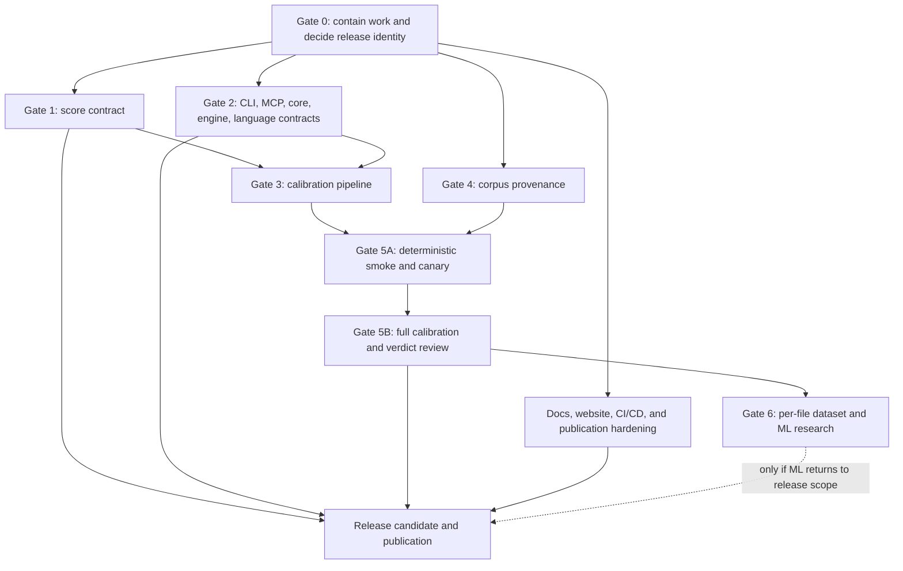

# v0.45 Calibration Continuation and Release-Hardening Plan

**Created:** 2026-07-09

**Status:** Active execution plan — recovery tasks 0–5 executed and reconciled; all broader release gates remain open

**Working project name:** v0.45 calibration, not yet an approved public version

**Latest verified npm/tag release:** v0.43.0

**Scope:** scanner correctness, corpus provenance, calibration infrastructure, rule evidence, ML research boundaries, package/release truth, documentation, website, CI/CD, and publication

> **For agentic workers:** This is a program roadmap, not a single executable implementation task. Before changing code, create a bounded implementation plan for the selected workstream and use `superpowers:subagent-driven-development` (recommended) or `superpowers:executing-plans` task-by-task. Each implementation plan must use failing-test → minimal-fix → full-verification cycles.

**Goal:** Restore trustworthy scanner behavior, calibration evidence, package contracts, public documentation, and release operations before the next public SlopBrick release.

### Recovery execution status (2026-07-09)

The bounded recovery tranche is complete through documentation reconciliation:

- Tasks 0–4 (artifact parity, discovery, completion outcomes, current-data CI,
  and Dart contracts) are approved by their independent reviews. See the
  commit/test ledger in [`v0.45.0-execution-evidence.md`](./v0.45.0-execution-evidence.md).
- Task 5 recorded fresh package-source and repository self-scans. Both scans
  analyzed every requested file with zero failures/skips, but both exited 1
  because `meanSlop` failed. This is not a release pass.
- Gate 0, Gates 1–6, and the documentation/site/operations/release gates below
  remain unchecked until their own evidence exists.

### Post-reconciliation verification (2026-07-09)

Commit `ea9c7c1d1` corrected the Dart signal metadata `aiSpecific` drift and
was independently approved (four files, 19 tests passed). Follow-up verification
after the pinned dependency repair shows structural-clone within budget,
category-separation passing, and parser-kotlin passing after compiling the Node
24 native addon. The calibration-db fixture still discovers zero files, so the
corpus/provenance gate remains open and no full-suite or release pass is claimed.

**Architecture:** Preserve the deterministic rules engine as the product baseline, put I/O behind explicit boundaries, make calibration runs immutable and file-accounted, and promote evidence only through versioned schemas and review gates. Independent workstreams are implemented and reviewed separately, then integrated through consumer and live-deployment tests.

**Tech stack:** TypeScript, Node.js, pnpm workspaces, Vitest, tsup, Astro, Playwright/axe, GitHub Actions, npm trusted publishing, and Cloudflare Pages.

### Global constraints

- preserve the existing dirty worktree and unrelated user changes
- no direct publication, local npm publish, or unreviewed signal-table update
- no production Python dependency in this TypeScript monorepo
- no “working” claim based on unit tests alone; require the relevant integration/consumer/live evidence
- no release claim for a language, command, schema URL, score, model, or deployment path without an executable contract test

---

## 1. Purpose and authority

This is the authoritative continuation of `v0.45.0-handoff.md` after the 2026-07-09 repository-wide audit.

It supersedes the execution order and release commands in:

- `v0.45.0-handoff.md`, especially “Priority 1”, “Priority 2”, “Release checklist”, and the “1–2 days” estimate
- `master-plan-v0.45.md` where it treats v0.44 as shipped or the current ML artifacts as release-ready
- `slopbrick-calibration-plan-v10.2.md` where historical phases are marked complete without the gates defined here
- the calibration section of the root `TODO.md`

Those files remain historical context. They are not safe operating instructions unless this plan explicitly adopts a step.

When sources disagree, use this order:

1. executable code and reproducible tests
2. this plan and its recorded gate evidence
3. the v0.45 handoff
4. older master plans, calibration plans, and TODO notes

This document does not authorize a release. A push to `main`, version tag, GitHub release, production deployment, or npm publication can occur only after every applicable release gate in Section 16 is evidenced.

---

## 2. Audit reset

The handoff estimated the work at roughly 80% complete and prescribed:

1. finish per-file feature extraction
2. train the model
3. run tests
4. release v0.45.0

That sequence is invalid. The post-handoff audit found defects upstream of both calibration and release:

- 755 chunks were expected; 421 have valid output, 144 have recorded error markers, and 190 are entirely missing
- the actual surviving scan covers 75,600 positive and 177,000 negative files: 33.61% positive coverage, 77.81% negative coverage, and 55.84% overall
- the merge labels a pooled fire ratio as “precision” even though the positive and negative denominators differ substantially
- zero-fire rules disappear from the merged report
- zero-fire files disappear from the feature data
- 35 of the advertised 50 model features are constant zero placeholders
- the trainer uses one aggregate row per rule rather than one row per file
- the proposed random file split leaks repository, framework, language, era, and clone identity across train/test
- the positive corpus contains mature human-authored projects without file-level AI provenance
- the “test-excluded” v5 lists still contain at least 19,441 positive and 11,642 negative test-like paths/names
- v5 selects the first 10,000 lexical paths per bucket and has extension/language-list mismatches, so sampling and claimed language coverage are not reproducible or representative
- worker scans ignore the include-rule filter used by calibration
- a timeout can discard a 600-file chunk, and `--skip-existing` treats error markers as completed work
- temporary scan output can be reused across chunks
- the updater emits `WEAK`, which is absent from the canonical verdict type
- the current model is a roughly 3.2 KB aggregate-rule meta-classifier with F1 0.0; it has no product inference path, its ONNX export omits preprocessing, and `models/` is excluded from npm
- score behavior, CLI command flow, MCP configuration, language routing, package metadata, release lineage, and deployment docs have separate release blockers

Therefore:

- do not use the current calibration report to promote or demote rules
- do not run `update-signal-strength.ts` against it
- do not train from `per-file-features-v45.jsonl`
- do not ship `ai-baseline-v0.45.json` or `ai-baseline-v0.45.onnx`
- preserve v10.2a as exploratory evidence; the corrected methodology/run becomes v10.3
- retire “80% complete”; progress is gate-based
- remove ML shipment from the critical path unless explicitly restored after Gate 6

---

## 3. Target release train

Verified public history stops at v0.43.0. v0.44.0 has no verified npm version, tag, or GitHub release, despite documents saying it shipped.

Recommended train:

- **v0.44.0 — trust restoration:** score/CLI/MCP/core correctness, language-routing truth, calibration infrastructure; no model and no unverified calibration claims
- **v0.45.0 — evidence-backed calibration:** completed v10.3 corpus run and manually reviewed rule-verdict changes
- **v0.46.0 or later — optional ML:** only after repository-disjoint evaluation and full product integration

Gate 0 must either adopt this train or record an explicit decision to skip v0.44.0. A mixed state is forbidden.

---

## 4. Completion definition

The program is complete only when:

1. public scores obey one written and tested contract
2. CLI, MCP, core, engine, schemas, caches, package types, and language claims agree
3. every calibration run has an immutable manifest and accounts for every selected file exactly once
4. corpus polarity is supported by evidence, not folder names or intuition
5. AI-signal calibration is separated from general quality-rule validation
6. metrics use explicit positive/negative denominators and include zero-fire files/rules
7. calibration decisions are reproducible, reviewable, and limited to eligible cohorts
8. any ML experiment uses real per-file features with repository-disjoint evaluation
9. package, changelog, docs, site, CLI help, MCP docs, GitHub, npm, and deployment tell the same versioned story
10. the full monorepo, clean-consumer, self-scan, accessibility, security, and release gates pass
11. npm publication uses GitHub Release → OIDC trusted publishing only

---

## 5. Non-negotiable guardrails

Until Gate 0 closes:

- do not use `git add -A`
- do not push the dirty `main` branch
- do not create a version tag or GitHub release
- do not approve a production publish/deploy
- do not overwrite canonical signal strengths
- do not wipe current raw artifacts before hashing and classifying them

Production calibration tooling must remain TypeScript. The repository currently declares Node 20+, but Node 20 is end-of-life as of 2026-07-09. Gate 0 must either raise the supported runtime to maintained LTS versions (recommended: Node 22 and 24) or document and fund an explicit EOL-support policy. Rewrite the current Python scripts in TypeScript or move research training to a separately governed repository.

Positive data requires recorded provenance:

- a reproducible model/prompt generation pipeline
- an explicitly AI-generated benchmark with traceable source metadata
- or manual adjudication under a written labeling protocol

A repository is not positive merely because it looks noisy, is AI-related, is a sample app, or balances a language.

---

## 6. Dependency map



Allowed parallelism:

- Gate 1 and Gate 2 can run in parallel
- corpus provenance can run alongside scanner/pipeline implementation
- CI/CD and site preparation can run early, but final copy waits for frozen release facts
- anything changing discovery, parsing, filtering, rule logic, or issue emission lands before the calibration SHA is frozen
- ML begins only after v10.3 data passes Gate 5

### Planning ranges

These are engineering-effort ranges, not release promises. Re-estimate after Gate 0; corpus acquisition and unattended scan time are separate.

| Wave | Work | Dependency | Initial effort range |
|---|---|---|---|
| 0 | containment, inventory, version/scope decision | none | 0.5–1.5 days |
| 1A | score contract and invariants | Gate 0 | 2–4 days |
| 1B | CLI/MCP/core/engine/language contracts | Gate 0 | 4–8 days |
| 2A | v10.3 schemas, runner, verifier, metrics | Gates 1–2 | 5–10 days |
| 2B | corpus manifest, provenance, leakage review | Gate 0; parallel with 1/2A | 5–15 days |
| 3 | smoke, canary, corrections | Gates 3–4 | 2–5 days plus compute |
| 4 | full calibration and manual verdict review | canary approval | 2–5 review days plus compute |
| 5 | release hardening, docs, site, operations | facts frozen; parts parallel | 3–7 days |
| Optional | valid feature data and ML research | full v10.3 | 5–15 days plus experiments |

The critical uncertainty is corpus provenance, not model training. If verified positive data is insufficient, pause calibration claims rather than compressing Gate 4.

### Required implementation-plan decomposition

Do not hand the entire roadmap to one implementation agent. Produce separate plans under `docs/superpowers/plans/`:

1. scanner worker packaging, lifecycle, self-scan, scores, and output UX
2. core/engine schema, cache, purity, graph, and public-API contracts
3. CLI/MCP command semantics, configuration, and security
4. v10.3 corpus, runner, statistics, verdict review, and optional ML research
5. package, GitHub/npm supply chain, website, Cloudflare, accessibility, and release truth

Each plan names exact files, public interfaces, failing tests, commands, expected failures/passes, and a standalone commit boundary.

### Required review roles

One person may hold multiple roles, but each sign-off must be explicit:

- release owner: version, scope, changelog, publication
- scanner owner: score, CLI, worker, parser, and rule contracts
- data owner: corpus licenses, labels, manifests, and exclusions
- statistical reviewer: method version, thresholds, intervals, and verdict diff
- package/ops reviewer: tarball consumer, CI, npm, Cloudflare, and rollback
- product-truth reviewer: README, CLI/MCP docs, website, and release facts

---

## 7. Gate 0 — preserve, classify, and decide

### Tasks

- [x] **G0-01 — Inventory the dirty tree.**
  - capture `git status --short --branch`, `git diff --stat`, `git diff --name-status`, and all untracked files
  - classify each item as keep/harden, regenerate, research-only, defer, unrelated, or accidental
  - preserve unrelated user changes

- [x] **G0-02 — Preserve current evidence.**
  - hash current chunk results, reports, feature JSONL, and model artifacts
  - record the producing commit/config when discoverable
  - label each artifact exploratory and non-authoritative
  - do not commit raw third-party code from `/tmp` without license/privacy review

- [x] **G0-03 — Move work off dirty `main`.**
  - create a `codex/` recovery branch
  - split existing work into reviewable concern-specific commits
  - use a dedicated worktree for long calibration runs if it prevents code/result drift

- [x] **G0-04 — Resolve accidental or misleading diffs.**
  - restore coherent ESM package metadata
  - inspect and revert only the accidental one-line Kotlin parser diff
  - remove date-only generated website drift
  - remove ML/model claims from package description and changelog
  - add an `[Unreleased]` changelog section until final facts exist
  - classify every current model/script as research or product
  - Evidence: `818207d18` restores the accidental parser/fixture state;
    `b3eed1836` aligns package/changelog metadata to the unreleased v0.44.0
    train and labels historical calibration paths as internal context.

- [x] **G0-05 — Decide the release train.**
  - recommended: next public version v0.44.0
  - alternative: explicitly document intentional v0.44.0 skip
  - eliminate every false “v0.44 shipped” statement
  - Decision recorded in `v0.45.0-gate0-evidence.md`: adopt v0.44.0 trust
    restoration; current v0.45.0 metadata remains unreleased staging.

- [x] **G0-06 — Freeze scope.**
  - recommended v0.44: trust restoration, no ML
  - decide whether Dart/Ruby/PHP/C# are completed or removed from claims
  - move deferred work to a later milestone rather than describing it as shipped
  - Decision recorded: these languages remain experimental/default-off and are
    excluded from public support claims until their gates pass.

- [x] **G0-07 — Define artifact ownership.**
  - code/schemas/small summaries in repo
  - raw corpora and file-level runs in a configurable external root
  - committed evidence contains hashes, counts, settings, metrics, and decisions
  - Ownership and hashes are recorded in `v0.45.0-gate0-evidence.md`.

### Gate 0 evidence

- [x] recovery branch and reviewed diff inventory — [`v0.45.0-gate0-evidence.md`](./v0.45.0-gate0-evidence.md), branch `codex/v0.45-recovery`
- [x] v10.2a evidence hash ledger — directory and artifact digests recorded in [`v0.45.0-gate0-evidence.md`](./v0.45.0-gate0-evidence.md)
- [x] one next-version decision — v0.44.0 trust restoration
- [x] frozen feature/language scope — no unverified language/ML claims
- [x] no release action taken — no tag, push, GitHub release, npm publication, or production deployment

---

## 8. Gate 1 — restore the score contract

### 8.1 Normative semantics

- [ ] **SCORE-01 — Define every public score.**
  - `aiSlopScore` uses enabled AI-specific evidence only
  - `hygieneScore` reflects maintainability/quality findings
  - `repositoryHealth` is always higher-is-better
  - `backendScore` explicitly states whether it is risk, finding density, or health
  - define bounds, rounding, empty input, suppression, and denominator
  - Partial implementation evidence: `9e1bf8d97` adds optional `scoreBasis`
    provenance (effective issue set, analysed-file denominator, suppression and
    parse-error counts) across report/health artifacts. Full public semantics
    and empty/suppression contract review remain open.
  - Renderer-contract evidence: `9fb68690c`, `f28db4525`, and `9fcb46b33`
    centralize the four score briefs and the Repository Health formula,
    propagate numeric scores plus score basis through JSON, Markdown, terminal,
    HTML, SARIF, and MCP, and retain disabled findings only in audit formats.
    The report/MCP contract slice passes 182/182 under independent review.
  - Canonical-health evidence: `b1b25ea09`, `614d43f03`, `3b869688a`, and
    `8779c1a49` remove the stale Phase-12 headline overwrite. Final scans,
    watch, health persistence, renderers, and documentation now use the
    published four-axis formula; a suppressed-test/non-default formula
    regression independently reconstructs the final headline.

- [ ] **SCORE-02 — Build one effective issue set.**
  - apply `defaultOff`, constitution suppression, ignores, path filters, and config toggles before aggregate scoring
  - every renderer consumes the same effective set
  - Partial implementation evidence: `b0c169701` filters default-off and
    suppressed findings before aggregation while retaining audit records;
    targeted scan, metrics, SARIF, structure, and TypeScript checks pass.
    Cross-renderer golden parity remains open.
  - `9fb68690c` makes the HTML report consume the actionable (non-`off`)
    finding view like terminal output while JSON and SARIF intentionally retain
    audit history. The fixed golden contract covers that boundary.
  - `614d43f03` shares directive/default-off normalization between scan and
    watch scoring while retaining `off` audit findings, so incremental output
    cannot score or present the same effective set differently.

- [x] **SCORE-03 — Enforce category separation.**
  - non-AI security/docs/hygiene rules cannot change AI Slop
  - category interactions exist only when the contract declares them
  - Evidence: `0ed1fe300` isolates explicit non-AI findings from the AI score;
    metrics/composite/category-separation tests pass (41 focused tests).

- [x] **SCORE-04 — Fix directionality once.**
  - adding unsuppressed harmful evidence cannot improve Repository Health
  - calculate health in one place; do not overwrite it later with a contradictory formula
  - Evidence: `1daa779bc` inverts raw aiSlopScore for repository health and
    adds monotonic coverage; `28b3f8ae7` aligns JSON/MCP score briefs;
    `1d04106fa` aligns telemetry and terminal brief wording. Focused
    score/maintenance/MCP/report tests pass (48/48). `b1b25ea09` removes the
    competing enrichment overwrite, and `614d43f03` aligns the exact final
    score inputs and watch behavior under independent review.

- [x] **SCORE-05 — Use a real exposure denominator.**
  - choose analyzed files, analyzed LOC, tokens, or relevant syntax nodes
  - remove UI-component-count normalization from backend scoring
  - use the same definition in CLI, JSON, MCP, SARIF metadata, and health artifacts
  - Implementation evidence: `7a81a4158` uses analyzed file count rather than
    UI component count and adds a backend/CLI regression; `9e1bf8d97` and
    `fbc6da3dd` propagate the same `scoreBasis` metadata through JSON, pretty,
    Markdown, HTML, SARIF, MCP, and health artifacts.
  - Invariant evidence: `622814466` deduplicates fired rule IDs before LR
    combination; engine 52/52 and SlopBrick LR/guardrail tests pass. SCORE-01
    and SCORE-02 remain open for the full public semantics/golden contract.

### 8.2 Tests

- [ ] no findings, empty repository, tiny repository, large repository
- [ ] AI-only, hygiene-only, backend-only, and mixed findings
- [x] suppressed and default-off findings
  - `769e0f3da` verifies through `runScan` that default-off and next-line
    directive findings leave all four effective scores and the exposure
    denominator unchanged, while their audit evidence remains observable.
- [ ] score bounds
- [ ] health monotonicity
- [x] suppression invariance
  - The same run-level contract checks default-off audit counts and parsed
    directive facts, with scan-completion passing 21/21 under independent review.
- [ ] category separation
- [x] input-order invariance for aggregate scoring
  - `1376358a7` and `9142cf9bf` add a decimal-weight permutation contract and
    canonicalize Bayesian, AI-bucket, and category weighted evidence sums.
    The prior arithmetic produced one-ULP score drift for equivalent inputs;
    metrics passes 40/40 and independent review approved the fix.
- [x] serial/worker equivalence for resolved workspace scans
  - `378543990`, `0914b5e98`, and `a1779f989` compare a direct scan with the
    worker path under the same configuration and registry. The regression
    exposed and fixed worker use of the process cwd instead of the requested
    workspace; fixtures cover workspace exclusions, default-off findings,
    next-line directives, canonical per-file results, all four scores, and
    `scoreBasis`. Independent review and the focused CLI suite pass 19/19.
- [x] CLI/MCP single-file and renderer score/provenance contract
  - `8b8172fe9` covers resolved-config single-file parity; `f28db4525`
    covers persisted-health MCP scores/basis/briefs and all report renderers.
- [ ] whole-project CLI/MCP golden report agreement

### Gate 1 evidence

- [ ] approved scoring contract
- [ ] invariant/property tests green
- [ ] no duplicate or overwriting score formula remains

---

## 9. Gate 2 — restore platform contracts

### 9.1 CLI and worker lifecycle

- [x] **CLI-00 — Fix packaged worker resolution and bound worker failure.**
  - Evidence: reviewed worker lifecycle/package commits through `1a306d2ba`,
    plus source/build parity in `e8b7a2d4f`.
  - current reproduction: a whole-platform scan resolves a nonexistent `dist/engine/worker.cjs` while the build emits `worker.js`/`worker.mjs`
  - a worker that dies before receiving a file currently triggers an uncapped replacement loop; the 2026-07-09 self-scan reached roughly 3,500 threads/file-descriptor pairs and ended with `EAGAIN` without scores
  - add a post-build/tarball test that asserts every resolved worker entry exists
  - run a >3-file scan from the packed tarball under Node 22 and 24
  - cap startup failures, reject the scan once the cap is reached, await worker termination, and prove resources return to baseline
  - record peak threads, open descriptors, RSS, elapsed time, and completed files in a regression budget
  - never respawn indefinitely when no file was assigned

- [x] **CLI-01 — Return typed outcomes instead of exiting inside scan actions.**
  - Evidence: `f94805af8`/`2090a5ba6`/`0da9150f5` and completion-outcome tests.
  - only the top-level entry sets `process.exitCode`
  - `ci` and `watch` consume scan results

- [x] **CLI-02 — Make every advertised flag observable.**
  - Partial evidence: `6fbfa2b11`/`f45ea9af5` correct the brief-report footer
    and keep the UX suite green (41 tests). `40b2de70f` normalizes Commander
    spellings (`--threads`, `--diff`, `--refresh-snippets`, `--security-only`,
    `--full`, `--verbose`, `--no-color`) into the scan contract; `--full`
    explicitly overrides a composed `--brief`, verbose counters go to stderr,
    and color overrides reset between runs. `scan-completion` now covers a
    four-file security-only worker scan. `f612ba0a0` adds a packaged
    subprocess smoke for `--threads`, `--verbose`, `--brief --full`, and
    `--no-color`; `27dd71568` forwards the refresh option through finalize
    persistence and adds an initialized-AGENTS subprocess regression. A full
    audit of every remaining advertised flag/alias remains open. `380ca1701`
    covers JSON/HTML output-file forms and `--no-telemetry` in a packaged
    subprocess (scan-completion 17/17). `2c46c2466` adds CI forwarding coverage
    and aligns `--max-slop` with raw `aiSlopScore` semantics. The named
    flag/alias subprocess audit is complete; do not remove a published flag
    without a migration note.

- [x] **CLI-03 — Forward all filters to workers.**
  - Evidence: `043a0dc35` and `7635d2678` expose and thread rule/include/exclude
    filters through worker data and add a >3-file regression; scan-completion,
    typecheck, and build pass.
  - include/exclude rules
  - paths and languages
  - size caps
  - config and constitution
  - add a >3-file test proving inline, worker, direct `scanFile`, and calibration subprocess parity

- [x] **CLI-04 — Command smoke tests.**
  - Focused evidence: built `dist` binary smoke-tested JSON scan, `--security-only`,
    `--verbose`, `--brief --full`, and a SIGINT watch lifecycle; existing CI
    pass/fail/JSON tests pass. `d268d629b` maps malformed config syntax to the
    documented exit-2/config-validation path, and MCP initialize returns valid
    JSON-RPC. `ebcdd8865` fixes source `dev -- --help` parity; packaged-worker
    and pack-consumer suites cover built/packed surfaces. Focused command smoke
    and source/build/tarball checks pass.

- [x] **CLI-05 — Make CI gating authoritative.**
  - Evidence: `f94805af8` through `0da9150f5`; CI tests cover current report,
    thresholds, incomplete scans, malformed config, JSON, and no-increase.
  - `2c46c2466` aligns `--max-slop` with the documented raw `aiSlopScore`
    ceiling; clean scans pass and a noisy markdown-leakage fixture fails.
  - scanning returns a typed result before any process exit
  - CI applies thresholds, writes CI-specific machine fields, then selects the documented exit code
  - add subprocess tests for pass, each threshold failure, scan failure, incomplete scan, and malformed config

- [x] **CLI-06 — Require source/build/tarball parity.**
  - Evidence: `e8b7a2d4f` and pack-consumer `640e6124c`; source, CJS/ESM,
    declarations, and packed artifact tests pass.
  - `pnpm dev -- --help`, built binary, and packed binary expose the same commands and semantics
  - current source dev fails through a CJS/ESM `unicorn-magic` export error
  - test help, version, ≤3-file inline scan, >3-file worker scan, CI, and MCP from all three surfaces

### 9.2 MCP

Boundary evidence: `eb7303272` and `77077e31f` constrain file tools to the
configured workspace, reject traversal/outside symlinks, and bind existing
reads to validated realpaths. Focused MCP tests pass 39/39; config/result
parity and protocol-wide contract tests remain open.

Configuration parity evidence: `060714730` resolves workspace configuration
once at MCP startup, injects it into tool handling, and rejects invalid config
instead of silently using defaults. MCP server/pattern tests pass 41/41.

Transport evidence: `ad5536dd4` keeps the MCP process open until all pending
async tool responses settle, preventing truncated responses for embedders;
server/pattern/suggest tests pass 53/53. `8b8172fe9` adds a single-file
CLI↔MCP parity contract under one resolved workspace configuration, including
framework, severity override, suppressions, telemetry setting, findings, and
composite result fields. It canonicalizes the existing-file path at the MCP
realpath boundary; focused MCP tests pass 43/43.

- [x] load the resolved project config, constitution, ignores, and path filters
- [x] constrain requested paths to the configured workspace; test traversal and symlinks
- [x] generate docs from the actual registry of seven tools
  - `0d89b3abf` reconciles `docs/MCP.md` with the seven canonical registry
    tools, current request fields, score/composite output, and removed-tool
    status. `51056e179` adds the generated registry block, a
    `generate:mcp-docs` check/write command, and two drift-contract tests.
- [x] validate request/response schemas and registry enumeration
  - Evidence: `fa4ea80e1` restores promised `compositeScore` fields; full MCP
    suite passes 62/62.
- [x] compare MCP and CLI results under the same resolved config/constitution
  - `060714730` loads and injects the resolved workspace config at MCP startup;
    `8b8172fe9` verifies canonical path, parser/component outcome, composite
    score, and every finding using the same loaded configuration. The coverage
    is single-file; multi-file project-report parity remains a Gate 1 renderer
    contract rather than an MCP configuration blocker.
- [x] reject generic “AI” remediation that conflicts with formatters or engineering practice
  - `d365fc043` replaces the whitespace heuristic's manual-formatting advice
    with formatter-safe configuration guidance; rule and hint tests enforce it.
- [x] include evidence category, confidence limits, why-it-fired facts, and a suppression/config explanation in rule output
  - `d365fc043`, `6b6bbdf8d`, and `6048c5011` share CLI/MCP explanations,
    expose historical point estimates with explicit unavailable confidence
    limits, and emit static policy state plus bounded, redacted issue facts.
    The 2 KiB/64-node/128-key contract prevents path/source/size leakage;
    MCP/explain verification passes 80/80 under independent review.

### 9.3 Core, engine, package

- [x] **CORE-01 — Separate cache namespaces/formats.**
  - core artifact cache and SlopBrick incremental cache cannot share a filename
  - version/discriminate each format and safely ignore unknown versions
  - Evidence: `e28f636ee` moves the core freshness cache to
    `.slopbrick/cache.json` and adds a collision regression; core and
    SlopBrick structure tests pass.

- [x] **CORE-02 — Fix atomic path construction.**
  - no `.slopbrick/.slopbrick` nesting
  - Evidence: `44db5737a` and core structure regression coverage; core tests and
    TypeScript validation pass.

- [x] **CORE-03 — Make validators match JSON Schemas.**
  - required fields, enums, nested objects, defaults, and additional properties
  - run valid/invalid fixtures through runtime and schema validators
  - Evidence: `549d49af5` plus `116c0e621`; AJV fixtures, runtime validators,
    39 core tests, codegen freshness, and TypeScript pass.

- [x] **CORE-04 — Replace schema CI stubs with real validation.**
  - compile schemas, validate examples/index/package contents
  - Evidence: `549d49af5` adds `validate:schema` with AJV fixtures and wires the
    CI job to run it; direct validation passes.

- [x] **CORE-05 — Align `structure` output and schema.**
  - define Markdown as a derived rendering or correct the contract
  - Evidence: `fce14364f` and `a26b91a2a` define the schema as a structured JSON
    projection, document `structure.md` as derived Markdown, and preserve the
    old TypeScript export as an alias.

- [x] **CORE-06 — Verify live schema delivery.**
  - Evidence: `fce14364f`/`a26b91a2a` add schema index/package delivery tests;
    core tests, codegen freshness, AJV validation, and TypeScript pass.
  - publish inventory, constitution, structure, health, and index as actual static JSON assets
  - assert HTTP status, JSON-compatible content type, parse success, expected `$id`, and local/remote hash equality
  - fail when Cloudflare returns an HTML SPA fallback with HTTP 200

- [x] **CORE-07 — Make freshness and cache migration truthful.**
  - give core artifacts and incremental scans distinct versioned cache paths
  - compare the recorded hash as well as mtime, or remove the hash field/claim
  - migrate without overwriting either cache format
  - Evidence: `e28f636ee` separates `.slopbrick/cache.json` from the root
    incremental cache and adds collision regression coverage.

- [x] **CORE-08 — Complete schema contract fixtures.**
  - validate every writer output with a Draft 2020-12 validator
  - reject invalid bounds, counts, enums, dates, fingerprints, and nested records
  - add health save/load roundtrip and direct health-validator tests
  - make codegen/build idempotent and leave a clean tree
  - Evidence: `549d49af5`/`116c0e621`/`fce14364f`/`a26b91a2a`; AJV fixtures,
    runtime validators, codegen, and 44 core tests pass.

- [x] **ENGINE-01 — Restore the pure-engine boundary.**
  - Evidence: `01aa7a7be` exports pure `parseSource` while retaining
    `parseFile` as an explicit filesystem adapter; `fc91db6d9` updates the
    architecture and CLI comments. Engine tests, typecheck, and build pass.
  - move filesystem work behind adapters or correct package claims

- [x] **ENGINE-02 — Correct or quarantine Louvain output.**
  - Evidence: `060714730` normalizes parallel/reversed edges before total edge
    weighting; engine 48/48 tests, typecheck, and build pass.
  - prove against reference fixtures or disable it from product decisions
  - use a brute-force small-graph modularity oracle
  - require every accepted move to be monotonic
  - require a complete K4 graph to improve from singleton Q=-0.25 and converge to Q=0

- [x] **ENGINE-03 — Make public API documentation executable.**
  - generate docs from actual exports/signatures
  - use an exact API snapshot rather than presence-only assertions
  - compile and execute every documented example
  - fail when a documented symbol is absent or an argument order/signature drifts
  - Evidence: `a836c9e77`, `87c4d9762`, `d58634c85`, and `a2230119a`
    add the exact `@usebrick/engine/pure` runtime contract, compile and execute
    documented examples, and fresh-build the Core-verdict → Engine-pure artifact
    closure in the test itself. Engine tests pass 56/56; Core verdict and
    package type/build checks pass.

- [x] **ENGINE-04 — Enforce or withdraw purity.**
  - if purity is retained, dependency tests prohibit `node:fs`, `globby`, process exits, and console output in the pure layer
  - discovery/read/write live behind adapters with behavioral integration tests
  - otherwise rename/re-document the package boundary honestly
  - Evidence: the pure subpath rejects filesystem/globby/process/console
    dependencies across every freshly built reachable chunk, while the legacy
    root API remains explicitly adapter-capable. Documentation calls the pure
    surface host/editor-safe rather than browser-portable; structure persistence
    remains root-only pending its own Core-I/O split.

- [x] **PKG-01 — Emit self-contained public declarations.**
  - published types cannot import private workspace-only `@usebrick/core`
  - prove in a clean external consumer
  - Evidence: `640e6124c` inlines workspace declarations and adds pack-consumer
    tests; dts, pack, and TypeScript checks pass.

- [x] **PKG-02 — Restore module metadata.**
  - reconcile `type`, exports, build files, the Gate 0 LTS policy, dev command, ESM, and any claimed CommonJS support
  - Evidence: `e8b7a2d4f` restores explicit ESM/CJS artifacts and source/build
    parity; package integration tests pass.

### 9.4 Language matrix

Each advertised language needs discovery → parsing/fact path → rule execution → end-to-end CLI evidence.

- [x] create one generated support matrix with extension, language ID, parser, rules, defaults, fixtures, and calibration eligibility
  - Evidence: `9354344cb` adds the deterministic `generate:language-matrix`
    script and generated `docs/language-support-matrix.md`; `--check` passes.
- [x] route Dart/Ruby/PHP through the intended parserless/blank-module path rather than SWC failure
  - Evidence: existing backend routing plus `894ef1670` Dart visitor coverage;
    Dart parserless regression passes.
- [x] make C# discoverable/routed or remove it from claims
  - Evidence: `5e49764c8` routes `.cs` through the source-preserving parser,
    adds default discovery, and passes parser/discovery/rule tests.
- [x] complete all four Dart rules: tests, `RULE_HINTS`, signal metadata, default state, registry/catalog, CLI fixture
  - Evidence: `158ee8011`/`ea9c7c1d1`; Dart contracts, hints, signal guardrails,
    and ai-specific drift tests pass.
- [ ] generate README/site/help/MCP claims from the matrix

### 9.5 Scan-output correctness and UX

- [ ] never emit headline scores when the scan is incomplete; show a prominent partial/failed status
  - Compatibility-safe implementation evidence: `074ccd1aa`, `fb65d13df`,
    `5b325332f`, and `4d9942745` retain legacy numeric fields but attach
    `scoreValidity: incomplete|not-applicable`; every human renderer, SARIF,
    persisted health, and MCP carries the non-gating state. Thresholds and
    history refuse invalid scores. A future wire-version decision is still
    required before removing numeric fields altogether.
- [ ] report requested, analyzed, zero-finding, excluded, parse-failed, timed-out, and crashed file counts
  - Partial implementation evidence: `caf41e1e3`, `635838c14`, and
    `ff8c1e617` add optional terminal `scanAccounting` and separate,
    additive `selectionAccounting`. The latter records only observed candidates
    with exclusive config/type/extensionless/outside-workspace/git-scope counts;
    direct-file and self-scan semantics are intentionally unchanged. Core,
    health, MCP, SARIF, JSON, and terminal contracts cover the aggregate data.
    Unobservable glob/ignore/deleted-path populations remain deliberately out
    of scope rather than being fabricated.
- [ ] make score directionality and contributing categories visible
- [ ] separate AI-specific evidence from engineering hygiene in wording and grouping
- [ ] show the exact matched fact/snippet, rule status, calibration cohort, and remediation rationale
- [ ] add `--explain-score` and machine-readable score-contribution output
- [ ] make hints formatter-compatible and technically useful; prohibit advice whose sole purpose is to look less AI-generated
- [ ] validate a stratified sample of self-scan findings manually before using self-scan scores as release evidence
- [ ] test terminal width, color/no-color, redirected output, keyboard copy, broken pipes, and deterministic JSON
- [ ] define stable exit codes for clean, findings/threshold breach, partial scan, config error, and internal failure

### Gate 2 evidence

- [x] inline/worker/filter parity
  - Evidence: CLI-03 filter-forwarding and scan-completion suites pass.
- [x] `ci`/`watch` subprocess tests
  - Evidence: `tests/cli.test.ts` 62/62 and CI/watch smoke tests pass.
- [x] MCP config/security contract
  - Evidence: workspace/symlink boundary, resolved-config injection, and
    invalid-config tests pass; async response flushing is covered by `ad5536dd4`.
- [x] schema/validator parity
  - Evidence: core 45/45 tests, codegen contract, AJV fixtures, and scoreBasis
    health-schema validation pass.
- [x] clean package consumer
  - Evidence: pack-consumer 2/2 plus ESM/CJS/declaration checks pass.
- [ ] all advertised languages pass all four layers
- [x] self-scan output passes the manual correctness/usefulness review
  - Evidence: rebuilt packaged v0.44.0 self-scan completes 328/328 with no
    parse failures or stderr noise; JSON exposes score direction and
    `scoreBasis` provenance. Fresh results are recorded in `.superpowers/sdd/progress.md`.

---

## 10. Gate 3 — build a lossless v10.3 calibration pipeline

### 10.1 Canonical artifacts

```text
$SLOPBRICK_CALIBRATION_RUNS/
  <run-id>/
    run-manifest.json
    corpus-selection.jsonl
    observations.jsonl
    failures.jsonl
    chunks/
    coverage.json
    rule-metrics.json
    language-metrics.json
    report.md
    logs/
```

`run-manifest.json` records:

- run ID/time, git SHA, dirty flag, package version
- Node/pnpm/platform versions
- schema and calibration-method versions
- registry, signal table, config, corpus manifest, and file-list hashes
- selection seed/policy
- expected file/chunk IDs per polarity
- include/exclude/size/timeout settings
- worker count and command arguments

### 10.2 Stable observations

Every selected file has a stable ID derived from source/family, pinned revision, and normalized relative path—not a local absolute path.

Every file terminates exactly once as:

- success with findings
- success with zero findings
- excluded, with reason
- parse failure
- timeout
- scanner failure

Required invariant:

```text
requested = successful + excluded + failed
```

Duplicates, missing records, stale hashes, corrupt JSON, unexpected records, and manifest mismatches fail closed.

### 10.3 Timeout/retry

Replace whole-chunk loss:

1. schedule bounded chunks, initially 50–100 files
2. use a unique run/chunk/attempt output and atomic completion rename
3. on timeout/crash, bisect recursively
4. isolate to one file
5. retry once under a documented longer timeout
6. persist a terminal status
7. never skip an error marker
8. resume only if input, scanner, registry, config, and feature-schema hashes match

A longer whole-chunk timeout is not a fix.

### 10.4 Coverage gates

- 100% of selected inputs accounted for
- ≥98% successfully scanned overall
- ≥95% successfully scanned in every claimed language/polarity stratum
- success-rate gap between polarities ≤2 percentage points per language
- no repository above 10% failure
- zero unexplained missing/corrupt output

Below-gate runs remain diagnostic only.

### 10.5 Separate two evidence tracks

1. **AI-signal calibration**
   - only rules explicitly marked `aiSpecific`
   - evaluated on verified AI/human labels

2. **Quality-rule validation**
   - security, accessibility, dead code, duplication, language hygiene, and similar rules
   - evaluated with rule-specific positive/negative fixtures, mutation tests, and FP audits
   - general quality rules are not demoted because they fail to predict AI authorship
   - their normal canonical verdict is `HYGIENE`

### 10.6 Metrics

For each AI-specific rule:

```text
P  = eligible verified-AI files
N  = eligible verified-human files
TP = positive files where the rule fired
FP = negative files where the rule fired

TPR / recall = TP / P
FPR          = FP / N
LR+ / lift   = smoothed TPR / smoothed FPR
balanced PPV = TPR / (TPR + FPR)
PPV(prior)   = prior*TPR / (prior*TPR + (1-prior)*FPR)
```

Report:

- TP, FP, P, N
- Wilson intervals for TPR/FPR
- repository-cluster bootstrap intervals for LR+, PPV, and F1
- repository- and language-macro metrics first
- file-micro metrics second
- declared deployment prior for prevalence-adjusted PPV

Never call `TP/(TP+FP)` deployment precision when the two corpus arms are sampled independently.

Concrete audit example: `ai/comment-ratio` has TPR 33.71%, FPR 21.95%, LR+ 1.536, and balanced PPV 60.57%. The current pooled-count calculation reports 39.62% because only 29.93% of surviving files are positive, then treats the rule as inverted. That change in verdict is caused by the sampled class mixture, not by the rule.

Initialize from the complete registry so zero-fire rules appear. Distinguish zero-fire, not executed, and ineligible.

### 10.7 Verdict policy

Canonical verdicts are exactly:

- `USEFUL`
- `OK`
- `NOISY`
- `INVERTED`
- `HYGIENE`
- `DORMANT`

Do not emit `WEAK` or create `INSUFFICIENT_DATA` as a runtime verdict. Insufficient data is calibration evidence and leaves the rule unchanged/default-off.

Initial default-on AI-signal proposal:

- explicitly `aiSpecific`
- lower 95% CI for LR+ ≥1.5
- lower 95% CI for recall ≥0.10
- upper 95% CI for FPR ≤0.10
- lower 95% CI for balanced PPV ≥0.60
- at least 30 positive fires across five positive source families
- eligible language/source cohort
- direction replicated across at least three independent families

Classify `INVERTED` only if the upper 95% CI for LR+ is below 1. Finalize thresholds after the pilot and freeze them before the full run.

### 10.8 Statistical governance

- preregister eligible rules, primary metrics, thresholds, exclusions, and analysis version before the confirmatory full run
- separate discovery/canary data from the untouched confirmatory cohort
- control the false-discovery rate across the family of evaluated AI rules (initial method: Benjamini–Hochberg), and report adjusted as well as raw values
- perform per-rule/cohort power analysis; replace fixed support thresholds when they cannot estimate the required FPR/recall bounds
- treat repository/source family as the resampling unit
- require a blinded manual audit of sampled true-positive and false-positive findings, with two reviewers and adjudicated disagreements
- publish every exploratory analysis separately from confirmatory claims

### 10.9 Canonical machine output and tests

- JSON is authoritative; Markdown is generated and never parsed downstream
- all JSON validates against versioned schemas
- test unequal arm sizes, zero cells, zero-fire rules/files, missing/corrupt/duplicate/stale records, timeout bisection, paths with spaces, filter propagation, resume hash mismatch, determinism, and serial/worker equivalence
- disable telemetry, flywheel writes, baseline mutation, and AGENTS refresh during calibration

### Gate 3 evidence

- Chunk accounting evidence: `ce6fb90b3` and `954ce523a` record malformed or
  truncated chunk outputs as skipped errors, preserve `_firstFile` metadata,
  and exclude incomplete chunks from denominators. Focused calibration/UX
  tests and TypeScript validation pass.

- Portability evidence: `6ac82b9c4` removes machine-specific repository and
  corpus paths from the parallel calibration shell wrappers; script syntax and
  merge accounting tests pass. Corpus lists are now explicit inputs rather than
  implicit local paths.
- Runtime path evidence: `021fc7af7` makes the shared TypeScript corpus-path
  adapter use an explicit `SLOPBRICK_CORPUS_DIR` or repository-local fallback;
  custom-path calibration and scan-completion checks pass. Legacy historical
  research scripts remain diagnostic-only and are not release evidence.

- Stale-output evidence: `73dc5238d` removes a prior chunk's temporary JSON
  before each attempt, records malformed JSON as an error chunk, and cleans the
  temporary artifact after successful aggregation; calibrator/merge tests pass
  (15 focused tests).
- CLI calibration controls: `d126df6f8` exposes bounded `--chunk-timeout`,
  repeatable rule include/exclude filters, parserless language routing, and
  skipped-chunk Markdown reporting; calibrator tests and TypeScript validation
  pass. Provenance/coverage gates still govern whether any run is usable.
- Machine-artifact evidence: `018b7b6b5` writes canonical
  `calibration-empirical.json` from the same aggregate used for Markdown and
  adds a fixed-timestamp determinism test. The merger test suite (4/4) and
  SlopBrick TypeScript validation pass.

- [ ] TypeScript implementation; no hard-coded `/Users/cheng` path
- [ ] complete synthetic test matrix
- [ ] 100% smoke accounting
- [ ] two smoke runs produce identical metrics after timestamp normalization
- [x] machine JSON and generated Markdown agree for the merge artifact
  - The merged JSON is the direct source for Markdown rendering. This does not
    replace the pending versioned v10.3 schema or a full-run determinism check.

---

## 11. Gate 4 — rebuild corpus provenance

### 11.1 Versioned manifest

Each repository/file records:

- stable repository/family ID
- origin URL and immutable commit
- acquisition date and license
- parent/fork/clone family
- language and source/test/generated/vendor/minified stratum
- label: `verified_ai`, `verified_human`, `mixed`, or `quarantine`
- evidence and evidence URL
- for AI: generator/model, prompt/task ID, date, and human-edit status
- content hash and near-duplicate cluster
- train/validation/test eligibility

The corpus release also includes a dataset card/datasheet covering motivation, composition, collection, labeling, preprocessing, licenses, intended uses, prohibited uses, maintenance, and known limitations.

### 11.2 Required corrections

- [ ] quarantine human projects currently used as positives unless file-level evidence exists
- [ ] treat the manifest—not a `positive/` directory—as truth
- [ ] use verified paired human/AI tasks as the primary gold corpus
- [ ] keep weaker silver data training-only, never primary test evidence
- [ ] group forks, nested repos, copied baselines, templates, and near-clones
- [ ] replace lexical `head -10000` sampling with seeded, hash-based, repository/language-stratified sampling
- [ ] fix language discovery mismatches in the v5 builder
- [ ] classify test-like filenames as well as directories
- [ ] report production source and test sensitivity as separate strata
- [ ] generate file lists only from the manifest
- [ ] keep human-AI coauthored/mixed files as a separate evaluation stratum rather than forcing them into a binary label
- [ ] create adversarial “humanized AI”, lightly edited AI, templated human, generated/vendor, and cross-domain challenge sets
- [ ] evaluate a reviewed external benchmark such as DroidCollection as an out-of-domain test; do not merge it into training without license, overlap, and provenance checks

### 11.3 Leakage and eligibility

- no repository/family/content cluster appears in both polarities
- no family or paired-task group crosses data splits
- every positive gold label has provenance
- every exclusion remains counted with a reason
- per-language standalone claims require ≥1,000 gold files and ≥5 independent families in each polarity
- otherwise report insufficient data and keep rules unchanged/default-off

### Gate 4 evidence

- [ ] 100% of evaluated files trace to reviewed manifest records
- [ ] zero unproven positives in gold/evaluation data
- [ ] zero family/hash leakage
- [ ] reproducible file lists from pinned commits
- [ ] approved language/repository/stratum balance report

---

## 12. Gate 5 — smoke, canary, full calibration, review

### 12.1 Smoke

- 100 verified-AI and 100 verified-human files
- multiple repositories/languages
- forced zero-fire, timeout, failure, and resume cases
- execute twice and compare

Purpose: mechanics, not rule quality.

### 12.2 Canary

- at least 10,000 files
- every eligible language
- several independent families per polarity
- fixed seed and frozen manifest

Review:

- coverage/failure bias
- repository dominance
- TPR/FPR distributions
- per-language support
- bisection/runtime/storage behavior
- inline/worker spot checks

Freeze method/thresholds after canary. Changes after seeing full outcomes create a new method version.

### 12.3 Full passes

1. **Pass A:** production files, tests excluded
2. **Pass B:** repository/language-balanced sensitivity sample
3. **Pass D:** tests included, sensitivity only
4. **Pass C:** reviewed verdict application after A/B comparison

Do not overwrite v10.2a. Freeze scanner SHA, registry, config, corpus manifest, file lists, and feature schema before v10.3 execution.

### 12.4 Rule decision record

Every proposed change includes:

- rule ID/current verdict/default state
- category, language, `aiSpecific` flag
- TP/P and interval
- FP/N and interval
- LR+/PPV and intervals
- repository/language macro results
- largest contributing families
- eligibility
- proposed canonical verdict
- reviewer rationale
- linked positive and negative examples

Generate a dry-run diff from canonical JSON. Reject unknown verdicts/rules, preserve manual annotations, and require explicit approval before writing. Put signal changes in one reversible commit.

### Gate 5 evidence

- [ ] smoke deterministic
- [ ] canary thresholds met and method frozen
- [ ] full run meets all coverage gates
- [ ] complete registry appears in report
- [ ] every changed rule has a reviewed record
- [ ] registry/catalog/guardrail/full tests pass after proposed changes

---

## 13. Gate 6 — valid per-file data and ML research

This gate is research-only by default and does not block a non-ML release.

### 13.1 Dataset

Retire the current JSONL. Every successfully scanned file—including zero-fire files—gets one row with:

- dataset/feature schema version
- stable file, repository-family, task, and duplicate-cluster IDs
- source revision, label tier, provenance reference
- language and stratum
- split
- run/scanner/registry/config hashes
- parse/status metadata
- ordered feature names/values

### 13.2 Features

- use the same `facts.v2` path available at inference
- implement all advertised features or call it an honest 15-feature model
- normalize counts by LOC/tokens where appropriate
- distinguish zero from unavailable with missingness indicators
- remove constants and label/repository-name leakage
- add training/inference feature-parity golden tests

### 13.3 Splits

Random file-level splitting is prohibited.

- deterministic 60/20/20 train/validation/test by repository/clone family
- stratify by label and language
- keep paired-task variants and near-duplicate clusters together
- lock test before threshold selection
- add temporal/generator-family out-of-distribution holdout
- add leave-one-generator, leave-one-domain, and leave-one-language-out reports where support permits
- balance only training; never mutate evaluation prevalence

### 13.4 Controls and model

Train:

1. majority/intercept baseline
2. language-only and repository-metadata controls
3. simple rule-voting baseline
4. grouped logistic regression
5. label-shuffle sanity check

Use repository-balanced weights. Tune regularization/threshold on grouped validation only. Export preprocessing and classifier together, then verify JSON/ONNX parity. Prefer transparent JSON weights for a linear model unless ONNX has a measured benefit.

### 13.5 Metrics and research acceptance

Report:

- confusion matrix, precision, recall, F1
- ROC-AUC and PR-AUC
- Brier score and calibration error/curve
- reliability diagrams and log loss; do not interpret aggregate Brier score as calibration alone without its discrimination/reliability decomposition
- validation-selected operating threshold
- repository-bootstrap confidence intervals
- repository/language macro and file-micro metrics
- zero-fire-file performance
- temporal/generator holdout
- ablation and feature importance

Initial experimental acceptance proposal:

- repository-macro F1 ≥0.60, lower 95% bound ≥0.55
- AUROC lower 95% bound ≥0.70
- ≥0.05 macro-F1 or AUPRC improvement over language-only control
- FPR upper 95% bound ≤5% at chosen threshold
- score coverage ≥98%
- Brier better than class-prior baseline and ECE ≤0.05
- no claimed language with FPR upper bound >10%

An F1 threshold alone is never a ship gate.

Any default or authorship-like claim additionally requires a declared realistic deployment prevalence and a lower-bound PPV of at least 70% at that prevalence (initial evaluation prior: 10%). Otherwise the output remains an experimental likelihood signal with abstention, never proof of authorship.

### 13.6 Productization

Before a model enters npm:

- actual opt-in inference flag and subprocess tests
- exact training/inference feature parity
- model included in packed tarball
- corrupt/missing artifact fallback
- Node/platform compatibility
- latency/memory budget
- model contribution explained in score/report contract
- model card with provenance, limits, threshold, intended use, and abstention
- no authorship-proof claim

Recommended outcome: publish a research report only; defer product inference.

### 13.7 Expiry and monitoring

- every calibration/model card records an evidence expiry date or revalidation trigger
- monitor input-language/source mix, abstention, score distribution, FPR audits, and user-reported false positives
- predefine drift thresholds and rollback/disable behavior
- never retrain automatically from user scans without explicit consent, provenance, poisoning controls, and a fresh held-out evaluation

---

## 14. Documentation, website, and operational truth

### 14.1 Single sources

- rule/category counts from registry metadata
- languages from support matrix
- MCP tools from MCP registry
- CLI flags from generated help snapshots
- candidate version from package metadata
- published version from verified npm/GitHub release facts

### 14.2 Documentation tasks

- [ ] correct root/package READMEs and architecture docs
- [ ] add `[Unreleased]` and remove future/false shipped dates
- [ ] mark v10.2a and old plans with validity/supersession notices
- [ ] update calibration README to the manifest/v10.3 flow
- [ ] generate rule catalog, MCP docs, and support claims
- [ ] remove model-quality/size/feature claims unless productization passes
- [ ] document score and calibration formulas with examples
- [ ] make release/changesets/local-publish guidance consistent

### 14.3 Website

- [ ] distinguish candidate from actually published version
- [ ] remove nonexistent versions, 503-rule claim, unsupported languages, and fake command output
  - `1f0d80ee9` removes the stale 503-rule and ~150 kB claims from the public
    site; published `slopbrick@0.43.0` registry metadata reports 103 rules and
    the downloaded tarball is 1,130,295 bytes. Remaining website claims still
    require the route/accessibility/deployment audit.
- [ ] correct `structure.json` vs `structure.md`
  - `597ffa422` corrects the live-terminal command/demo from `structure.json`
    to the canonical `structure.md` artifact and adds command-completion state
    assertions instead of timing-only waits.
- [ ] repair docs/changelog links and real 404 behavior
- [ ] make build generation deterministic
- [ ] keyboard/focus/contrast/accessible-name fixes
- [ ] no-JavaScript, reduced-motion, font-failure, and low-power fallbacks; remove stale Lenis/GSAP/WebGL claims unless those systems actually exist
- [ ] mobile/low-power behavior
- [ ] production dependency advisory remediation
- [ ] upgrade Astro/Vite in a dedicated migration; document reachability for every remaining advisory and give any temporary exception an owner and expiry
- [ ] Playwright/axe and performance tests on built/deployed candidate
  - Local website evidence: Astro build, typecheck, unit suite (35 tests), and
    Playwright/axe suite (9/9) pass after `597ffa422`; deployed-candidate and
    performance evidence remain open.
- [ ] route contract for `/`, `/docs`, changelog, sitemap, robots, real unknown-path 404, and every public schema
- [ ] canonical-domain decision for `www.usebrick.dev` plus redirect/DNS test
- [ ] derive public tarball size from the npm artifact; never hard-code “~150 kB” when the published tarball is roughly 1.1 MiB
  - `1f0d80ee9` now displays the measured published artifact size (~1.1 MB)
    rather than the obsolete ~150 kB estimate; future releases should derive it
    automatically from the artifact.
- [ ] remove soft-200 fallbacks for missing docs/pages
- [ ] eliminate serious axe violations; tests must fail on any serious/critical rule, not merely count a small number of rule objects
- [ ] replace timing-sensitive typed-animation assertions with state/event-based waits
- [ ] harden CSP toward nonces/hashes and review whether wildcard CORS is needed

### 14.4 GitHub, publish, Cloudflare

- [ ] repair or remove `slopbrick-review.yml`: preserve exit codes, valid multiline output, declared inputs/environment
- [ ] protect `main` and require the real CI check
- [ ] align the pre-push hook with recursive monorepo release gates
- [ ] split publish into ungated verify/build/pack and gated publish-only artifact consumption
- [ ] make reruns/idempotence safe
- [ ] add packed-tarball Node 22/24 consumer matrix
- [ ] choose manual GitHub Release or Changesets; recommended: retain documented manual releases and archive stale changesets
- [ ] use Cloudflare Git integration as the sole website deploy owner; remove/repurpose duplicate failing Actions deploy
- [ ] require both the monorepo `ci / build` check and the native `Cloudflare Pages` preview check before merge
- [ ] verify the deployed Cloudflare commit SHA equals the approved site/release commit
- [ ] document preview, production, domain verification, and rollback
- [ ] add active `main` and release-tag rulesets: PR required, strict CI, force-push/deletion blocked, minimal audited bypass
- [ ] pin third-party actions to reviewed full commit SHAs and enable the repository SHA-pinning policy
- [ ] reduce workflow permissions to least privilege and restrict allowed actions
- [ ] move verification/build/real-tarball upload into an ungated job; the `publish` environment gates only publication of that exact hashed artifact
- [ ] correct workflow documentation: GitHub environment approval happens before the referenced job starts, not after its build steps
- [ ] evaluate npm staged publishing (`npm stage publish` + 2FA approval) and record the chosen approval topology
- [ ] verify the published npm provenance attestation points to the expected repository, workflow, tag, and commit
- [ ] add SBOM/build attestation for the release tarball where it adds independently verifiable value
- [ ] remove Node 20 from Actions and consumer matrices unless the EOL-support decision explicitly retains it

Update website published-release facts only after npm publication succeeds.

---

## 15. Planned command surface

These are implementation targets, not commands expected to work today:

```bash
pnpm --filter slopbrick cal:corpus:validate --manifest <manifest>
pnpm --filter slopbrick cal:select --manifest <manifest> --seed <seed> --out <run-dir>
pnpm --filter slopbrick cal:scan --run <run-dir> --resume
pnpm --filter slopbrick cal:verify --run <run-dir>
pnpm --filter slopbrick cal:report --run <run-dir>
pnpm --filter slopbrick cal:review --run <run-dir> --dry-run
pnpm --filter slopbrick cal:features --run <run-dir> --out <dataset>
```

Requirements:

- no hard-coded local path
- no destructive cleanup of an existing run
- refuse mismatched resume hashes
- nonzero exit for missing/malformed/duplicate data
- JSON output for CI; human progress on stderr
- dry-run selection and signal updates

---

## 16. Release gates and runbook

### R0 — identity/scope

- [ ] one version everywhere
- [ ] no future changelog date
- [ ] every claim maps to passing code/tests
- [ ] deferred work removed from product/marketing claims

### R1 — correctness/evidence

- [ ] Gates 1 and 2 pass
- [ ] Gate 5 passes for any calibration-derived rule changes
- [ ] Gate 6 productization passes only if ML ships
- [ ] no known P0/P1 correctness or security issue

### R2 — exact release commit

```bash
pnpm install --frozen-lockfile
pnpm --filter slopbrick generate:rules
pnpm --filter slopbrick exec tsx scripts/generate-rule-registry.ts --check
pnpm --filter @usebrick/core test:contract
pnpm -r typecheck
pnpm -r test
pnpm -r build
pnpm --filter @usebrick/website test:a11y:ci
pnpm audit --prod --audit-level high
pnpm --filter slopbrick exec -- slopbrick scan --workspace packages/slopbrick/src --no-telemetry
```

Also require:

- `git diff --check`
- generation/build leaves a clean tree
- inspect and record all four self-scan scores
- a zero score is audited, not assumed correct
- whole-platform self-scan completes under a fixed time/thread/FD/RSS budget
- pretty and JSON outputs agree on files, findings, scores, suppressions, and exit status
- `--no-telemetry`/read-only verification performs no cache, baseline, AGENTS, config, or source mutation
- redirected/non-TTY output still exposes useful periodic progress or a machine-readable heartbeat

### R3 — package consumer

- [ ] produce and inspect a real packed tarball
- [ ] no private workspace-only declaration import
- [ ] no missing runtime/model asset
- [ ] clean Node 22 and 24 consumers: install, ESM import, claimed CJS require, CLI, TypeScript
- [ ] standalone install failure is tested for every unpublished workspace dependency; public packages cannot depend on unavailable private packages
- [ ] intentional tarball size/file list

### R4 — site/operations

- [ ] required CI green
- [ ] preview reviewed
- [ ] site facts match candidate
- [ ] deployment owner unambiguous
- [ ] rollback documented/tested

### R5 — publish

1. merge/push the approved release commit to protected `main`
2. tag the exact green commit and push the chosen version tag
3. create the GitHub release from reviewed notes
4. approve the `publish` environment if required
5. monitor `publish.yml`
6. verify `npm view slopbrick@<version>`
7. install/smoke the exact npm version
8. update published website facts, deploy, and verify

Never use local `pnpm publish` or `npm publish`.

### Absolute stop conditions

Do not tag/publish if:

- version lineage is ambiguous
- dirty/unexplained files remain
- inline/worker behavior differs
- an advertised language lacks end-to-end evidence
- Dart lacks tests/hints/signal metadata
- labels lack provenance or leak between groups
- accounting/coverage gates fail
- pooled raw counts are still called precision
- updater would write a noncanonical verdict
- signal changes lack review
- ML is claimed without grouped holdout and inference integration
- score monotonicity/suppression/category tests fail
- recursive test/build/schema/a11y/security gates fail
- clean tarball consumer fails
- registry/catalog drift exists
- tag is not the exact green `main` commit
- npm/site would advertise unpublished facts

---

## 17. Commit sequence

1. plan and handoff correction
2. score contract + failing invariants
3. score implementation
4. CLI/worker lifecycle and filters
5. MCP/config/path contract
6. core schema/cache/package contract
7. language matrix and routing
8. calibration schemas/manifest/verifier
9. resumable scanner/bisection
10. metric engine and synthetic tests
11. corpus provenance corrections
12. smoke/canary evidence
13. full v10.3 evidence
14. reviewed signal-strength patch
15. ML research dataset/report, if pursued
16. docs/site/a11y truth
17. CI/CD/release metadata
18. release candidate

Keep signal changes, model work, corpus changes, and release metadata separately reversible.

---

## 18. Rollback

- score changes have golden/invariant fixtures
- cache changes use new namespaces/versions and safely ignore old formats
- signal changes are one standalone commit
- raw corpus sources are never overwritten by manifest edits
- runs are immutable; corrections receive a new run ID
- deterministic behavior remains the fallback if ML is ever integrated
- Cloudflare can roll the site back independently of npm
- after npm publication, never overwrite a version; correct via a patch release
- never bypass a failed trusted-publisher workflow with local publication

---

## 19. Evidence ledger

| Gate | Commit/run ID | Evidence | Reviewer | Date | Decision |
|---|---|---|---|---|---|
| 0 | | scope, version, artifact hashes | | | |
| 1 | | score contract/invariants | | | |
| 2 | | CLI/MCP/core/engine/language tests | | | |
| 3 | | deterministic pipeline smoke | | | |
| 4 | | provenance/leakage/balance report | | | |
| 5 | | canary/full v10.3 report | | | |
| 6 | | dataset/model report, if pursued | | | |
| R | | release-candidate evidence | | | |

### Recovery tranche evidence

| Task | Commit/run ID | Evidence | Reviewer | Decision |
|---|---|---|---|---|
| 0 | `e8b7a2d4f` | Source help, `tsc`, `tsup`, package-worker/artifact tests | independent review APPROVE | complete |
| 1 | `83e1d2894` | 14 discovery tests and `tsc` | independent review APPROVE | complete |
| 2 | `e388b4a0a` (correction chain from `160e149bc`) | Completion tests and final review | independent review APPROVE | complete |
| 3 | `0da9150f5` (correction chain from `f94805af8`) | 26 CI-focused tests and `tsc` | independent review APPROVE | complete |
| 4 | `158ee8011` | 17 Dart/guardrail tests and `tsc` | independent review APPROVE | complete |
| 5 | `v0.45.0-execution-evidence.md` | Package source: 328/328 complete; repository: 388/388 complete; both exit 1 on `meanSlop` | docs reconciliation | recorded; broader gates open |

An unchecked box is not evidence. Link a commit, test run, immutable manifest, or report.

For each package/tool, record separate evidence columns for:

- compile/typecheck
- unit tests
- behavioral integration
- schema/contract
- packed-artifact consumer
- live HTTP/deployment
- UX/manual review

A green value in one column must never be summarized as “the tool works.”

---

## 20. Immediate continuation

Execute in this order:

1. close Gate 0: preserve evidence, branch safely, choose version, freeze scope
2. write score contract and failing invariants
3. fix issue eligibility, category separation, and health direction
4. fix CLI result flow, worker filters, and language routing
5. implement calibration schemas, manifest, observations, verifier, and bisection
6. implement denominator-aware metrics and the two evidence tracks
7. rebuild corpus provenance and quarantine unproven positives
8. run deterministic smoke and canary
9. freeze method, then run full v10.3
10. review/apply canonical verdict changes in a standalone commit
11. decide whether valid data justifies ML research
12. finish package/docs/site/operations and produce the appropriate release candidate
13. publish only after every applicable gate closes

The next implementation task is **not training or release**. It is Gate 0, followed by the score/scan contracts that every trustworthy calibration depends on.

---

## 21. Primary research and platform references

The first version of this roadmap was repository-audit based and had no external citations. The following sources now support the amended gates:

- [Node.js release status](https://nodejs.org/en/about/previous-releases) — Node 20 is EOL; production should use maintained LTS lines
- [JSON Schema Draft 2020-12 validation](https://json-schema.org/draft/2020-12/json-schema-validation) — assertion and format-validation contract
- [Original Louvain paper](https://arxiv.org/abs/0803.0476) — modularity optimization basis
- [TypeScript module-resolution reference](https://www.typescriptlang.org/docs/handbook/modules/reference) — package exports/types behavior
- [scikit-learn GroupKFold](https://scikit-learn.org/stable/modules/generated/sklearn.model_selection.GroupKFold.html) — non-overlapping source groups
- [Kapoor and Narayanan on ML leakage](https://pmc.ncbi.nlm.nih.gov/articles/PMC10499856/) — leakage taxonomy and reproducibility risk
- [Saito and Rehmsmeier on precision-recall evaluation](https://journals.plos.org/plosone/article?id=10.1371/journal.pone.0118432) — imbalanced-class evaluation
- [Benjamini and Hochberg](https://doi.org/10.1111/j.2517-6161.1995.tb02031.x) — multiple-testing false-discovery control
- [Droid: AI-generated code detection resources](https://aclanthology.org/2025.emnlp-main.1593/) — cross-model/domain/language, coauthored, and adversarial evaluation
- [Datasheets for Datasets](https://doi.org/10.1145/3458723) and [Model Cards](https://doi.org/10.1145/3287560.3287596) — data/model reporting
- [NIST AI RMF](https://www.nist.gov/publications/artificial-intelligence-risk-management-framework-ai-rmf-10) and [2026 monitoring report](https://www.nist.gov/news-events/news/2026/03/new-report-challenges-monitoring-deployed-ai-systems) — TEVV, limits, drift, and post-deployment monitoring
- [GitHub rulesets](https://docs.github.com/en/repositories/configuring-branches-and-merges-in-your-repository/managing-rulesets/available-rules-for-rulesets), [secure Actions use](https://docs.github.com/en/actions/reference/security/secure-use), and [deployment environments](https://docs.github.com/en/actions/concepts/workflows-and-actions/deployment-environments) — protected branches, immutable action references, and job gating
- [npm trusted publishing](https://docs.npmjs.com/trusted-publishers/) and [staged publishing](https://docs.npmjs.com/staged-publishing/) — OIDC provenance and review-before-publication
- [Cloudflare Pages Git integration](https://developers.cloudflare.com/pages/configuration/git-integration/) and [preview deployments](https://developers.cloudflare.com/pages/configuration/preview-deployments/) — deployment ownership and preview contracts
